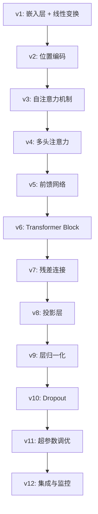

# 学习路径指南

<cite>
**本文档中引用的文件**  
- [babygpt_v1.py](file://babygpt_v1.py)
- [babygpt_v2_position.py](file://babygpt_v2_position.py)
- [babygpt_v3_self_attention.py](file://babygpt_v3_self_attention.py)
- [babygpt_v4_multihead_attention.py](file://babygpt_v4_multihead_attention.py)
- [babygpt_v5_feedforward.py](file://babygpt_v5_feedforward.py)
- [babygpt_v6_block.py](file://babygpt_v6_block.py)
- [babygpt_v7_residual_connection.py](file://babygpt_v7_residual_connection.py)
- [babygpt_v8_projection.py](file://babygpt_v8_projection.py)
- [babygpt_v9_layer_norm.py](file://babygpt_v9_layer_norm.py)
- [babygpt_v10_dropout.py](file://babygpt_v10_dropout.py)
- [babygpt_v11_hyper_params.py](file://babygpt_v11_hyper_params.py)
- [babygpt_v12_wandb.py](file://babygpt_v12_wandb.py)
- [babygpt_sample_with_kvcache.py](file://babygpt_sample_with_kvcache.py)
- [simplebigrammodel_with_comments.py](file://simplebigrammodel_with_comments.py)
</cite>

## 目录
1. [引言](#引言)
2. [学习路径概览](#学习路径概览)
3. [从v1到v12的演进详解](#从v1到v12的演进详解)
4. [关键学习建议](#关键学习建议)
5. [推荐学习流程](#推荐学习流程)
6. [结论](#结论)

## 引言
本指南旨在为学习者提供一条系统性、渐进式的语言模型构建学习路径。通过分析 `buildyourownllm` 项目中的版本迭代脚本，帮助用户从最基础的神经网络组件开始，逐步理解现代语言模型的核心机制。项目通过一系列命名清晰的脚本（从 `babygpt_v1.py` 到 `babygpt_v12_wandb.py`），展示了从简单嵌入到完整Transformer架构的完整构建过程。

**Section sources**
- [babygpt_v1.py](file://babygpt_v1.py#L1-L130)
- [babygpt_v12_wandb.py](file://babygpt_v12_wandb.py#L1-L363)

## 学习路径概览
建议学习者严格按照版本号顺序（v1 至 v12）依次学习每个脚本。每个版本在前一版本的基础上引入一个或多个关键概念，形成清晰的技术增量。这种“一次只学一个新东西”的方法，有助于构建扎实的底层理解，避免被复杂性压垮。

**Diagram sources**
- [babygpt_v1.py](file://babygpt_v1.py#L1-L130)
- [babygpt_v2_position.py](file://babygpt_v2_position.py#L1-L130)
- [babygpt_v3_self_attention.py](file://babygpt_v3_self_attention.py#L1-L130)
- [babygpt_v4_multihead_attention.py](file://babygpt_v4_multihead_attention.py#L1-L130)
- [babygpt_v5_feedforward.py](file://babygpt_v5_feedforward.py#L1-L130)
- [babygpt_v6_block.py](file://babygpt_v6_block.py#L1-L130)
- [babygpt_v7_residual_connection.py](file://babygpt_v7_residual_connection.py#L1-L130)
- [babygpt_v8_projection.py](file://babygpt_v8_projection.py#L1-L130)
- [babygpt_v9_layer_norm.py](file://babygpt_v9_layer_norm.py#L1-L130)
- [babygpt_v10_dropout.py](file://babygpt_v10_dropout.py#L1-L130)
- [babygpt_v11_hyper_params.py](file://babygpt_v11_hyper_params.py#L1-L130)
- [babygpt_v12_wandb.py](file://babygpt_v12_wandb.py#L1-L363)

## 从v1到v12的演进详解

### v1: 嵌入层与线性变换
`babygpt_v1.py` 是整个学习路径的起点。它实现了最基础的语言模型：通过嵌入层将token映射到向量空间，再通过一个简单的线性层（`lm_head`）预测下一个token。此版本不包含任何注意力机制，是理解模型输入输出流程的理想入口。

**Section sources**
- [babygpt_v1.py](file://babygpt_v1.py#L1-L130)

### v2: 位置编码
`babygpt_v2_position.py` 在v1的基础上引入了位置编码。通过添加一个可学习的位置嵌入表，模型开始具备对序列中token顺序的感知能力。这是从“无状态”模型向“有序”模型转变的关键一步。

**Section sources**
- [babygpt_v2_position.py](file://babygpt_v2_position.py#L1-L130)

### v3: 自注意力机制
`babygpt_v3_self_attention.py` 实现了自注意力机制的核心。模型现在能够计算序列中每个token与其他所有token的相关性（通过Q、K、V计算），从而捕捉长距离依赖。这是Transformer架构的基石。

**Section sources**
- [babygpt_v3_self_attention.py](file://babygpt_v3_self_attention.py#L1-L130)

### v4: 多头注意力
`babygpt_v4_multihead_attention.py` 将单一的注意力头扩展为多个头。多头注意力允许模型在不同的表示子空间中并行地关注输入的不同部分，极大地增强了模型的表达能力。

**Section sources**
- [babygpt_v4_multihead_attention.py](file://babygpt_v4_multihead_attention.py#L1-L130)

### v5: 前馈网络
`babygpt_v5_feedforward.py` 在注意力层后添加了前馈神经网络（Feed-Forward Network）。这个两层的MLP为模型提供了非线性变换能力，是Transformer块中的另一个核心组件。

**Section sources**
- [babygpt_v5_feedforward.py](file://babygpt_v5_feedforward.py#L1-L130)

### v6: Transformer Block
`babygpt_v6_block.py` 将自注意力和前馈网络封装成一个可复用的`Block`模块。这标志着模型架构开始模块化，为堆叠多层网络奠定了基础。

**Section sources**
- [babygpt_v6_block.py](file://babygpt_v6_block.py#L1-L130)

### v7: 残差连接
`babygpt_v7_residual_connection.py` 引入了残差连接（跳跃连接）。这种设计允许梯度直接流过网络，有效缓解了深度网络中的梯度消失问题，使得训练更深的模型成为可能。

**Section sources**
- [babygpt_v7_residual_connection.py](file://babygpt_v7_residual_connection.py#L1-L130)

### v8: 投影层
`babygpt_v8_projection.py` 在多头注意力后添加了投影层。该线性层将多头拼接后的向量映射回原始维度，确保了数据流的维度一致性。

**Section sources**
- [babygpt_v8_projection.py](file://babygpt_v8_projection.py#L1-L130)

### v9: 层归一化
`babygpt_v9_layer_norm.py` 在每个子层后添加了层归一化（LayerNorm）。这有助于稳定训练过程，加速收敛，并提高模型的泛化能力。

**Section sources**
- [babygpt_v9_layer_norm.py](file://babygpt_v9_layer_norm.py#L1-L130)

### v10: Dropout
`babygpt_v10_dropout.py` 引入了Dropout作为正则化技术。通过在训练过程中随机丢弃一部分神经元，有效防止了模型过拟合。

**Section sources**
- [babygpt_v10_dropout.py](file://babygpt_v10_dropout.py#L1-L130)

### v11: 超参数调优
`babygpt_v11_hyper_params.py` 展示了如何系统地调整学习率、批次大小等超参数，以优化模型性能。这是将理论模型转化为高效实践的关键环节。

**Section sources**
- [babygpt_v11_hyper_params.py](file://babygpt_v11_hyper_params.py#L1-L130)

### v12: 完整功能集成
`babygpt_v12_wandb.py` 是当前学习路径的终点。它集成了前11个版本的所有组件，并引入了`wandb`进行实验跟踪。此版本代表了一个功能完整、可用于实际训练和评估的微型GPT模型。

**Section sources**
- [babygpt_v12_wandb.py](file://babygpt_v12_wandb.py#L1-L363)

## 关键学习建议

### 实际操作建议
- **先运行，再理解**：对于每个版本，首先运行脚本，观察其输出（如损失值、生成的文本），建立直观感受。
- **修改与实验**：尝试修改超参数（如`n_embed`、`learning_rate`）或输入数据，观察模型行为的变化。
- **代码注释**：在阅读代码时，尝试用自己的话为关键代码段添加注释，加深理解。

### 辅助学习资源
- **simplebigrammodel_with_comments.py**：该文件提供了一个带有详细中文注释的二元语言模型实现。虽然技术上比v1更简单，但其详尽的注释是理解基本概念（如数据批处理、概率采样）的绝佳辅助材料。
- **babygpt_sample_with_kvcache.py**：此脚本展示了如何在推理阶段使用KV缓存来优化性能。学习此文件有助于理解如何将训练好的模型应用于实际生成任务，并了解推理优化的核心思想。

**Section sources**
- [babygpt_sample_with_kvcache.py](file://babygpt_sample_with_kvcache.py#L1-L232)
- [simplebigrammodel_with_comments.py](file://simplebigrammodel_with_comments.py#L1-L131)

## 推荐学习流程
1. 从 `babygpt_v1.py` 开始，确保完全理解嵌入和线性变换。
2. 依次学习 v2 到 v11，每次只关注新增的组件。
3. 在学习到 v6 之后，尝试绘制模型的整体架构图。
4. 运行 `babygpt_v12_wandb.py`，体验完整模型的训练过程。
5. 使用 `babygpt_sample_with_kvcache.py` 加载训练好的模型，进行交互式文本生成。
6. 参考 `simplebigrammodel_with_comments.py` 的注释风格，为 `babygpt_v1.py` 添加自己的详细注释。

## 结论
通过遵循此渐进式学习路径，学习者能够系统地掌握语言模型的核心构建模块。从 `babygpt_v1.py` 的简单起点到 `babygpt_v12_wandb.py` 的完整实现，每一步都建立在坚实的理解之上。这种由浅入深的方法，不仅适用于本项目，也为学习更复杂的深度学习模型提供了可复制的学习范式。