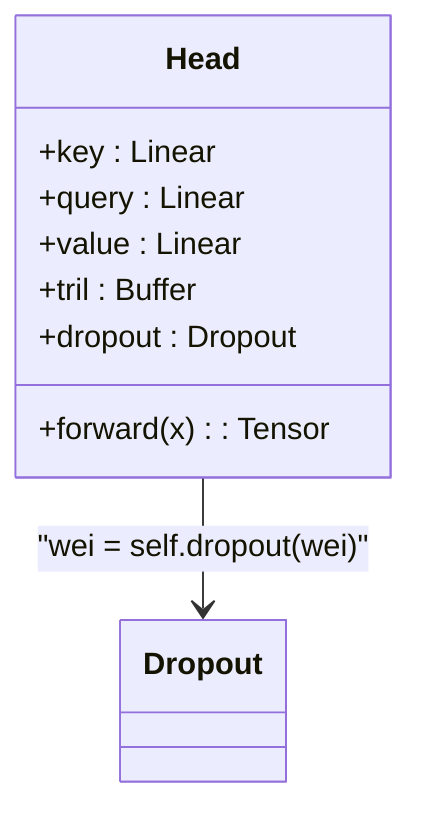
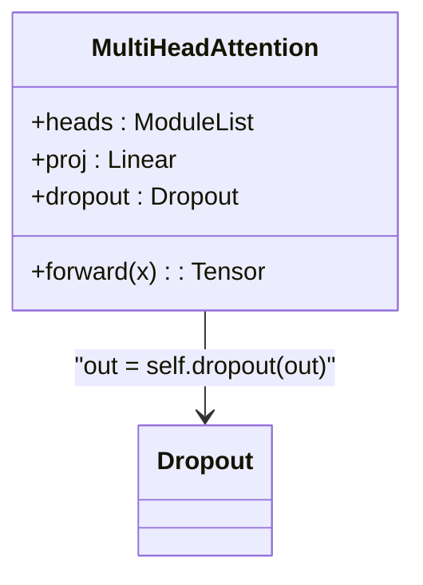
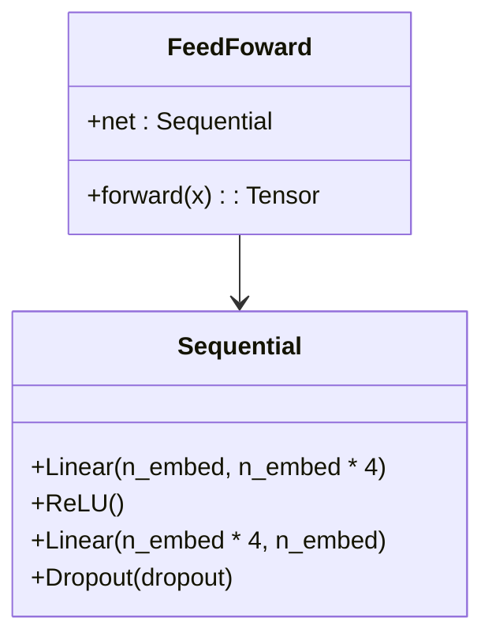
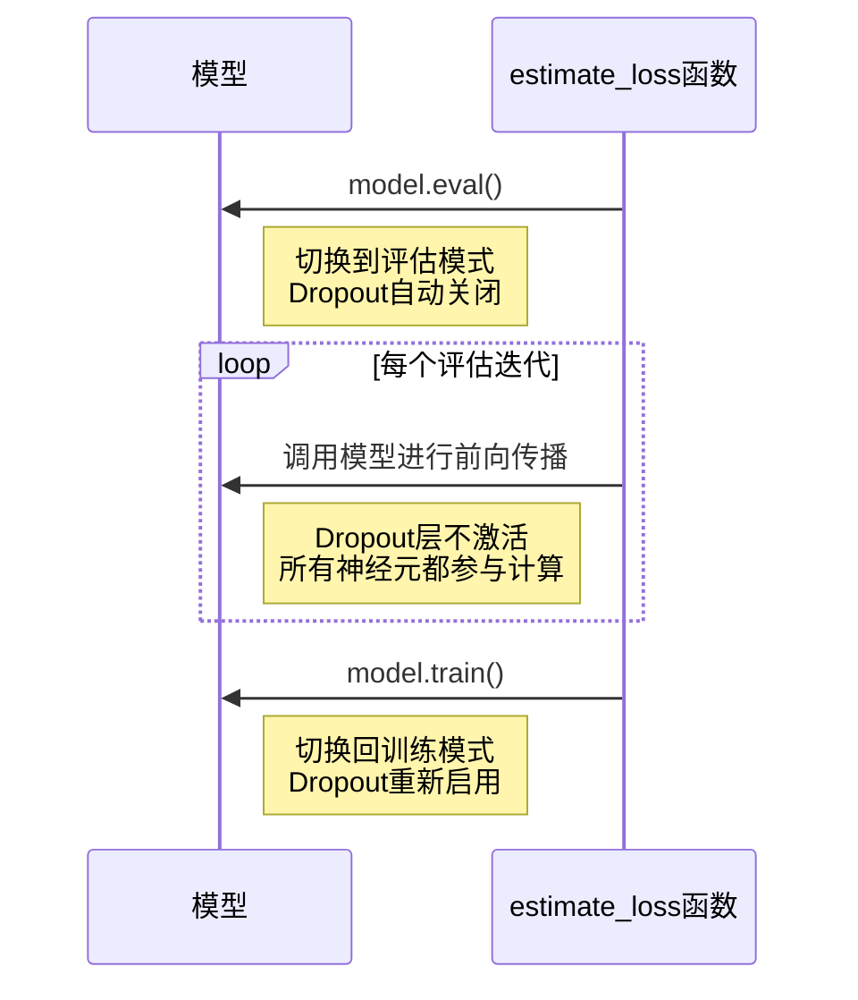

# Dropout正则化

<cite>
**Referenced Files in This Document**   
- [babygpt_v10_dropout.py](file://babygpt_v10_dropout.py)
</cite>

## 目录
1. [Dropout正则化技术概述](#dropout正则化技术概述)
2. [Dropout工作原理](#dropout工作原理)
3. [代码实现分析](#代码实现分析)
4. [Dropout在模型中的应用位置](#dropout在模型中的应用位置)
5. [训练与推理模式的区别](#训练与推理模式的区别)
6. [总结](#总结)

## Dropout正则化技术概述

Dropout是一种在深度神经网络中广泛使用的正则化技术，旨在防止模型过拟合。过拟合是指模型在训练数据上表现良好，但在未见过的测试数据上表现较差的现象。通过在训练过程中随机"丢弃"一部分神经元，Dropout强制网络不依赖于任何单个神经元，从而增强模型的泛化能力。

在`babygpt_v10_dropout.py`文件中，Dropout被应用于多个关键组件，包括`Head`、`MultiHeadAttention`和`FeedFoward`模块，以提高模型的鲁棒性和泛化性能。

**Section sources**
- [babygpt_v10_dropout.py](file://babygpt_v10_dropout.py#L41-L171)

## Dropout工作原理

Dropout的工作原理是在训练过程中，以预设的概率`dropout`随机将一部分神经元的输出置零。这种随机性迫使网络学习更加鲁棒的特征表示，因为网络不能过度依赖任何特定的神经元或特征。

具体来说，当Dropout比率设置为0.2时，意味着在每次训练迭代中，大约20%的神经元输出会被随机设置为零。这种机制可以看作是一种模型集成技术，因为在不同的训练步骤中，实际上是在训练不同的"子网络"，这些子网络共享权重但具有不同的结构。

通过这种方式，Dropout有效地减少了神经元之间的复杂共适应关系，使得每个神经元都必须独立地学习有用的特征，而不是与其他特定神经元协同工作。这增强了模型的泛化能力，使其在面对新数据时表现更加稳定。

**Section sources**
- [babygpt_v10_dropout.py](file://babygpt_v10_dropout.py#L41-L171)

## 代码实现分析

在`babygpt_v10_dropout.py`文件中，Dropout的实现遵循了PyTorch的标准做法。首先，在文件的全局变量中定义了`dropout = 0.2`，这表示20%的神经元将在训练过程中被随机丢弃。

```python
dropout = 0.2 # dropout的比例
```

这个全局变量随后被用于初始化各个模块中的Dropout层。PyTorch的`nn.Dropout(dropout)`层会在前向传播过程中自动应用Dropout机制，根据指定的概率随机将输入张量中的元素置零，并对剩余元素进行缩放以保持期望值不变。

**Section sources**
- [babygpt_v10_dropout.py](file://babygpt_v10_dropout.py#L41)

## Dropout在模型中的应用位置

### Head模块中的Dropout

在`Head`类中，Dropout被应用于注意力权重计算之后。具体来说，在计算完注意力权重`wei`并应用softmax函数后，立即应用Dropout：



**Diagram sources**
- [babygpt_v10_dropout.py](file://babygpt_v10_dropout.py#L80-L100)

**Section sources**
- [babygpt_v10_dropout.py](file://babygpt_v10_dropout.py#L80-L100)

### MultiHeadAttention模块中的Dropout

在`MultiHeadAttention`类中，Dropout被应用于多头注意力输出的投影层之后。这种设计确保了在将多个注意力头的输出合并并投影回原始维度后，仍然保持正则化效果：



**Diagram sources**
- [babygpt_v10_dropout.py](file://babygpt_v10_dropout.py#L67-L78)

**Section sources**
- [babygpt_v10_dropout.py](file://babygpt_v10_dropout.py#L67-L78)

### FeedFoward模块中的Dropout

在`FeedFoward`类中，Dropout被作为前馈网络的最后一层。这种设计模式在Transformer架构中很常见，它确保了在非线性变换后仍然保持正则化效果：



**Diagram sources**
- [babygpt_v10_dropout.py](file://babygpt_v10_dropout.py#L55-L65)

**Section sources**
- [babygpt_v10_dropout.py](file://babygpt_v10_dropout.py#L55-L65)

## 训练与推理模式的区别

Dropout的一个重要特性是它仅在训练时启用，在推理（评估）时会自动关闭。这种行为是通过PyTorch的`model.train()`和`model.eval()`模式切换实现的。

在`babygpt_v10_dropout.py`文件中，`estimate_loss`函数清晰地展示了这一机制：



**Diagram sources**
- [babygpt_v10_dropout.py](file://babygpt_v10_dropout.py#L157-L171)

**Section sources**
- [babygpt_v10_dropout.py](file://babygpt_v10_dropout.py#L157-L171)

当调用`model.eval()`时，所有Dropout层都会被禁用，确保在推理过程中所有神经元都参与计算，从而获得最完整的模型输出。相反，当调用`model.train()`时，Dropout层会恢复正常工作，继续在训练过程中随机丢弃神经元。

这种设计确保了模型在训练时能够通过Dropout获得正则化效果，而在推理时能够利用所有可用的神经元进行预测，从而在保持泛化能力的同时最大化模型性能。

## 总结

Dropout作为一种有效的正则化技术，在`babygpt_v10_dropout.py`实现的GPT模型中发挥了重要作用。通过在`Head`、`MultiHeadAttention`和`FeedFoward`等关键组件中应用Dropout，模型能够有效防止过拟合，提高泛化能力。

Dropout的核心思想是通过在训练过程中随机丢弃神经元，强制网络不依赖于任何单个神经元，从而学习更加鲁棒的特征表示。这种技术在训练时启用，在推理时自动关闭，确保了模型在不同模式下的最优表现。

通过合理设置Dropout比率（在本例中为0.2），可以在防止过拟合和保持模型表达能力之间取得良好平衡，这对于训练深度神经网络，特别是像GPT这样的大型语言模型，至关重要。