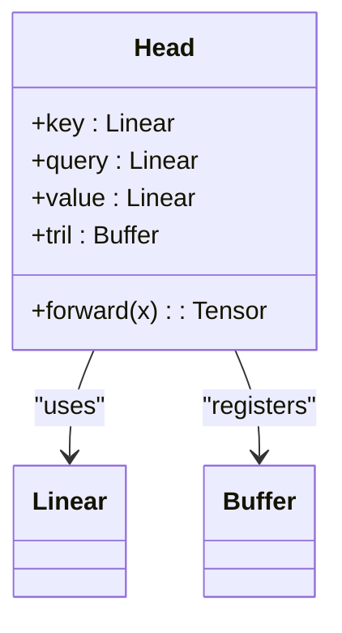
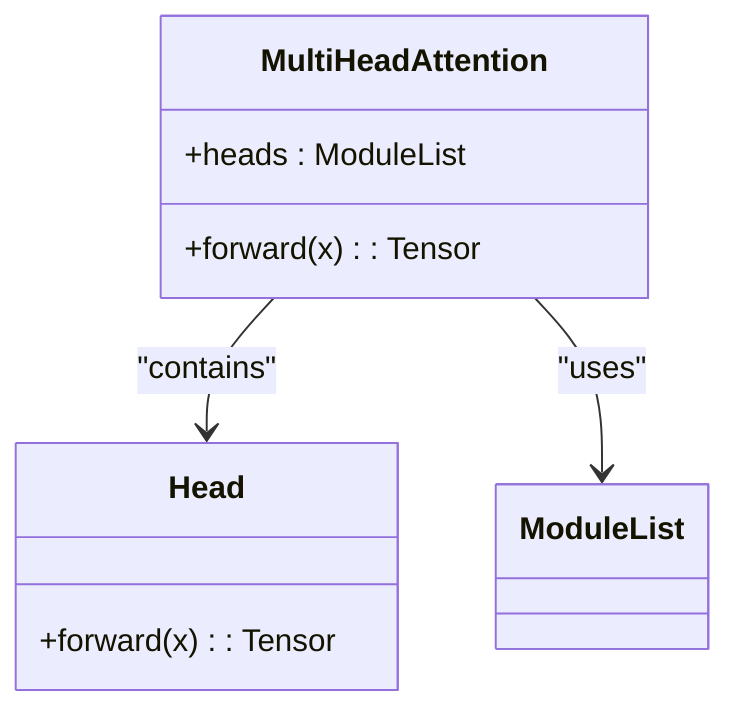
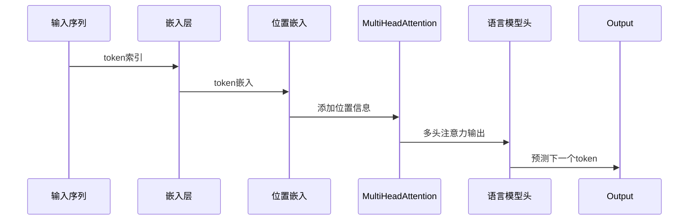

# 多头注意力机制

<cite>
**Referenced Files in This Document**   
- [babygpt_v4_multihead_attention.py](file://babygpt_v4_multihead_attention.py)
- [Head](file://babygpt_v4_multihead_attention.py#L47-L65)
- [MultiHeadAttention](file://babygpt_v4_multihead_attention.py#L39-L45)
- [BabyGPT](file://babygpt_v4_multihead_attention.py#L67-L103)
</cite>

## 目录
1. [引言](#引言)
2. [多头注意力机制设计思想](#多头注意力机制设计思想)
3. [核心组件分析](#核心组件分析)
4. [实现细节与代码结构](#实现细节与代码结构)
5. [计算量与表达能力分析](#计算量与表达能力分析)
6. [总结](#总结)

## 引言

多头注意力机制是现代Transformer架构中的核心组件，它通过并行处理输入序列的不同子空间信息，显著提升了模型的表达能力。本文基于`babygpt_v4_multihead_attention.py`文件，深入剖析多头注意力机制的设计原理与实现细节，重点阐述为何将嵌入维度拆分为多个“头”（heads），以及这种设计如何在保持计算效率的同时增强模型对复杂语言模式的理解能力。

## 多头注意力机制设计思想

多头注意力机制的核心思想是**将高维嵌入空间分解为多个低维子空间，并让每个子空间独立学习不同的注意力模式**。传统的单头注意力机制只能捕捉一种类型的上下文依赖关系，而多头机制通过并行的多个注意力头，使模型能够同时关注输入序列中不同位置的多种语义或语法特征。

例如，在处理中文诗句时，不同的注意力头可能分别学习到：
- **语法结构**：识别主谓宾关系
- **语义关联**：理解意象之间的隐喻联系
- **韵律模式**：捕捉平仄和押韵规律
- **上下文依赖**：追踪代词指代或省略成分

这种并行化的设计使得模型能够从多个角度同时理解输入文本，从而获得更丰富、更全面的表示。

**Section sources**
- [babygpt_v4_multihead_attention.py](file://babygpt_v4_multihead_attention.py#L39-L45)

## 核心组件分析

### Head类：单个注意力头的实现

`Head`类实现了标准的自注意力机制，负责在一个子空间内计算注意力权重并生成输出。



**Diagram sources**
- [Head](file://babygpt_v4_multihead_attention.py#L47-L65)

### MultiHeadAttention类：多头管理器

`MultiHeadAttention`类通过`nn.ModuleList`管理多个独立的`Head`实例，并将它们的输出进行拼接。



**Diagram sources**
- [MultiHeadAttention](file://babygpt_v4_multihead_attention.py#L39-L45)
- [Head](file://babygpt_v4_multihead_attention.py#L47-L65)

## 实现细节与代码结构

### 多头并行处理流程

多头注意力的前向传播过程遵循以下步骤：

```mermaid
flowchart TD
Start([输入 x (B,T,C)]) --> CreateHeads["创建 n_head 个 Head 实例"]
CreateHeads --> Parallel["并行计算每个头的输出<br/>h(x) for h in heads"]
Parallel --> Concat["使用 torch.cat 沿特征维度拼接<br/>dim=-1"]
Concat --> Output([输出 (B,T,C)])
```

**Diagram sources**
- [MultiHeadAttention](file://babygpt_v4_multihead_attention.py#L39-L45)

### Head实例的管理

`MultiHeadAttention`类在初始化时使用`nn.ModuleList`创建并管理多个`Head`实例：

```python
self.heads = nn.ModuleList([Head(head_size) for _ in range(num_heads)])
```

`nn.ModuleList`确保了所有子模块（即每个`Head`）都能被PyTorch正确注册，从而在模型训练时自动参与梯度计算和参数更新。

**Section sources**
- [MultiHeadAttention](file://babygpt_v4_multihead_attention.py#L39-L45)

### 输出拼接操作

各头的输出通过`torch.cat`在特征维度（`dim=-1`）上进行拼接：

```python
return torch.cat([h(x) for h in self.heads], dim=-1)
```

这一操作将原本分散在多个低维空间的表示重新组合成一个完整的高维表示，供后续层使用。

**Section sources**
- [MultiHeadAttention](file://babygpt_v4_multihead_attention.py#L44-L45)

## 计算量与表达能力分析

### head_size = n_embed // n_head 的设计意义

代码中通过以下方式计算每个头的维度：

```python
head_size = n_embed // n_head
```

这一设计的关键在于**保持总计算量与单头注意力相近**。具体来说：

- **单头注意力**：输入维度为`n_embed`，计算复杂度主要由`QK^T`决定，约为`O(n_embed^2)`
- **多头注意力**：每个头的维度为`n_embed/n_head`，单个头的计算复杂度为`O((n_embed/n_head)^2)`，`n_head`个头的总复杂度为`n_head * O((n_embed/n_head)^2) = O(n_embed^2 / n_head)`

虽然总计算量略有下降，但通过并行化处理，实际运行时间与单头注意力相当，而模型的表达能力却得到了显著提升。

**Section sources**
- [babygpt_v4_multihead_attention.py](file://babygpt_v4_multihead_attention.py#L39-L45)

### 增强模型表达能力

多头机制通过以下方式增强模型的表达能力：

1. **特征解耦**：不同头可以专注于学习不同类型的特征（如语法、语义、韵律等）
2. **鲁棒性提升**：即使某些头学习效果不佳，其他头仍能提供有效信息
3. **并行学习**：多个头可以同时从不同角度理解输入，提高学习效率

在`BabyGPT`模型中，多头注意力被集成到主干网络中：



**Diagram sources**
- [BabyGPT](file://babygpt_v4_multihead_attention.py#L67-L103)

## 总结

多头注意力机制通过将嵌入维度拆分为多个“头”，实现了对输入序列的多角度并行分析。`MultiHeadAttention`类利用`nn.ModuleList`高效管理多个`Head`实例，并通过`torch.cat`将各头输出拼接，形成完整的表示。`head_size = n_embed // n_head`的设计巧妙地在保持计算效率的同时，极大地增强了模型的表达能力，使其能够学习到更丰富、更复杂的语言模式。这种设计已成为现代大语言模型的基石，为自然语言处理任务带来了革命性的进步。