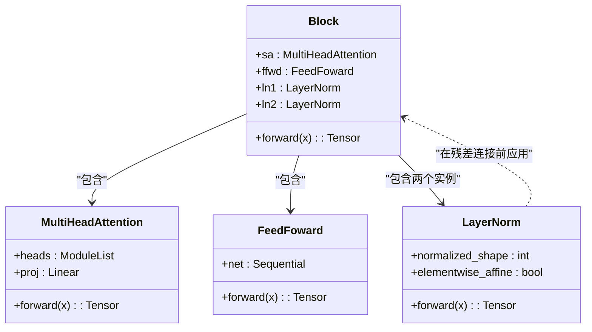
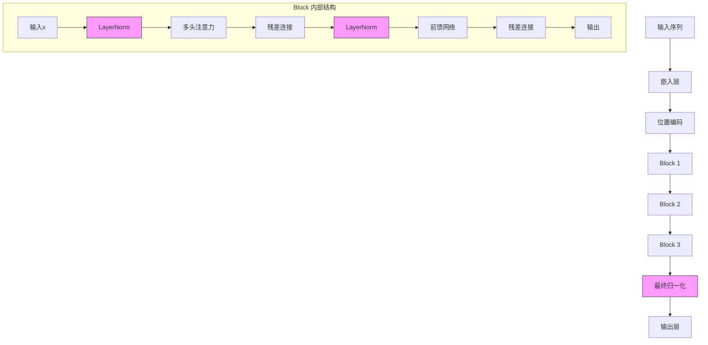
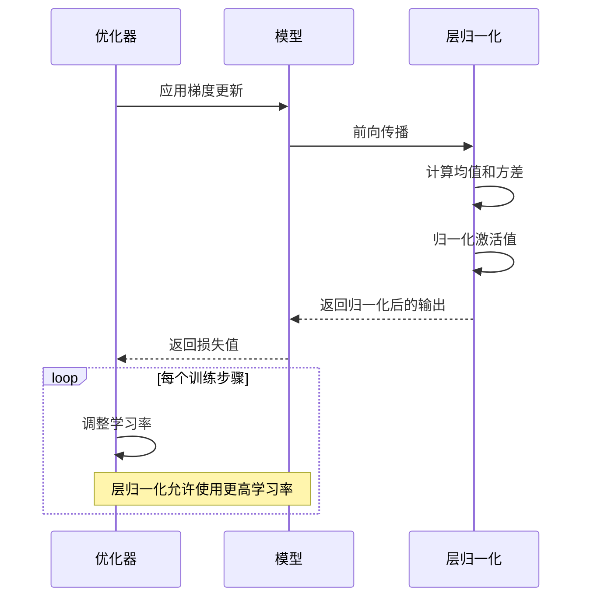

# 层归一化

<cite>
**本文档中引用的文件**
- [babygpt_v9_layer_norm.py](file://babygpt_v9_layer_norm.py)
</cite>

## 目录
1. [引言](#引言)
2. [层归一化的计算方式](#层归一化的计算方式)
3. [代码实现分析](#代码实现分析)
4. [层归一化在Transformer中的作用](#层归一化在transformer中的作用)
5. [内部协变量偏移问题](#内部协变量偏移问题)
6. [训练稳定性与学习率](#训练稳定性与学习率)
7. [结论](#结论)

## 引言

层归一化（Layer Normalization）是深度神经网络中一种重要的归一化技术，尤其在Transformer架构中发挥着关键作用。本文档将基于`babygpt_v9_layer_norm.py`代码文件，深入分析层归一化如何稳定和加速Transformer的训练过程。通过代码分析和理论解释，我们将探讨其计算机制、实现方式以及对模型训练性能的影响。

**Section sources**
- [babygpt_v9_layer_norm.py](file://babygpt_v9_layer_norm.py#L1-L50)

## 层归一化的计算方式

层归一化是一种在特征维度上对每个样本进行归一化的技术。与批归一化（Batch Normalization）不同，层归一化不依赖于批次统计量，而是在单个样本的所有特征上进行计算。

具体而言，对于一个形状为`(batch_size, sequence_length, n_embed)`的输入张量，层归一化在`n_embed`维度上对每个token的激活值进行归一化处理。其计算过程如下：

1. 对每个样本（token）计算其在特征维度上的均值和方差
2. 使用计算得到的均值和方差将激活值归一化为均值为0、方差为1的分布
3. 应用可学习的缩放（scale）和偏移（shift）参数，以保留网络的表达能力

这种归一化方式确保了每个token的特征分布具有相似的统计特性，从而减少了网络内部的数值变化范围，为稳定训练提供了基础。

**Section sources**
- [babygpt_v9_layer_norm.py](file://babygpt_v9_layer_norm.py#L40-L52)

## 代码实现分析

在`babygpt_v9_layer_norm.py`文件中，层归一化通过PyTorch的`nn.LayerNorm`模块实现。该实现主要体现在`Block`类中，这是Transformer架构的基本构建单元。



**Diagram sources**
- [babygpt_v9_layer_norm.py](file://babygpt_v9_layer_norm.py#L40-L52)

在`Block`类的初始化方法中，定义了两个层归一化层：

```python
self.ln1 = nn.LayerNorm(n_embed) # 注意力机制前的归一化
self.ln2 = nn.LayerNorm(n_embed) # 前馈网络前的归一化
```

这两个层归一化层分别应用于多头注意力机制和前馈神经网络之前。在前向传播过程中，其应用顺序遵循"归一化-残差连接"模式：

```python
x = x + self.sa(self.ln1(x)) # 注意力机制前先进行归一化
x = x + self.ffwd(self.ln2(x)) # 前馈网络前先进行归一化
```

这种设计模式（Pre-LN）相比于传统的Post-LN（在残差连接后归一化）具有更好的训练稳定性，因为它确保了进入注意力机制和前馈网络的输入都具有稳定的分布特性。

**Section sources**
- [babygpt_v9_layer_norm.py](file://babygpt_v9_layer_norm.py#L40-L52)

## 层归一化在Transformer中的作用

层归一化在Transformer架构中扮演着至关重要的角色，主要体现在以下几个方面：

### 稳定激活值分布

在深度神经网络中，随着网络层数的增加，前一层输出的分布变化会逐层放大，导致后续层的输入分布不稳定。层归一化通过在每个token的特征维度上强制执行均值为0、方差为1的分布，有效控制了激活值的尺度，防止了数值过大或过小的问题。

### 加速收敛过程

通过稳定各层的输入分布，层归一化减少了训练过程中的震荡，使得梯度更新更加平滑。这不仅加快了模型的收敛速度，还降低了对学习率精细调参的依赖。

### 改善梯度流动

层归一化有助于缓解梯度消失和梯度爆炸问题。由于激活值被限制在合理的范围内，反向传播时的梯度也相应地保持在稳定区间，从而改善了深层网络中的梯度流动。



**Diagram sources**
- [babygpt_v9_layer_norm.py](file://babygpt_v9_layer_norm.py#L40-L52)
- [babygpt_v9_layer_norm.py](file://babygpt_v9_layer_norm.py#L110-L120)

## 内部协变量偏移问题

内部协变量偏移（Internal Covariate Shift）是深度神经网络训练中的一大挑战。它指的是在网络训练过程中，由于前面层参数的更新导致后面层输入分布不断变化的现象。

### 问题描述

在没有归一化的情况下，当网络的前几层参数更新时，它们输出的激活值分布会发生变化。这种变化会逐层传递，导致后续层需要不断适应新的输入分布，从而降低了训练效率。

### 层归一化的解决方案

层归一化通过以下机制缓解内部协变量偏移问题：

1. **独立于批次的归一化**：与批归一化不同，层归一化不依赖于批次统计量，因此在小批次或变长序列情况下依然有效。

2. **逐样本归一化**：对每个样本单独进行归一化，确保了即使在不同批次之间，同一token的特征分布也保持一致。

3. **特征维度归一化**：在`n_embed`维度上进行归一化，直接控制了每个token的特征表示尺度。

通过这些机制，层归一化有效地减少了网络内部各层输入分布的变化，使得每一层可以更专注于学习有意义的特征变换，而不是不断适应输入分布的变化。

**Section sources**
- [babygpt_v9_layer_norm.py](file://babygpt_v9_layer_norm.py#L40-L52)

## 训练稳定性与学习率

层归一化对模型训练稳定性和学习率选择有着显著影响。

### 提高训练稳定性

层归一化通过控制激活值的范围，显著提高了训练过程的稳定性。在`babygpt_v9_layer_norm.py`的训练过程中，我们可以观察到损失函数的下降更加平稳，较少出现剧烈波动。

### 允许使用更高的学习率

由于层归一化稳定了网络内部的数值分布，模型可以承受更高的学习率而不至于发散。在代码中设置的学习率为`1e-2`，这是一个相对较高的值，但在层归一化的支持下，模型能够稳定收敛。



**Diagram sources**
- [babygpt_v9_layer_norm.py](file://babygpt_v9_layer_norm.py#L150-L180)

这种能力对于加速模型训练尤为重要，因为更高的学习率意味着更快的参数更新速度，从而缩短了达到收敛所需的迭代次数。

## 结论

通过对`babygpt_v9_layer_norm.py`代码的分析，我们可以得出层归一化在Transformer架构中的关键作用：

1. **计算机制**：在特征维度上对每个token的激活值进行归一化，使其均值为0、方差为1。

2. **实现方式**：在`Block`类中通过`nn.LayerNorm(n_embed)`实现，通常置于残差连接之前。

3. **核心优势**：有效减少内部协变量偏移，稳定训练过程，允许使用更高的学习率。

4. **架构影响**：采用Pre-LN模式（归一化在残差连接前）相比Post-LN具有更好的训练稳定性。

层归一化作为Transformer架构的标配组件，不仅解决了深度网络训练中的稳定性问题，还为模型的高效训练提供了重要支持。其独立于批次的特性使其特别适合处理变长序列和小批次训练场景，在现代语言模型中发挥着不可或缺的作用。