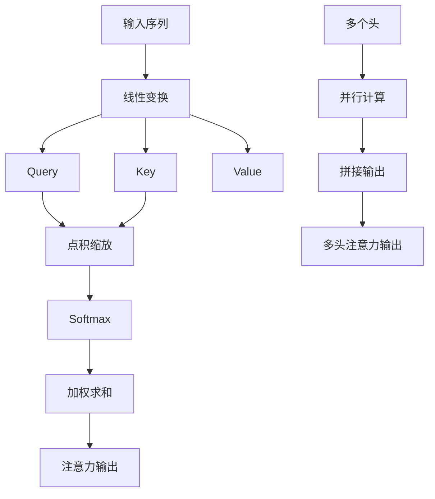

# 核心概念详解

<cite>
**本文档中引用的文件**
- [babygpt_v3_self_attention.py](file://babygpt_v3_self_attention.py)
- [babygpt_v4_multihead_attention.py](file://babygpt_v4_multihead_attention.py)
- [babygpt_v5_feedforward.py](file://babygpt_v5_feedforward.py)
- [babygpt_v7_residual_connection.py](file://babygpt_v7_residual_connection.py)
- [babygpt_v9_layer_norm.py](file://babygpt_v9_layer_norm.py)
- [babygpt_v10_dropout.py](file://babygpt_v10_dropout.py)
</cite>

## 目录
1. [自注意力机制](#自注意力机制)
2. [多头注意力机制](#多头注意力机制)
3. [前馈神经网络](#前馈神经网络)
4. [残差连接](#残差连接)
5. [层归一化](#层归一化)
6. [Dropout正则化](#dropout正则化)

## 自注意力机制

自注意力机制是Transformer架构的核心，它允许模型在处理序列数据时关注序列中不同位置的信息。在`babygpt_v3_self_attention.py`中，`Head`类实现了单个注意力头的计算逻辑。输入序列首先通过三个线性变换分别生成查询（Query）、键（Key）和值（Value）向量。注意力分数通过计算查询与键的点积并进行缩放得到，公式为：$\text{Attention}(Q, K, V) = \text{softmax}(\frac{QK^T}{\sqrt{d_k}})V$，其中$d_k$是键向量的维度，缩放操作防止点积过大导致softmax梯度消失。

为了实现因果掩码（即防止模型看到未来的信息），代码使用了下三角矩阵`tril`，将注意力分数矩阵的上三角部分填充为负无穷，确保每个位置只能关注到其之前的位置。最终的输出是注意力权重与值向量的乘积。

**Section sources**
- [babygpt_v3_self_attention.py](file://babygpt_v3_self_attention.py#L45-L75)

## 多头注意力机制

多头注意力机制通过并行计算多个注意力头来增强模型的表达能力。在`babygpt_v4_multihead_attention.py`中，`MultiHeadAttention`类包含多个`Head`实例，每个头独立计算注意力输出，然后将所有头的输出沿特征维度拼接。这种机制允许模型在不同的表示子空间中学习序列的不同特征，例如语法结构和语义关系。

多头注意力的总输出维度保持不变，因为每个头的输出维度被减小为`n_embed // n_head`。这种设计在增加模型容量的同时，保持了计算复杂度的可控性。多头注意力的优势在于其并行性和多样性，能够捕捉更丰富的上下文信息。

**Diagram sources**
- [babygpt_v4_multihead_attention.py](file://babygpt_v4_multihead_attention.py#L80-L95)

**Section sources**
- [babygpt_v4_multihead_attention.py](file://babygpt_v4_multihead_attention.py#L80-L95)

## 前馈神经网络

前馈神经网络（Feed-Forward Network, FFN）在Transformer中用于对自注意力层的输出进行非线性变换。在`babygpt_v5_feedforward.py`中，`FeedFoward`类由两个线性层和一个ReLU激活函数组成。第一个线性层将输入维度扩展到更高维度（通常是4倍），然后通过ReLU引入非线性，最后通过第二个线性层将维度恢复到原始大小。

这种两层结构的设计允许模型学习更复杂的特征表示。FFN独立地应用于序列的每个位置，为每个token提供独立的非线性变换能力，增强了模型的表达力。

**Diagram sources**
- [babygpt_v5_feedforward.py](file://babygpt_v5_feedforward.py#L100-L110)

**Section sources**
- [babygpt_v5_feedforward.py](file://babygpt_v5_feedforward.py#L100-L110)

## 残差连接

残差连接是解决深度神经网络中梯度消失问题的关键技术。在`babygpt_v7_residual_connection.py`中，`Block`类在自注意力和前馈网络后都添加了残差连接。具体实现为`x = x + self.sa(x)`和`x = x + self.ffwd(x)`，将输入直接加到输出上。

这种结构允许梯度直接通过捷径传播，避免了在深层网络中梯度逐层衰减的问题。残差连接使得训练更深的网络成为可能，提高了模型的稳定性和性能。

**Diagram sources**
- [babygpt_v7_residual_connection.py](file://babygpt_v7_residual_connection.py#L120-L130)

**Section sources**
- [babygpt_v7_residual_connection.py](file://babygpt_v7_residual_connection.py#L120-L130)

## 层归一化

层归一化（Layer Normalization）用于稳定训练过程，通过规范化每个样本在特征维度上的均值和方差。在`babygpt_v9_layer_norm.py`中，`Block`类在自注意力和前馈网络前添加了`nn.LayerNorm`层。层归一化对每个token的嵌入向量进行独立归一化，公式为：$y = \frac{x - \mu}{\sqrt{\sigma^2 + \epsilon}} \gamma + \beta$，其中$\mu$和$\sigma^2$是均值和方差，$\gamma$和$\beta$是可学习的缩放和平移参数。

层归一化减少了内部协变量偏移，加速了训练收敛，并提高了模型的鲁棒性。

**Diagram sources**
- [babygpt_v9_layer_norm.py](file://babygpt_v9_layer_norm.py#L130-L145)

**Section sources**
- [babygpt_v9_layer_norm.py](file://babygpt_v9_layer_norm.py#L130-L145)

## Dropout正则化

Dropout是一种正则化技术，用于防止模型过拟合。在`babygpt_v10_dropout.py`中，`Head`、`MultiHeadAttention`和`FeedFoward`类都添加了`nn.Dropout`层。在训练期间，Dropout随机将一部分神经元的输出设置为零，比例由`dropout`参数控制（如0.2），这迫使网络不依赖于任何单个神经元，增强了泛化能力。

在推理时，Dropout被禁用，所有神经元都参与计算。Dropout通常应用于注意力权重、多头注意力输出和前馈网络内部，有效减少了模型的过拟合风险。

**Diagram sources**
- [babygpt_v10_dropout.py](file://babygpt_v10_dropout.py#L150-L165)

**Section sources**
- [babygpt_v10_dropout.py](file://babygpt_v10_dropout.py#L150-L165)