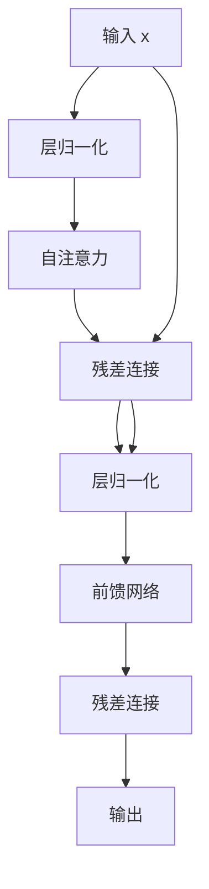

# 残差连接

<cite>
**本文档中引用的文件**  
- [babygpt_v7_residual_connection.py](file://babygpt_v7_residual_connection.py)
- [babygpt_v6_block.py](file://babygpt_v6_block.py)
- [babygpt_v8_projection.py](file://babygpt_v8_projection.py)
- [babygpt_v9_layer_norm.py](file://babygpt_v9_layer_norm.py)
</cite>

## 目录
1. [引言](#引言)  
2. [残差连接在Block类中的实现](#残差连接在block类中的实现)  
3. [梯度消失问题与残差连接的解决方案](#梯度消失问题与残差连接的解决方案)  
4. [跳跃连接的梯度传播机制](#跳跃连接的梯度传播机制)  
5. [残差连接在深层Transformer模型中的作用](#残差连接在深层transformer模型中的作用)  
6. [残差连接与层归一化的结合模式](#残差连接与层归一化的结合模式)  
7. [总结](#总结)

## 引言

在深度神经网络中，随着网络层数的增加，训练过程常常面临梯度消失或梯度爆炸的问题，导致深层网络难以收敛。残差连接（Residual Connection）作为一种有效的架构设计，通过引入“跳跃连接”（Skip Connection），允许输入信号直接绕过某些子层并加到输出上，从而显著缓解了这一问题。本文结合 `babygpt_v7_residual_connection.py` 中的 `Block` 类，深入分析残差连接如何在Transformer结构中发挥作用，特别是 `x = x + self.sa(x)` 和 `x = x + self.ffwd(x)` 这两行代码的关键意义。

## 残差连接在Block类中的实现

在 `babygpt_v7_residual_connection.py` 文件中，`Block` 类是Transformer模型的基本构建单元，包含自注意力机制（Self-Attention）和前馈网络（Feed-Forward Network）两个子层。其 `forward` 方法实现了典型的残差连接结构：

```python
def forward(self, x):
    x = x + self.sa(x)  # 自注意力子层的残差连接
    x = x + self.ffwd(x)  # 前馈网络子层的残差连接
    return x
```

这两行代码的核心思想是：将输入 `x` 直接加到子层（`self.sa` 或 `self.ffwd`）的输出上，形成输出结果。这种设计确保了即使子层的变换较为复杂或非线性较强，原始输入的信息仍能以恒等映射的方式传递到后续层。

**Section sources**  
- [babygpt_v7_residual_connection.py](file://babygpt_v7_residual_connection.py#L40-L50)

## 梯度消失问题与残差连接的解决方案

在传统的深层神经网络中，反向传播时梯度需要通过链式法则逐层传递。当网络层数较深时，若每层的激活函数导数小于1（如Sigmoid或ReLU在部分区域），则梯度会随着层数增加呈指数级衰减，最终导致靠近输入层的参数几乎无法更新——这就是梯度消失问题。

残差连接通过引入恒等映射路径，改变了梯度的传播路径。考虑一个简单的残差块：

```
输出 = 输入 + 子层(输入)
```

在反向传播时，损失对输入的梯度不仅来自子层的梯度流，还直接包含一条恒等路径的梯度（即1）。因此，即使子层的梯度很小，总梯度也不会完全消失，从而保证了深层网络中梯度的有效传递。

在 `Block` 类中，`x = x + self.sa(x)` 表示自注意力层的输出与原始输入相加，使得即使自注意力机制引入了复杂的非线性变换，输入信息依然可以通过加法操作保留下来。

**Section sources**  
- [babygpt_v7_residual_connection.py](file://babygpt_v7_residual_connection.py#L45-L46)

## 跳跃连接的梯度传播机制

残差连接的本质是一种跳跃连接（Skip Connection），它允许信息和梯度“跳过”一个或多个层直接传递。在 `x = x + self.sa(x)` 中，加法操作创建了一条从输入到输出的直接通路。

从数学角度看，假设某一层的输出为：
```
H(x) = F(x) + x
```
其中 `F(x)` 是子层的变换（如自注意力或前馈网络），`x` 是输入。那么在反向传播中，梯度为：
```
dH/dx = dF/dx + I
```
这里的 `I` 是单位矩阵（恒等映射的导数），保证了梯度中始终存在一个非零分量，极大降低了梯度消失的风险。

这种机制使得深层网络即使在训练初期也能保持较好的梯度流动，从而更容易优化。

**Section sources**  
- [babygpt_v7_residual_connection.py](file://babygpt_v7_residual_connection.py#L45-L46)

## 残差连接在深层Transformer模型中的作用

在 `babygpt_v7_residual_connection.py` 中，`n_layer = 3` 表示模型堆叠了3个 `Block` 层。如果没有残差连接，随着层数增加，信息在逐层传递过程中可能逐渐丢失或扭曲，导致模型难以学习长期依赖。

通过在每个 `Block` 中引入残差连接，每一层都能保留原始输入的“副本”，使得深层网络能够学习到输入与输出之间的细微差异（即残差），而不是从零开始学习完整的映射。这不仅提升了模型的表达能力，也显著加快了训练收敛速度。

此外，残差连接使得网络可以更灵活地决定是否使用某个子层的输出——如果子层的变换接近恒等映射，则权重会自动调整使 `F(x) ≈ 0`，从而保留原始输入。

**Section sources**  
- [babygpt_v7_residual_connection.py](file://babygpt_v7_residual_connection.py#L15-L16)
- [babygpt_v7_residual_connection.py](file://babygpt_v7_residual_connection.py#L40-L50)

## 残差连接与层归一化的结合模式

虽然 `babygpt_v7_residual_connection.py` 中的 `Block` 类尚未引入层归一化（Layer Normalization），但在后续版本（如 `babygpt_v9_layer_norm.py`）中可以看到更成熟的实现模式：

```python
x = x + self.sa(self.ln1(x))
x = x + self.ffwd(self.ln2(x))
```

这种“预归一化”（Pre-LN）结构将层归一化放在子层之前，进一步稳定了训练过程。层归一化通过对每个样本的特征进行标准化，减少了内部协变量偏移，与残差连接协同作用，共同提升了深层模型的训练稳定性。

残差连接解决梯度传播问题，层归一化解决特征分布稳定性问题，二者结合构成了现代Transformer模型的标准组件。



**Diagram sources**  
- [babygpt_v9_layer_norm.py](file://babygpt_v9_layer_norm.py#L45-L46)

**Section sources**  
- [babygpt_v9_layer_norm.py](file://babygpt_v9_layer_norm.py#L40-L52)

## 总结

残差连接是深度神经网络，尤其是Transformer架构中的关键技术。通过在 `Block` 类中实现 `x = x + self.sa(x)` 和 `x = x + self.ffwd(x)`，模型能够有效缓解梯度消失问题，确保信息和梯度在深层网络中顺畅流动。这种跳跃连接机制不仅提升了模型的可训练性，还增强了其表达能力。当与层归一化结合使用时，进一步提升了训练的稳定性和收敛速度。在 `n_layer=3` 的深层结构中，残差连接使得模型能够成功学习复杂的语言模式，为构建更强大的语言模型奠定了基础。