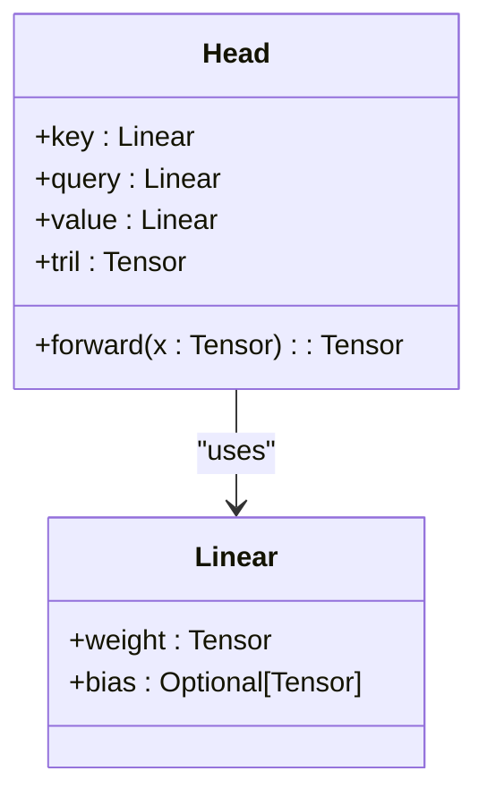
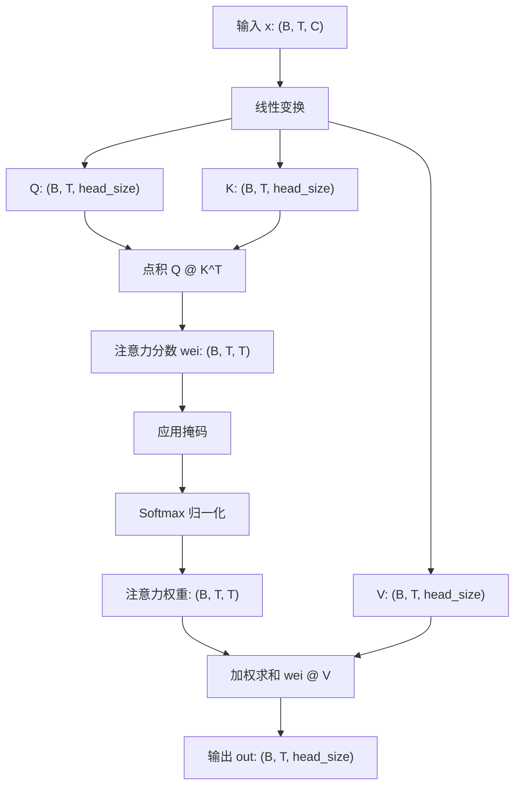

# 自注意力机制

<cite>
**Referenced Files in This Document**   
- [babygpt_v3_self_attention.py](file://babygpt_v3_self_attention.py)
- [babygpt_v4_multihead_attention.py](file://babygpt_v4_multihead_attention.py)
</cite>

## 目录
1. [引言](#引言)
2. [核心组件分析](#核心组件分析)
3. [自注意力机制的数学原理](#自注意力机制的数学原理)
4. [张量维度变化详解](#张量维度变化详解)
5. [单头注意力的局限性与多头注意力铺垫](#单头注意力的局限性与多头注意力铺垫)
6. [总结](#总结)

## 引言

自注意力机制（Self-Attention）是现代大型语言模型的核心组件，它使模型能够动态地关注输入序列中不同位置的信息。本文将深入解析 `babygpt_v3_self_attention.py` 文件中的代码实现，详细阐述查询（Query）、键（Key）、值（Value）的计算过程，解释注意力分数缩放的数学原理，以及通过 `tril` 矩阵实现因果掩码（Causal Masking）的技术细节。通过清晰的张量维度变化示例和直观的类比，确保不同背景的读者都能理解这一关键机制。

## 核心组件分析

本节分析实现自注意力机制的核心类 `Head`。



**Diagram sources**
- [babygpt_v3_self_attention.py](file://babygpt_v3_self_attention.py#L38-L58)

**Section sources**
- [babygpt_v3_self_attention.py](file://babygpt_v3_self_attention.py#L38-L58)

### 查询、键、值的计算

在 `Head` 类的 `forward` 方法中，输入张量 `x` 的形状为 `(B, T, C)`，其中 `B` 是批次大小（batch size），`T` 是序列长度（block size），`C` 是嵌入维度（n_embed）。

- **查询（Query）**：通过 `self.query(x)` 计算，这是一个线性变换，将输入从 `C` 维映射到 `head_size` 维。其作用类似于“问题”，表示当前词元想要从其他词元中获取什么样的信息。
- **键（Key）**：通过 `self.key(x)` 计算，同样是一个线性变换。其作用类似于“标签”或“索引”，表示每个词元可以被查询的特征。
- **值（Value）**：通过 `self.value(x)` 计算，也是一个线性变换。其作用类似于“内容”或“信息本身”，表示每个词元所承载的实际信息。

这三个线性层的权重矩阵是模型在训练过程中学习得到的，它们共同决定了模型如何从输入中提取用于计算注意力的特征。

### 注意力分数的计算与缩放

计算出 `q`、`k`、`v` 后，下一步是计算注意力分数（attention scores）：
```python
wei = q @ k.transpose(-2, -1) / (k.size(-1) ** 0.5)
```

1.  **点积计算**：`q @ k.transpose(-2, -1)` 计算查询和键的点积。`k.transpose(-2, -1)` 将 `k` 的最后两个维度转置，使其形状从 `(B, T, head_size)` 变为 `(B, head_size, T)`。点积的结果 `wei` 形状为 `(B, T, T)`，其中 `wei[i, j]` 表示第 `i` 个位置的查询与第 `j` 个位置的键的相似度。

2.  **缩放（Scaling）**：点积结果除以 `sqrt(head_size)`，即 `(k.size(-1) ** 0.5)`。这是缩放点积注意力（Scaled Dot-Product Attention）的关键步骤。

**缩放的原因**：当 `head_size` 较大时，点积的结果方差会变大，导致某些值非常大或非常小。经过 `Softmax` 函数后，这些极端值会使输出的分布变得非常尖锐（接近 one-hot），即模型会过度关注少数几个位置，而忽略其他位置，这不利于信息的均衡融合。通过除以 `sqrt(head_size)`，可以有效地将点积结果的方差稳定在一个合理的范围内，使得 `Softmax` 函数的输入更加平滑，从而产生更稳定、更均衡的注意力权重分布。

### 因果掩码（Causal Masking）

为了确保模型在预测时只能关注到当前及之前的位置（即不能“偷看”未来的信息），代码中使用了因果掩码：
```python
wei = wei.masked_fill(self.tril[:T, :T] == 0, float('-inf'))
```

- `self.tril` 是在 `__init__` 方法中通过 `self.register_buffer('tril', torch.tril(torch.ones(block_size, block_size)))` 创建的。`torch.tril` 生成一个下三角矩阵，其主对角线及以下元素为 1，上三角元素为 0。
- `wei.masked_fill(...)` 将 `wei` 中对应于 `tril` 矩阵中为 0 的位置（即上三角部分）的值替换为负无穷大（`float('-inf')`）。
- 在后续的 `F.softmax(wei, dim=-1)` 操作中，`Softmax` 函数会将负无穷大的值映射为 0。因此，最终的注意力权重矩阵中，每个位置只能看到它自身和它之前的位置，实现了自回归（autoregressive）的生成过程。

### 加权求和得到输出

最后，将经过 `Softmax` 归一化后的注意力权重 `wei` 与值 `v` 进行加权求和：
```python
out = wei @ v
```
- `wei` 的形状是 `(B, T, T)`，`v` 的形状是 `(B, T, head_size)`。
- 矩阵乘法的结果 `out` 形状为 `(B, T, head_size)`。
- 这个操作的含义是：对于输出序列中的每一个位置 `i`，其输出向量是所有输入位置的 `v` 向量的加权平均，权重由 `wei[i, :]` 提供。权重越大，表示该位置的 `v` 对当前位置的输出贡献越大。

## 自注意力机制的数学原理

自注意力机制的整体计算过程可以用以下数学公式表示：

1.  **线性变换**：
    $$
    \mathbf{Q} = \mathbf{X}\mathbf{W}_Q, \quad \mathbf{K} = \mathbf{X}\mathbf{W}_K, \quad \mathbf{V} = \mathbf{X}\mathbf{W}_V
    $$
    其中 $\mathbf{X} \in \mathbb{R}^{T \times C}$ 是输入序列，$\mathbf{W}_Q, \mathbf{W}_K, \mathbf{W}_V \in \mathbb{R}^{C \times d_k}$ 是可学习的权重矩阵。

2.  **计算注意力分数**：
    $$
    \text{Attention}(\mathbf{Q}, \mathbf{K}, \mathbf{V}) = \text{softmax}\left(\frac{\mathbf{Q}\mathbf{K}^T}{\sqrt{d_k}} + \mathbf{M}\right)\mathbf{V}
    $$
    其中 $d_k$ 是 `head_size`，$\mathbf{M}$ 是掩码矩阵（在本例中，`M[i,j] = -inf` 当 `i < j`，否则为 0）。

**Section sources**
- [babygpt_v3_self_attention.py](file://babygpt_v3_self_attention.py#L45-L55)

## 张量维度变化详解

下图清晰地展示了自注意力机制中张量的维度变化过程。



**Diagram sources**
- [babygpt_v3_self_attention.py](file://babygpt_v3_self_attention.py#L45-L55)

## 单头注意力的局限性与多头注意力铺垫

虽然单头注意力机制已经非常强大，但它也存在局限性。一个注意力头可能只能捕捉到输入序列中的一种特定类型的依赖关系（例如，只关注语法结构或只关注语义相似性）。为了克服这一局限，模型引入了多头注意力（Multi-Head Attention）机制。

在 `babygpt_v4_multihead_attention.py` 文件中，可以看到 `MultiHeadAttention` 类将多个 `Head` 实例并行组合：
```python
class MultiHeadAttention(nn.Module):
    def __init__(self, num_heads, head_size):
        super().__init__()
        self.heads = nn.ModuleList([Head(head_size) for _ in range(num_heads)])

    def forward(self, x):
        return torch.cat([h(x) for h in self.heads], dim=-1)
```
- 每个注意力头都有独立的 `W_Q`, `W_K`, `W_V` 参数，因此可以学习到不同的表示子空间。
- 所有头的输出被拼接（`torch.cat`）在一起，从而让模型能够同时关注来自不同表示子空间的信息，极大地增强了模型的表达能力。

**Section sources**
- [babygpt_v4_multihead_attention.py](file://babygpt_v4_multihead_attention.py#L69-L77)

## 总结

本文深入剖析了 `babygpt_v3_self_attention.py` 中实现的自注意力机制。我们了解到，该机制通过计算查询、键、值来衡量序列内部各位置间的相关性，并通过缩放点积和因果掩码来稳定训练和保证自回归性。张量维度从 `(B, T, C)` 到 `(B, T, T)` 再到 `(B, T, head_size)` 的变化过程，清晰地展示了信息融合的路径。最后，我们指出了单头注意力的局限性，并介绍了多头注意力作为其自然的扩展，为构建更强大的语言模型奠定了基础。