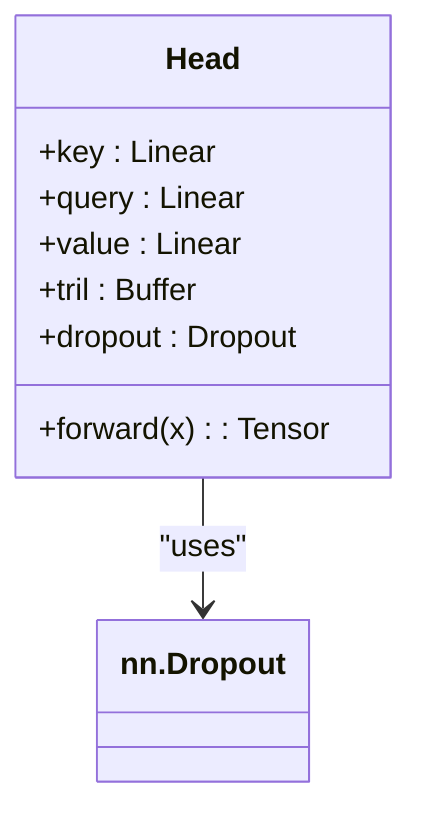
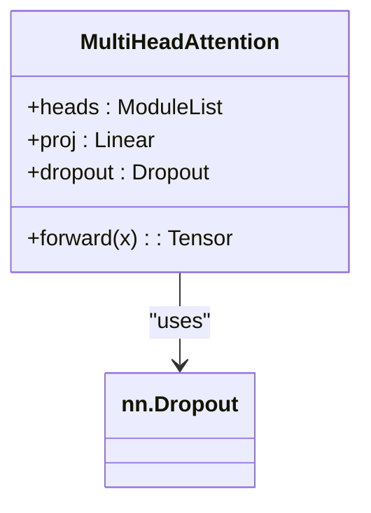
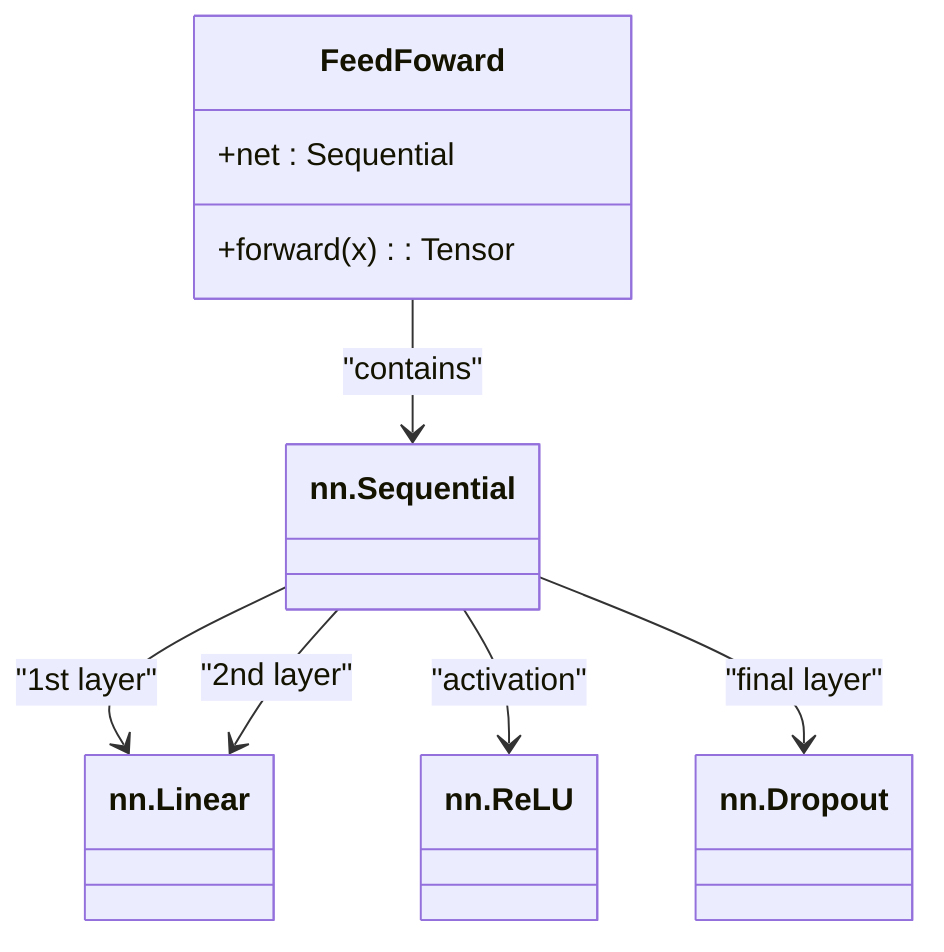
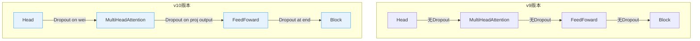

# v10：Dropout正则化

<cite>
**Referenced Files in This Document**   
- [babygpt_v10_dropout.py](file://babygpt_v10_dropout.py)
- [babygpt_v9_layer_norm.py](file://babygpt_v9_layer_norm.py)
- [babygpt_v11_hyper_params.py](file://babygpt_v11_hyper_params.py)
</cite>

## Table of Contents
1. [Dropout正则化技术概述](#dropout正则化技术概述)
2. [全局Dropout超参数定义](#全局dropout超参数定义)
3. [Head类中的Dropout实现](#head类中的dropout实现)
4. [MultiHeadAttention类中的Dropout实现](#multiheadattention类中的dropout实现)
5. [FeedFoward类中的Dropout实现](#feedforward类中的dropout实现)
6. [Dropout在训练与推理模式下的行为差异](#dropout在训练与推理模式下的行为差异)
7. [代码结构对比分析](#代码结构对比分析)

## Dropout正则化技术概述

Dropout是一种广泛应用于神经网络的正则化技术，旨在防止模型过拟合并提高其泛化能力。在训练过程中，Dropout通过随机将一部分神经元的输出置零，强制网络不依赖于任何单一神经元，从而促使模型学习到更加鲁棒和分散的特征表示。这种随机失活机制有效地减少了神经元之间的复杂共适应关系，使得模型在面对新数据时表现更加稳定。

在v10版本中，Dropout技术被系统性地引入到模型的多个关键组件中，包括自注意力机制的单个注意力头（Head）、多头注意力模块（MultiHeadAttention）以及前馈神经网络（FeedFoward）。这一改进显著增强了模型的抗过拟合能力，特别是在处理大规模文本数据时，能够有效避免模型对训练集的过度记忆。

**Section sources**
- [babygpt_v10_dropout.py](file://babygpt_v10_dropout.py#L1-L206)

## 全局Dropout超参数定义

在v10版本中，Dropout的比例作为一个全局超参数在代码的顶部被明确定义。该参数以浮点数形式表示，其值决定了在训练过程中每个Dropout层随机失活神经元的比例。

```python
dropout = 0.2 # dropout的比例
```

此全局变量`dropout`的值为0.2，意味着在训练期间，每个应用了Dropout的层中，平均有20%的神经元输出会被随机置零。这个超参数被所有需要Dropout的组件所共享，确保了正则化强度在整个模型中的一致性。通过集中定义，开发者可以方便地调整整个模型的正则化程度，而无需在每个组件内部单独修改。

**Section sources**
- [babygpt_v10_dropout.py](file://babygpt_v10_dropout.py#L15)

## Head类中的Dropout实现

在`Head`类中，Dropout层被精心地放置在注意力权重计算之后。具体而言，该层被应用于经过Softmax函数归一化后的注意力权重矩阵`wei`上。



**Diagram sources**
- [babygpt_v10_dropout.py](file://babygpt_v10_dropout.py#L80-L102)

在`Head`类的`__init__`方法中，通过`self.dropout = nn.Dropout(dropout)`初始化了一个Dropout层。在`forward`方法的执行流程中，计算得到的注意力权重`wei`在与值向量`v`进行矩阵乘法之前，会先经过`wei = self.dropout(wei)`这一步骤。这种设计确保了注意力机制在聚合信息时，其关注的权重分布本身也受到随机失活的影响，从而增加了模型的多样性，防止其过度依赖于某些固定的注意力模式。

**Section sources**
- [babygpt_v10_dropout.py](file://babygpt_v10_dropout.py#L80-L102)

## MultiHeadAttention类中的Dropout实现

在`MultiHeadAttention`类中，Dropout层被应用于多头注意力机制的最终输出上，具体位置在投影层（`proj`）之后。



**Diagram sources**
- [babygpt_v10_dropout.py](file://babygpt_v10_dropout.py#L63-L78)

该类在初始化时创建了一个Dropout层实例`self.dropout`。在`forward`方法中，所有注意力头的输出被拼接（`torch.cat`）并经过线性投影层`self.proj`映射回原始嵌入维度后，其结果`out`会再经过`out = self.dropout(out)`操作。这一层Dropout作用于整个多头注意力模块的综合输出，进一步对特征表示进行随机正则化，增强了模型的鲁棒性。

**Section sources**
- [babygpt_v10_dropout.py](file://babygpt_v10_dropout.py#L63-L78)

## FeedFoward类中的Dropout实现

在`FeedFoward`类中，Dropout层被集成在前馈神经网络的序列化结构（`nn.Sequential`）的末尾。



**Diagram sources**
- [babygpt_v10_dropout.py](file://babygpt_v10_dropout.py#L54-L62)

`FeedFoward`类的`net`属性是一个由线性层、ReLU激活函数和Dropout层组成的序列。其结构为：首先将输入从`n_embed`维度扩展到`n_embed * 4`维度，然后应用ReLU激活，接着通过另一个线性层将其压缩回`n_embed`维度，最后应用Dropout。这种将Dropout置于网络末端的设计，确保了前馈网络的最终输出特征也受到正则化影响，有效防止了网络在非线性变换后产生过于复杂的、可能过拟合的特征。

**Section sources**
- [babygpt_v10_dropout.py](file://babygpt_v10_dropout.py#L54-L62)

## Dropout在训练与推理模式下的行为差异

Dropout层的行为会根据模型所处的模式（训练或推理）自动调整。当模型处于训练模式（`model.train()`）时，Dropout层会按照预设的`dropout`比例（如0.2）随机将输入张量中的元素置零，并对剩余元素进行缩放以保持整体期望值不变。

然而，在推理或评估阶段，当调用`model.eval()`方法时，Dropout层会自动失效。此时，Dropout层的行为变为恒等映射（identity function），即直接将输入原封不动地传递给输出。这种设计是Dropout正则化技术的核心：在训练时引入随机性以增强泛化能力，在推理时则使用完整的、未失活的网络进行确定性预测，从而获得更稳定和准确的结果。开发者无需手动干预，PyTorch框架会自动根据模型的`training`标志来切换Dropout层的行为。

**Section sources**
- [babygpt_v10_dropout.py](file://babygpt_v10_dropout.py#L157-L165)

## 代码结构对比分析

通过对v9和v10版本的代码进行对比，可以清晰地看到Dropout的引入过程。在v9版本中，`Head`、`MultiHeadAttention`和`FeedFoward`类均未包含任何Dropout层。而v10版本在这些类的初始化方法中均添加了`self.dropout = nn.Dropout(dropout)`的定义，并在相应的`forward`方法中调用了该层。



**Diagram sources**
- [babygpt_v9_layer_norm.py](file://babygpt_v9_layer_norm.py#L40-L100)
- [babygpt_v10_dropout.py](file://babygpt_v10_dropout.py#L40-L102)

这一系列修改体现了从基础模型到具备更强正则化能力的演进。全局超参数`dropout`的引入也使得正则化强度的调整变得极为便捷。后续的v11版本继承了v10的Dropout设计，证明了该技术的有效性和稳定性。

**Section sources**
- [babygpt_v9_layer_norm.py](file://babygpt_v9_layer_norm.py#L40-L100)
- [babygpt_v10_dropout.py](file://babygpt_v10_dropout.py#L40-L102)
- [babygpt_v11_hyper_params.py](file://babygpt_v11_hyper_params.py#L39-L86)