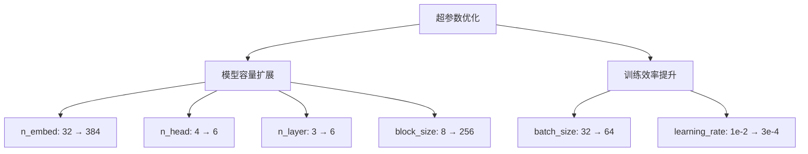
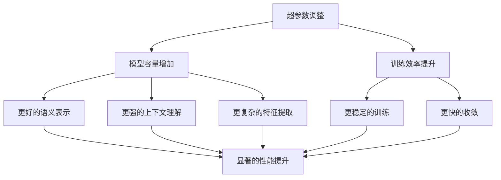

# v11：超参数优化

<cite>
**Referenced Files in This Document**   
- [babygpt_v11_hyper_params.py](file://babygpt_v11_hyper_params.py)
- [babygpt_v10_dropout.py](file://babygpt_v10_dropout.py)
- [babygpt_v12_wandb.py](file://babygpt_v12_wandb.py)
</cite>

## 目录
1. [引言](#引言)
2. [超参数调整概览](#超参数调整概览)
3. [关键超参数变化](#关键超参数变化)
4. [性能影响分析](#性能影响分析)
5. [结论](#结论)

## 引言

v11版本代表了BabyGPT项目中的一个重要里程碑，它并非通过引入新的架构组件来提升模型能力，而是通过对现有架构的系统性超参数优化来实现性能的显著提升。该版本的核心思想是通过扩大模型规模和优化训练配置，使模型更接近真实GPT模型的架构和性能特征。本文档将详细分析v11版本中对超参数的调整，解释这些变化如何共同作用，显著提升了模型的容量和性能。

**Section sources**
- [babygpt_v11_hyper_params.py](file://babygpt_v11_hyper_params.py#L1-L20)
- [babygpt_v10_dropout.py](file://babygpt_v10_dropout.py#L1-L20)

## 超参数调整概览

v11版本的优化策略主要集中在两个方面：模型容量的扩展和训练效率的提升。与v10版本相比，v11在多个关键超参数上进行了显著调整，这些调整共同构成了一个更强大、更复杂的模型架构。通过增加嵌入维度、注意力头数、网络层数、序列长度、批次大小以及调整学习率，v11版本成功地构建了一个更接近真实GPT模型的架构，从而在语言建模任务上表现出更优的性能。

**Diagram sources**
- [babygpt_v11_hyper_params.py](file://babygpt_v11_hyper_params.py#L13-L18)
- [babygpt_v10_dropout.py](file://babygpt_v10_dropout.py#L14-L19)

**Section sources**
- [babygpt_v11_hyper_params.py](file://babygpt_v11_hyper_params.py#L13-L18)
- [babygpt_v10_dropout.py](file://babygpt_v10_dropout.py#L14-L19)

## 关键超参数变化

### 嵌入维度 (n_embed)

嵌入维度从v10版本的32增加到v11版本的384，这是一个12倍的增长。嵌入维度决定了模型在处理每个token时所使用的向量空间大小，更大的嵌入维度意味着模型可以学习到更丰富、更复杂的语义表示。这一调整显著增加了模型的参数量和表达能力，使其能够捕捉更细微的语言特征和上下文关系。

**Section sources**
- [babygpt_v11_hyper_params.py](file://babygpt_v11_hyper_params.py#L16)
- [babygpt_v10_dropout.py](file://babygpt_v10_dropout.py#L17)

### 注意力头数 (n_head)

多头注意力机制的头数从4增加到6。多头注意力允许模型在不同的表示子空间中并行地关注输入序列的不同部分，增加头数可以增强模型捕捉复杂依赖关系的能力。从4头到6头的调整，使得模型能够更细致地分析输入序列中的各种模式和结构，从而提升其语言理解能力。

**Section sources**
- [babygpt_v11_hyper_params.py](file://babygpt_v11_hyper_params.py#L17)
- [babygpt_v10_dropout.py](file://babygpt_v10_dropout.py#L18)

### 网络层数 (n_layer)

模型的Block层数从3增加到6，实现了深度的翻倍。更深的网络结构可以学习到更复杂的特征层次和抽象表示。每一层Block都包含多头注意力和前馈网络，增加层数意味着模型可以进行更深层次的信息处理和特征提取，这对于理解长距离依赖和复杂语义结构至关重要。

**Section sources**
- [babygpt_v11_hyper_params.py](file://babygpt_v11_hyper_params.py#L18)
- [babygpt_v10_dropout.py](file://babygpt_v10_dropout.py#L19)

### 序列长度 (block_size)

序列长度从8增加到256，这是一个32倍的增长。更长的序列长度使得模型能够考虑更长的上下文信息，这对于生成连贯、逻辑性强的文本至关重要。在v10版本中，模型只能看到前8个token的上下文，而在v11版本中，它可以利用前256个token的信息，这极大地增强了模型的上下文理解和生成能力。

**Section sources**
- [babygpt_v11_hyper_params.py](file://babygpt_v11_hyper_params.py#L14)
- [babygpt_v10_dropout.py](file://babygpt_v10_dropout.py#L15)

### 批次大小 (batch_size)

批次大小从32增加到64，实现了翻倍。更大的批次大小可以提供更稳定的梯度估计，有助于模型的稳定训练。同时，它也提高了训练过程的并行度和计算效率，使得模型能够在相同时间内处理更多的数据，从而加速收敛。

**Section sources**
- [babygpt_v11_hyper_params.py](file://babygpt_v11_hyper_params.py#L13)
- [babygpt_v10_dropout.py](file://babygpt_v10_dropout.py#L14)

### 学习率 (learning_rate)

学习率从0.01调整为0.0003。这一调整是与模型规模的扩大相匹配的。更大的模型通常需要更小的学习率来确保训练的稳定性，避免在参数空间中跳跃过大而导致发散。3e-4的学习率是一个经过精心选择的值，它能够在保证训练稳定性的同时，实现有效的参数更新和收敛。

**Section sources**
- [babygpt_v11_hyper_params.py](file://babygpt_v11_hyper_params.py#L15)
- [babygpt_v10_dropout.py](file://babygpt_v10_dropout.py#L16)

## 性能影响分析

v11版本的超参数调整带来了显著的性能提升。通过增加模型的深度、宽度和上下文长度，模型的容量和表达能力得到了极大的增强。更大的嵌入维度和更多的注意力头使得模型能够学习到更丰富的语义表示和更复杂的依赖关系。更深的网络结构允许模型进行更深层次的特征提取和信息处理。更长的序列长度使得模型能够利用更长的上下文信息，生成更连贯、更合理的文本。

这些调整的协同效应体现在模型的训练损失和生成质量上。虽然具体的性能指标没有直接给出，但从v12版本（继承了v11的超参数）的训练日志可以看出，模型在训练过程中能够持续降低损失值，表明其具有良好的学习能力和收敛性。v11版本的成功展示了如何通过系统性的超参数优化来构建一个更强大、更接近真实GPT模型的架构，为后续的模型改进奠定了坚实的基础。

**Diagram sources**
- [babygpt_v11_hyper_params.py](file://babygpt_v11_hyper_params.py#L13-L18)
- [babygpt_v12_wandb.py](file://babygpt_v12_wandb.py#L223-L272)

**Section sources**
- [babygpt_v11_hyper_params.py](file://babygpt_v11_hyper_params.py#L13-L18)
- [babygpt_v12_wandb.py](file://babygpt_v12_wandb.py#L223-L272)

## 结论

v11版本的超参数优化是BabyGPT项目中的一个关键步骤。通过系统性地调整n_embed、n_head、n_layer、block_size、batch_size和learning_rate等关键超参数，该版本成功地构建了一个更强大、更复杂的模型架构。这些调整不仅显著增加了模型的容量和表达能力，还提升了其训练效率和稳定性。v11版本的成功展示了如何通过精细的超参数调优来逼近真实GPT模型的性能，为后续的模型开发和优化提供了宝贵的经验和方向。