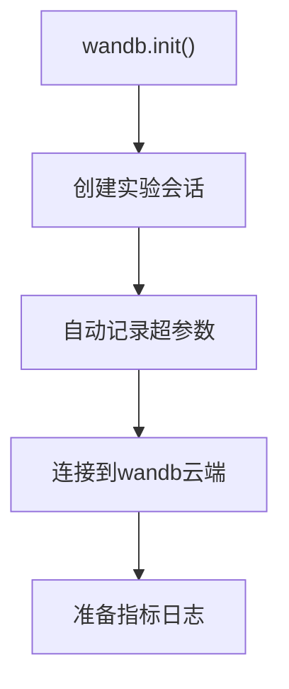
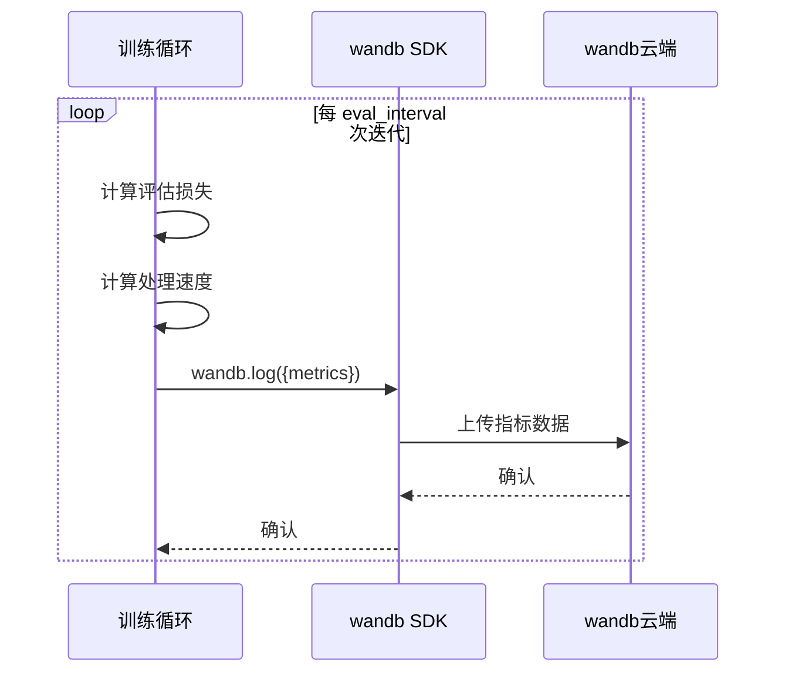

# v12：wandb集成

<cite>
**Referenced Files in This Document**   
- [babygpt_v12_wandb.py](file://babygpt_v12_wandb.py)
- [README.md](file://README.md)
</cite>

## 目录
1. [引言](#引言)
2. [wandb实验跟踪集成](#wandb实验跟踪集成)
3. [训练指标监控](#训练指标监控)
4. [模型持久化](#模型持久化)
5. [总结](#总结)

## 引言

在`babygpt_v12_wandb.py`版本中，项目集成了Weights & Biases (wandb) 服务，以实现对机器学习实验的全面跟踪和可视化。该版本在v11的基础上，不仅增强了对训练过程的监控能力，还引入了模型保存功能，显著提升了实验的可复现性和结果的可分析性。本文件旨在详细阐述v12版本中wandb的集成方式、核心功能及其带来的优势。

**Section sources**
- [babygpt_v12_wandb.py](file://babygpt_v12_wandb.py#L1-L50)

## wandb实验跟踪集成

v12版本的核心改进是通过`wandb.init()`函数初始化一个实验记录会话。此调用在脚本的早期阶段执行，标志着一次新的训练实验的开始。

**Diagram sources**
- [babygpt_v12_wandb.py](file://babygpt_v12_wandb.py#L24-L38)

**Section sources**
- [babygpt_v12_wandb.py](file://babygpt_v12_wandb.py#L24-L38)

### 实验会话初始化

`wandb.init()`函数的调用是整个集成过程的起点。它负责在本地和wandb的云端服务器之间建立连接，并为本次运行创建一个唯一的“运行”（run）实例。这个实例将作为所有后续日志记录的容器。

### 超参数自动记录

该函数的关键参数是`config`字典。在v12版本中，开发者将所有关键的超参数（如学习率、批次大小、嵌入维度等）预先定义为全局变量，并将它们作为键值对传入`config`字典。当`wandb.init()`被调用时，它会自动捕获并记录这些超参数。这确保了实验的配置是透明且可追溯的，任何后续的分析都可以精确地知道该次训练是在何种参数设置下进行的，极大地促进了结果的可复现性。

## 训练指标监控

为了实时监控模型的训练动态，v12版本在训练循环中周期性地使用`wandb.log()`函数将关键指标上传到wandb云端。

**Diagram sources**
- [babygpt_v12_wandb.py](file://babygpt_v12_wandb.py#L199-L221)

**Section sources**
- [babygpt_v12_wandb.py](file://babygpt_v12_wandb.py#L199-L221)

### 指标日志记录

`wandb.log()`函数被放置在一个条件判断内，确保它只在每`eval_interval`次迭代后执行。它接收一个包含多个指标的字典作为参数，这些指标包括：
- **训练损失 (train_loss)** 和 **验证损失 (val_loss)**：通过`estimate_loss`函数计算，反映了模型在训练集和验证集上的性能。
- **tokens_per_sec**：计算自训练开始以来平均每秒处理的token数量，用于衡量训练效率。
- **iteration**：当前的迭代次数，用于在时间轴上对齐所有指标。

### 可视化与比较

通过将这些指标上传到wandb云端，开发者可以利用wandb强大的仪表板功能。该仪表板提供实时的、交互式的图表，允许用户：
- **监控训练动态**：直观地观察训练损失和验证损失的收敛趋势，判断模型是否过拟合或欠拟合。
- **比较不同实验**：并排比较不同超参数配置下运行的多个实验，快速识别出性能最佳的模型。
- **深入分析**：探索不同指标之间的关系，例如处理速度是否随着迭代次数增加而下降。

## 模型持久化

除了实验跟踪，v12版本还增加了模型保存的功能，这对于保存训练成果至关重要。

**Diagram sources**
- [babygpt_v12_wandb.py](file://babygpt_v12_wandb.py#L223-L224)

**Section sources**
- [babygpt_v12_wandb.py](file://babygpt_v12_wandb.py#L223-L224)

### 模型保存机制

在训练循环结束后，代码使用`torch.save()`函数将训练好的模型状态字典（`model.state_dict()`）序列化并保存到名为`model.pth`的文件中。`state_dict`包含了模型所有可学习参数（权重和偏置）的张量。通过保存这个字典，可以在未来加载它来恢复模型的完整状态，用于推理、继续训练或部署。

## 总结

v12版本通过集成Weights & Biases，为项目带来了专业的实验管理能力。`wandb.init()`和`wandb.log()`的结合，实现了从超参数记录到训练指标监控的全流程自动化，为模型开发提供了强大的数据支持和可视化工具。同时，`torch.save()`的引入确保了训练成果可以被可靠地保存和复用。这两项功能的结合，使得v12版本不仅是一个功能性的模型实现，更是一个具备良好工程实践的、可复现的机器学习项目。