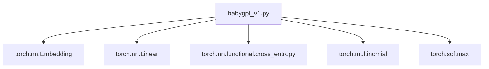

# v1：基础嵌入与线性层

<cite>
**本文档中引用的文件**  
- [babygpt_v1.py](file://babygpt_v1.py)
</cite>

## 目录
1. [简介](#简介)
2. [项目结构](#项目结构)
3. [核心组件](#核心组件)
4. [架构概述](#架构概述)
5. [详细组件分析](#详细组件分析)
6. [依赖分析](#依赖分析)
7. [性能考虑](#性能考虑)
8. [故障排除指南](#故障排除指南)
9. [结论](#结论)

## 简介
本文档深入分析 `babygpt_v1.py` 中实现的基础模型架构。该模型是构建大型语言模型过程中的第一个关键步骤，展示了如何使用嵌入层和线性层来处理文本数据。文档将详细解释模型的核心机制，包括输入 token 如何通过 `nn.Embedding` 层映射到嵌入空间，以及如何通过语言模型头（`nn.Linear`）进行预测。同时，本文档将阐述 `forward` 函数中 logits 的生成过程、损失函数的计算方式以及 `generate` 方法的自回归生成逻辑，并指出该版本模型的关键局限性。

## 项目结构
该项目是一个渐进式构建大型语言模型（LLM）的教学代码库，包含多个版本的 `babygpt` 实现，从最基础的 v1 版本逐步演进到更复杂的 v12 版本。`babygpt_v1.py` 是整个系列的起点，它实现了一个极简但功能完整的语言模型，仅依赖于嵌入层和线性层，为理解后续版本中引入的注意力机制、位置编码等复杂概念奠定了基础。

## 核心组件
`babygpt_v1.py` 的核心组件包括一个 `Tokenizer` 类用于文本的编码与解码，以及一个 `BabyGPT` 类作为模型的主体。`BabyGPT` 模型由两个主要的神经网络层构成：`token_embedding_table` 用于将离散的 token 转换为连续的向量表示，以及 `lm_head` 用于将这些向量表示转换回词汇表上的概率分布以进行预测。

**Section sources**
- [babygpt_v1.py](file://babygpt_v1.py#L38-L65)

## 架构概述
v1 版本的模型架构极其简洁，遵循“嵌入-预测”的基本范式。其核心思想是将每个输入的 token 索引转换为一个高维的稠密向量（嵌入），然后直接通过一个线性变换来预测下一个 token。

```mermaid
graph TD
A[输入 Token IDs] --> B[nn.Embedding]
B --> C[嵌入向量 (B, T, n_embd)]
C --> D[nn.Linear (语言模型头)]
D --> E[Logits (B, T, vocab_size)]
E --> F[Softmax]
F --> G[输出概率分布]
```

**Diagram sources**
- [babygpt_v1.py](file://babygpt_v1.py#L40-L41)

## 详细组件分析

### 嵌入与预测流程分析
`BabyGPT` 模型的 `forward` 方法定义了数据的前向传播流程。该流程是理解模型如何学习和预测的关键。

#### 前向传播（forward）函数
`forward` 函数是模型的核心，它接收一个包含 token ID 的张量 `idx`，并返回预测的 logits 和（在训练时）损失值。

1.  **嵌入层 (`token_embedding_table`)**：`idx` 张量的形状为 `(B, T)`，其中 `B` 是批次大小，`T` 是序列长度。`self.token_embedding_table(idx)` 通过查找表操作，将每个 token ID 映射到其对应的 `n_embd` 维嵌入向量。这一步的输出 `tok_emb` 形状为 `(B, T, n_embd)`，它将离散的符号信息转换为了连续的、可微的向量表示。
2.  **语言模型头 (`lm_head`)**：`self.lm_head(tok_emb)` 是一个线性全连接层，它将 `(B, T, n_embd)` 的嵌入向量重新投影到 `(B, T, vocab_size)` 维的空间。这个投影后的结果被称为 `logits`，它代表了模型对下一个 token 的原始、未归一化的预测分数。
3.  **损失计算 (`F.cross_entropy`)**：当提供 `targets` 参数时（即训练阶段），模型会计算损失。`logits` 和 `targets` 的形状会被重塑为二维，以满足 `F.cross_entropy` 函数的要求。损失函数通过比较模型预测的 `logits` 和真实的下一个 token `targets` 来衡量模型的预测误差，指导模型参数的更新。

```mermaid
flowchart TD
Start([forward(idx, targets)]) --> Embed["tok_emb = token_embedding_table(idx)"]
Embed --> Linear["logits = lm_head(tok_emb)"]
Linear --> HasTarget{"targets 存在?"}
HasTarget --> |是| ReshapeLogits["logits.view(B*T, C)"]
HasTarget --> |否| ReturnLogits["返回 logits, loss=None"]
ReshapeLogits --> ReshapeTargets["targets.view(B*T)"]
ReshapeTargets --> ComputeLoss["loss = F.cross_entropy(logits, targets)"]
ComputeLoss --> ReturnBoth["返回 logits, loss"]
```

**Diagram sources**
- [babygpt_v1.py](file://babygpt_v1.py#L45-L57)

**Section sources**
- [babygpt_v1.py](file://babygpt_v1.py#L45-L57)

### 文本生成方法分析
`generate` 方法实现了自回归文本生成，即模型根据已有的文本序列，一次生成一个新 token，并将其添加到序列末尾，用以生成下一个 token，如此循环。

#### 生成（generate）方法
该方法基于模型的预测能力，通过采样来创造新的文本。

1.  **循环生成**：方法在一个循环中运行 `max_new_tokens` 次，每次生成一个新 token。
2.  **获取预测**：`logits, _ = self(idx)` 调用 `forward` 方法，获取当前整个序列的预测 logits。我们只关心序列中最后一个 token 的预测结果，因此使用 `logits[:, -1, :]` 来提取它。
3.  **概率分布**：`F.softmax(logits, dim=-1)` 将最后一个 token 的 logits 转换为一个概率分布 `probs`，该分布表示了词汇表中每个 token 作为下一个 token 出现的可能性。
4.  **采样**：`torch.multinomial(probs, num_samples=1)` 根据这个概率分布进行随机采样，得到下一个 token 的索引 `idx_next`。
5.  **序列拼接**：`torch.cat((idx, idx_next), dim=1)` 将新生成的 token 拼接到原始输入序列 `idx` 的末尾，形成新的输入序列，用于下一次迭代。

```mermaid
flowchart TD
Start([generate(idx, max_new_tokens)]) --> Loop{"i < max_new_tokens?"}
Loop --> |是| Forward["logits, _ = self(idx)"]
Forward --> Extract["logits = logits[:, -1, :]"]
Extract --> Softmax["probs = F.softmax(logits, dim=-1)"]
Softmax --> Sample["idx_next = torch.multinomial(probs, 1)"]
Sample --> Concat["idx = torch.cat((idx, idx_next), dim=1)"]
Concat --> Loop
Loop --> |否| Return["返回 idx"]
```

**Diagram sources**
- [babygpt_v1.py](file://babygpt_v1.py#L58-L65)

**Section sources**
- [babygpt_v1.py](file://babygpt_v1.py#L58-L65)

### 模型局限性
v1 版本的模型存在一个根本性的局限：**它缺乏对序列中 token 顺序的感知能力**。在 `forward` 函数中，`token_embedding_table` 仅根据 token 本身的 ID 进行查找，而完全不考虑该 token 在序列中的位置。这意味着，对于模型而言，序列 `[A, B, C]` 和 `[C, B, A]` 中的 `B` 会被映射到完全相同的嵌入向量，因为它们的 token ID 相同。这种设计导致模型无法学习到“词序”这一语言的关键特征，使其本质上只能学习到词汇的共现统计，而无法理解语法结构和上下文依赖。后续的 `babygpt_v2_position.py` 版本通过引入位置嵌入（Positional Embedding）来解决此问题。

## 依赖分析
`babygpt_v1.py` 的依赖关系非常简单，主要依赖于 PyTorch 框架提供的核心模块，如 `torch.nn` 用于构建神经网络层，`torch.nn.functional` 用于损失函数和激活函数。模型本身不依赖于其他自定义的复杂模块，这体现了其作为基础版本的简洁性。



**Diagram sources**
- [babygpt_v1.py](file://babygpt_v1.py#L1-L3)

## 性能考虑
由于 v1 模型结构简单，其训练和推理速度非常快。然而，其性能（以损失值衡量）会迅速达到一个瓶颈，因为模型容量有限，且缺乏对上下文的理解能力。尽管训练损失可能下降，但由于模型无法捕捉序列顺序，其生成的文本质量会很差，通常表现为重复或无意义的词组。

## 故障排除指南
如果模型训练不收敛或生成的文本质量极差，首先应检查：
1.  **数据预处理**：确保 `ci.txt` 文件存在且编码正确，`Tokenizer` 能够正确地对文本进行编码和解码。
2.  **超参数设置**：检查 `n_embd`（嵌入维度）、`learning_rate`（学习率）、`batch_size`（批次大小）等超参数是否设置合理。过大的学习率可能导致训练不稳定。
3.  **模型局限性**：认识到 v1 模型天生无法理解词序，因此不应期望它能生成语法正确的长句。这是设计上的限制，而非代码错误。

## 结论
`babygpt_v1.py` 成功地构建了一个最基础的语言模型，清晰地展示了嵌入层和线性层在文本处理中的核心作用。它为理解现代大型语言模型的基石提供了完美的起点。通过分析其 `forward` 和 `generate` 方法，我们掌握了从 token 到嵌入、再到预测和生成的完整流程。同时，其明显的局限性——缺乏位置感知——也凸显了在语言模型中引入位置信息的必要性，为后续版本的演进指明了方向。