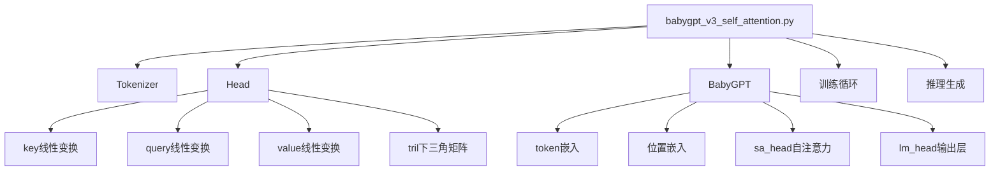
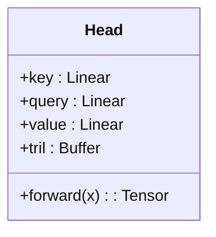
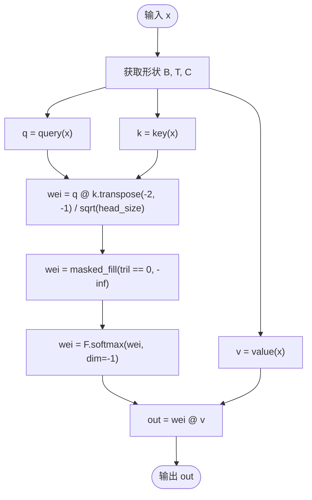
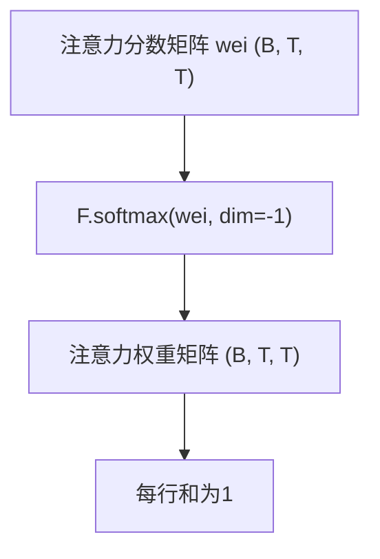
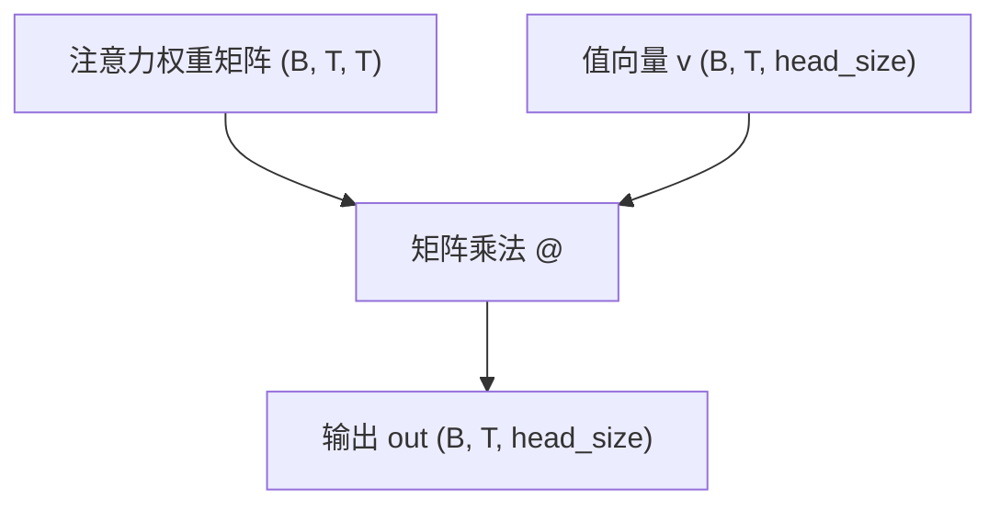
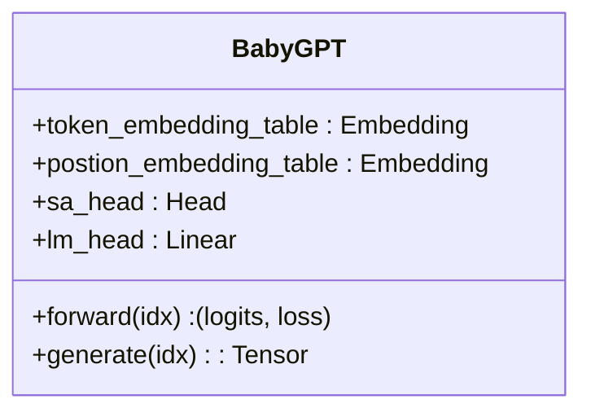

# v3：引入自注意力机制

<cite>
**本文档中引用的文件**   
- [babygpt_v3_self_attention.py](file://babygpt_v3_self_attention.py)
</cite>

## 目录
1. [项目结构](#项目结构)
2. [核心组件](#核心组件)
3. [自注意力机制详解](#自注意力机制详解)
4. [注意力头（Head）的实现](#注意力头head的实现)
5. [前向传播过程推导](#前向传播过程推导)
6. [因果掩码（Causal Masking）机制](#因果掩码causal-masking机制)
7. [注意力权重的归一化](#注意力权重的归一化)
8. [加权求和输出](#加权求和输出)
9. [自注意力头集成到主模型](#自注意力头集成到主模型)
10. [模型能力提升分析](#模型能力提升分析)

## 项目结构
本项目通过一系列版本迭代逐步构建BabyGPT模型。v3版本的核心文件`babygpt_v3_self_attention.py`引入了自注意力机制，为模型赋予了捕捉序列内部依赖关系的能力。该文件包含了完整的训练、推理流程以及自注意力模块的实现。



**图示来源**
- [babygpt_v3_self_attention.py](file://babygpt_v3_self_attention.py#L38-L56)

**本节来源**
- [babygpt_v3_self_attention.py](file://babygpt_v3_self_attention.py#L1-L159)

## 核心组件
v3版本的核心在于`Head`类的实现，它封装了自注意力机制的所有计算逻辑。同时，`BabyGPT`主模型类将这一机制集成，形成了具备上下文理解能力的神经网络。

**本节来源**
- [babygpt_v3_self_attention.py](file://babygpt_v3_self_attention.py#L38-L56)
- [babygpt_v3_self_attention.py](file://babygpt_v3_self_attention.py#L58-L100)

## 自注意力机制详解
自注意力机制是Transformer架构的核心，它允许模型在处理序列数据时，让每个位置的token能够关注序列中所有其他位置的token，从而捕捉长距离依赖关系。在v3版本中，这一机制通过`Head`类实现，其核心思想是为每个token计算一组`key`、`query`和`value`向量。

## 注意力头（Head）的实现
`Head`类是自注意力机制的具体实现单元。其内部结构如下：



**图示来源**
- [babygpt_v3_self_attention.py](file://babygpt_v3_self_attention.py#L38-L45)

**本节来源**
- [babygpt_v3_self_attention.py](file://babygpt_v3_self_attention.py#L38-L56)

### key、query、value线性变换层的作用
在`Head`类的初始化方法中，定义了三个关键的线性变换层：
- **key (键)**: `self.key = nn.Linear(n_embed, head_size, bias=False)`。该层将输入的嵌入向量转换为“键”向量。可以将“键”理解为当前token的“特征摘要”或“名片”，用于被其他token查询。
- **query (查询)**: `self.query = nn.Linear(n_embed, head_size, bias=False)`。该层将输入的嵌入向量转换为“查询”向量。可以将“查询”理解为当前token在寻找“我需要关注谁？”时发出的“问题”。
- **value (值)**: `self.value = nn.Linear(n_embed, head_size, bias=False)`。该层将输入的嵌入向量转换为“值”向量。可以将“值”理解为当前token所包含的“实际信息”或“内容”，当它被其他token关注时，这部分信息将被提取。

这三个变换层的参数在训练过程中会被学习，使得模型能够学会如何为不同的token生成最有效的`key`、`query`和`value`表示。

**本节来源**
- [babygpt_v3_self_attention.py](file://babygpt_v3_self_attention.py#L38-L45)

## 前向传播过程推导
`Head`类的`forward`方法定义了自注意力的计算流程。



**图示来源**
- [babygpt_v3_self_attention.py](file://babygpt_v3_self_attention.py#L47-L56)

**本节来源**
- [babygpt_v3_self_attention.py](file://babygpt_v3_self_attention.py#L47-L56)

### 注意力分数（wei）的计算
前向传播的第一步是计算注意力分数矩阵`wei`，其计算公式为 `q @ k.transpose(-2, -1) / (k.size(-1) ** 0.5)`。
1.  **矩阵乘法**: `q @ k.transpose(-2, -1)` 执行矩阵乘法。`q`的形状为`(B, T, head_size)`，`k`的转置形状为`(B, head_size, T)`。相乘后得到形状为`(B, T, T)`的矩阵。这个矩阵中的每个元素`wei[i, j]`表示第`i`个token的`query`向量与第`j`个token的`key`向量的点积。
2.  **点积的意义**: 点积衡量了两个向量的相似度。一个较大的点积值意味着第`i`个token的“问题”（query）与第`j`个token的“名片”（key）非常匹配，因此第`i`个token应该高度关注第`j`个token。
3.  **缩放因子**: 除以`sqrt(head_size)`是为了进行缩放操作。当`head_size`较大时，点积的结果可能会变得非常大，导致`softmax`函数的梯度变得非常小（进入饱和区），从而阻碍训练。缩放操作可以稳定梯度，使训练更加高效。

**本节来源**
- [babygpt_v3_self_attention.py](file://babygpt_v3_self_attention.py#L50)

## 因果掩码（Causal Masking）机制
为了确保模型在预测时只能利用过去的信息（即不能“偷看”未来的token），v3版本引入了因果掩码机制。

```mermaid
flowchart LR
subgraph "注意力分数矩阵 wei"
A[0,0] B[0,1] C[0,2] D[0,3]
E[1,0] F[1,1] G[1,2] H[1,3]
I[2,0] J[2,1] K[2,2] L[2,3]
M[3,0] N[3,1] O[3,2] P[3,3]
end
wei --> Masked["应用 tril 掩码"]
subgraph "掩码后矩阵"
A1[✓] B1[✗] C1[✗] D1[✗]
E1[✓] F1[✓] G1[✗] H1[✗]
I1[✓] J1[✓] K1[✓] L1[✗]
M1[✓] N1[✓] O1[✓] P1[✓]
end
style B1 fill:#f9f,stroke:#333
style C1 fill:#f9f,stroke:#333
style D1 fill:#f9f,stroke:#333
style G1 fill:#f9f,stroke:#333
style H1 fill:#f9f,stroke:#333
style L1 fill:#f9f,stroke:#333
```

**图示来源**
- [babygpt_v3_self_attention.py](file://babygpt_v3_self_attention.py#L43)
- [babygpt_v3_self_attention.py](file://babygpt_v3_self_attention.py#L51)

**本节来源**
- [babygpt_v3_self_attention.py](file://babygpt_v3_self_attention.py#L43)
- [babygpt_v3_self_attention.py](file://babygpt_v3_self_attention.py#L51)

### tril下三角矩阵与masked_fill
1.  **tril矩阵的创建**: 在`Head`的`__init__`方法中，`self.register_buffer('tril', torch.tril(torch.ones(block_size, block_size)))`创建了一个大小为`block_size x block_size`的下三角矩阵（lower triangular matrix）。这个矩阵的下三角（包括对角线）元素为1，上三角元素为0。
2.  **masked_fill的应用**: 在`forward`方法中，`wei = wei.masked_fill(self.tril[:T, :T] == 0, float('-inf'))`这行代码将`wei`矩阵中所有对应`tril`矩阵为0的位置（即上三角部分）填充为负无穷大（`-inf`）。
3.  **因果性的实现**: 当后续的`softmax`函数作用于这个矩阵时，负无穷大的值会变成0。这意味着，对于第`i`个token，它对所有`j > i`的未来token的注意力权重为0，从而强制模型只能关注当前及之前的token，实现了因果性。

**本节来源**
- [babygpt_v3_self_attention.py](file://babygpt_v3_self_attention.py#L43)
- [babygpt_v3_self_attention.py](file://babygpt_v3_self_attention.py#L51)

## 注意力权重的归一化
经过因果掩码处理后，注意力分数矩阵`wei`被送入`F.softmax(wei, dim=-1)`函数。



**图示来源**
- [babygpt_v3_self_attention.py](file://babygpt_v3_self_attention.py#L52)

**本节来源**
- [babygpt_v3_self_attention.py](file://babygpt_v3_self_attention.py#L52)

### Softmax的作用
`Softmax`函数沿最后一个维度（`dim=-1`）对`wei`矩阵的每一行进行归一化。其作用是将原始的注意力分数（可能为任意实数）转换为一个有效的概率分布。对于每个token `i`，其对应的权重行`wei[i, :]`经过`softmax`后，所有元素都变为非负数，并且总和为1。这使得这些权重可以被解释为：在生成token `i`时，模型将注意力分配给序列中各个token（包括自己）的“概率”或“重要性程度”。

**本节来源**
- [babygpt_v3_self_attention.py](file://babygpt_v3_self_attention.py#L52)

## 加权求和输出
最后一步是计算最终的输出`out`，其公式为 `out = wei @ v`。



**图示来源**
- [babygpt_v3_self_attention.py](file://babygpt_v3_self_attention.py#L53)

**本节来源**
- [babygpt_v3_self_attention.py](file://babygpt_v3_self_attention.py#L53)

### 输出的含义
这个矩阵乘法的计算过程是：对于每个token `i`，其输出向量`out[i]`是所有`value`向量`v[j]`的加权和，权重就是`wei[i, j]`。换句话说，模型根据计算出的注意力权重，从序列的所有`value`信息中“提取”和“混合”出一个全新的、富含上下文信息的表示。这个输出向量`out`既包含了token `i`自身的语义，也融合了它认为重要的上下文信息。

**本节来源**
- [babygpt_v3_self_attention.py](file://babygpt_v3_self_attention.py#L53)

## 自注意力头集成到主模型
自注意力头`Head`被集成到`BabyGPT`主模型中，作为其核心处理单元。



**图示来源**
- [babygpt_v3_self_attention.py](file://babygpt_v3_self_attention.py#L58-L64)

**本节来源**
- [babygpt_v3_self_attention.py](file://babygpt_v3_self_attention.py#L58-L100)

在`BabyGPT`的`forward`方法中，输入的token序列首先经过词嵌入和位置嵌入，然后将得到的嵌入向量`x`直接传递给`self.sa_head(x)`。自注意力头处理后的输出再经过一个线性层`lm_head`映射回词汇表空间，用于预测下一个token。

**本节来源**
- [babygpt_v3_self_attention.py](file://babygpt_v3_self_attention.py#L74)

## 模型能力提升分析
v3版本通过引入自注意力机制，使模型能力实现了质的飞跃：
1.  **捕捉长距离依赖**: 相比于v1和v2版本，模型不再局限于n-gram或简单的上下文窗口，而是能够直接计算任意两个token之间的相关性，有效捕捉长距离的语义依赖。
2.  **动态上下文感知**: 模型为每个token动态地计算注意力权重，这意味着它可以根据当前的上下文灵活地决定关注哪些信息，极大地增强了其上下文理解能力。
3.  **并行计算优势**: 自注意力的计算（除了因果掩码）本质上是并行的，这比RNN等序列模型具有更好的计算效率。

**本节来源**
- [babygpt_v3_self_attention.py](file://babygpt_v3_self_attention.py#L58-L100)
- [babygpt_v3_self_attention.py](file://babygpt_v3_self_attention.py#L38-L56)