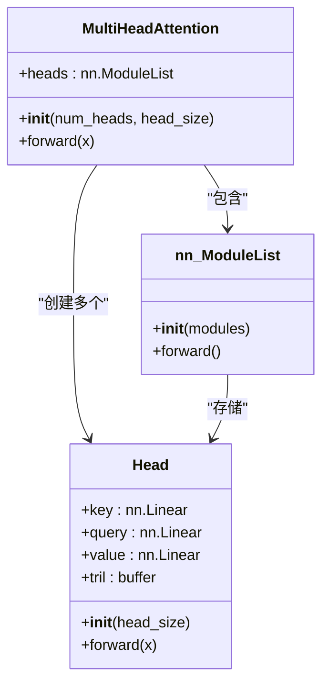
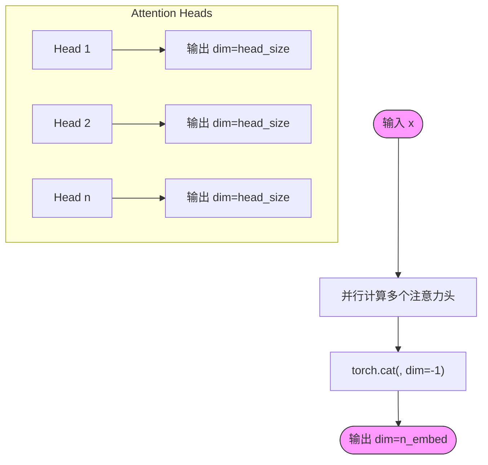
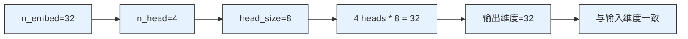

<cite>
**本文档中引用的文件**
- [babygpt_v4_multihead_attention.py](file://babygpt_v4_multihead_attention.py)
</cite>

## 目录
1. [引言](#引言)
2. [从单头到多头注意力的演进](#从单头到多头注意力的演进)
3. [MultiHeadAttention类的设计与实现](#multiheadattention类的设计与实现)
4. [前向传播中的并行计算与特征拼接](#前向传播中的并行计算与特征拼接)
5. [多头注意力的表征能力分析](#多头注意力的表征能力分析)
6. [维度设计与模型一致性](#维度设计与模型一致性)
7. [结论](#结论)

## 引言
本文档深入解析从单头注意力机制向多头注意力机制的演进过程，重点阐述`MultiHeadAttention`类的设计原理与实现细节。通过分析代码实现，揭示多头注意力如何通过并行计算多个注意力头来增强模型的表征能力，并保持输入输出维度的一致性。

**Section sources**
- [babygpt_v4_multihead_attention.py](file://babygpt_v4_multihead_attention.py#L1-L168)

## 从单头到多头注意力的演进
单头注意力机制虽然能够捕捉序列内部的依赖关系，但其局限性在于只能学习一种类型的依赖模式。多头注意力机制通过引入多个并行的注意力头，允许模型在不同的子空间中同时学习多种依赖关系。这种设计借鉴了卷积神经网络中使用多个滤波器的思想，通过多样化特征提取来增强模型的表达能力。

在实现上，多头注意力将输入的嵌入维度`n_embed`划分为`n_head`个子空间，每个子空间对应一个注意力头，其维度为`head_size = n_embed // n_head`。这种分而治之的策略使得每个注意力头可以专注于学习不同类型的上下文关系。

**Section sources**
- [babygpt_v4_multihead_attention.py](file://babygpt_v4_multihead_attention.py#L60-L68)
- [babygpt_v4_multihead_attention.py](file://babygpt_v4_multihead_attention.py#L110-L112)

## MultiHeadAttention类的设计与实现
`MultiHeadAttention`类继承自`nn.Module`，其核心设计是使用`nn.ModuleList`来管理多个注意力头实例。`nn.ModuleList`是一个特殊的PyTorch容器，能够正确地注册和管理模块列表，确保所有子模块的参数都能被自动追踪和优化。

**Diagram sources**
- [babygpt_v4_multihead_attention.py](file://babygpt_v4_multihead_attention.py#L60-L68)
- [babygpt_v4_multihead_attention.py](file://babygpt_v4_multihead_attention.py#L70-L88)

**Section sources**
- [babygpt_v4_multihead_attention.py](file://babygpt_v4_multihead_attention.py#L60-L68)

## 前向传播中的并行计算与特征拼接
在前向传播过程中，`MultiHeadAttention`类通过列表推导式并行执行所有注意力头的计算。每个注意力头独立处理相同的输入`x`，产生维度为`head_size`的输出。这些输出随后通过`torch.cat`函数在特征维度（`dim=-1`）上进行拼接，形成最终的输出张量。

**Diagram sources**
- [babygpt_v4_multihead_attention.py](file://babygpt_v4_multihead_attention.py#L65-L68)

**Section sources**
- [babygpt_v4_multihead_attention.py](file://babygpt_v4_multihead_attention.py#L65-L68)

## 多头注意力的表征能力分析
多头注意力机制的核心优势在于其能够并行地在不同子空间中学习不同的依赖关系。每个注意力头可以专注于捕捉特定类型的上下文信息，例如：

- 某些头可能专注于局部语法结构
- 某些头可能关注长距离语义依赖
- 某些头可能捕捉主题或情感信息

这种分工机制使得模型能够更全面地理解输入序列的复杂结构。通过将多个头的输出拼接，模型能够整合来自不同视角的信息，从而获得更丰富、更鲁棒的表征。

**Section sources**
- [babygpt_v4_multihead_attention.py](file://babygpt_v4_multihead_attention.py#L60-L68)
- [babygpt_v4_multihead_attention.py](file://babygpt_v4_multihead_attention.py#L70-L88)

## 维度设计与模型一致性
代码中`n_head`和`head_size`的计算关系`n_embed // n_head`是保持模型维度一致性的关键设计。这种设计确保了：

1. 每个注意力头的输出维度为`head_size = n_embed // n_head`
2. `n_head`个头的输出拼接后总维度为`n_head * (n_embed // n_head) = n_embed`
3. 输出维度与输入维度`n_embed`完全一致

这种设计使得多头注意力层可以无缝集成到深层神经网络中，无需额外的维度变换层。同时，它保证了模型架构的模块化和可扩展性，允许通过调整`n_head`参数来控制模型的复杂度。

**Diagram sources**
- [babygpt_v4_multihead_attention.py](file://babygpt_v4_multihead_attention.py#L110-L112)

**Section sources**
- [babygpt_v4_multihead_attention.py](file://babygpt_v4_multihead_attention.py#L110-L112)

## 结论
多头注意力机制通过并行计算多个注意力头，显著增强了Transformer模型的表征能力。`MultiHeadAttention`类的设计巧妙地利用`nn.ModuleList`管理多个头实例，并通过`torch.cat`在特征维度上拼接输出。维度计算关系`n_embed // n_head`确保了输入输出维度的一致性，使得该模块能够灵活地集成到各种深度学习架构中。这种设计不仅提升了模型性能，也为理解语言的多维度特性提供了强大的工具。