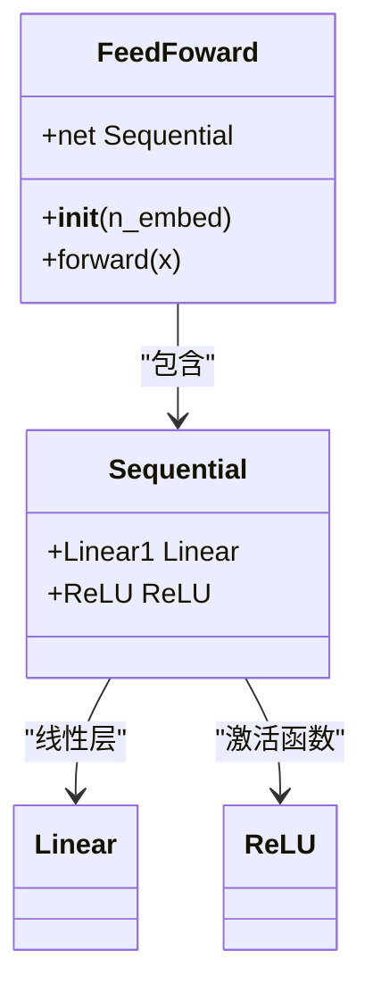
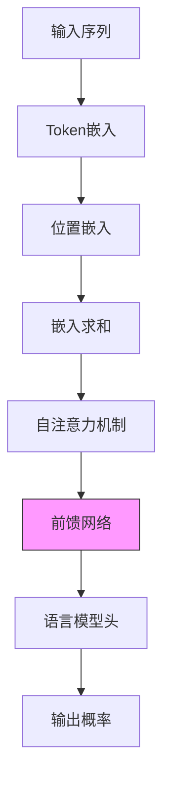

# v5：加入前馈网络

<cite>
**Referenced Files in This Document**   
- [babygpt_v5_feedforward.py](file://babygpt_v5_feedforward.py)
</cite>

## Table of Contents
1. [前馈网络的作用](#前馈网络的作用)
2. [FeedFoward类实现分析](#feedforward类实现分析)
3. [模型集成与数据流](#模型集成与数据流)
4. [架构演进](#架构演进)

## 前馈网络的作用

在Transformer架构中，前馈网络（Feed-Forward Network, FFN）是一个关键组件，位于自注意力机制之后。其主要作用是为模型提供非线性变换能力，从而增强模型的表达能力。自注意力机制擅长捕捉序列中不同位置之间的依赖关系，但其本身是线性变换的组合。前馈网络通过引入非线性激活函数，使模型能够学习更复杂的特征表示和函数映射。

在v5版本中引入的前馈网络组件，对每个token的表示进行独立的、位置无关的变换。这意味着每个token的嵌入向量都会通过相同的前馈网络进行处理，但处理过程不依赖于其他token的信息。这种设计既保持了自注意力机制的全局依赖性，又增加了模型的非线性表达能力，有助于模型学习更丰富的语言特征。

**Section sources**
- [babygpt_v5_feedforward.py](file://babygpt_v5_feedforward.py#L39-L47)

## FeedFoward类实现分析

v5版本中的`FeedFoward`类实现了前馈网络的核心功能。该类继承自`nn.Module`，其结构由一个`nn.Sequential`容器构成，包含两个线性层和一个ReLU激活函数。

**Diagram sources**
- [babygpt_v5_feedforward.py](file://babygpt_v5_feedforward.py#L39-L47)

在v5版本的实现中，第一个线性层将输入维度从`n_embed`映射到`n_embed`（而非后续版本中的`n_embed*4`），然后通过ReLU激活函数引入非线性，最后输出。这种设计虽然简单，但已经为模型引入了必要的非线性变换能力。值得注意的是，在后续版本（如v8及以后）中，该结构被改进为"瓶颈"结构，即先将维度扩展到`n_embed*4`，再压缩回`n_embed`，以提供更丰富的特征变换能力。

**Section sources**
- [babygpt_v5_feedforward.py](file://babygpt_v5_feedforward.py#L39-L47)

## 模型集成与数据流

前馈网络被集成到`BabyGPT`模型中，作为信息处理流程中的一个重要环节。在模型的前向传播过程中，数据流按照特定顺序经过各个组件。

**Diagram sources**
- [babygpt_v5_feedforward.py](file://babygpt_v5_feedforward.py#L66-L86)

在`BabyGPT`类的`forward`方法中，输入序列首先经过token嵌入和位置嵌入的处理，然后将两者相加得到包含位置信息的嵌入表示。接着，数据通过自注意力机制进行全局依赖关系的建模，之后立即传递给前馈网络`self.ffwd`进行非线性变换。最后，经过变换的表示通过语言模型头`lm_head`映射回词汇表空间，生成预测概率。这种"自注意力+前馈网络"的组合构成了Transformer块的基本架构。

**Section sources**
- [babygpt_v5_feedforward.py](file://babygpt_v5_feedforward.py#L66-L86)

## 架构演进

v5版本引入前馈网络是模型架构演进的重要一步。通过将`FeedFoward`模块添加到模型中，实现了从纯注意力机制到标准Transformer架构的过渡。这一变化不仅增加了模型的表达能力，也为后续的架构改进奠定了基础。

在v5版本之后，前馈网络的实现经历了进一步优化。后续版本采用了"扩展-压缩"的瓶颈结构，即先将维度从`n_embed`扩展到`n_embed*4`，经过非线性变换后再压缩回`n_embed`。这种设计允许网络在更高维度的空间中进行特征变换，从而获得更强的表达能力。此外，后续版本还可能引入了残差连接、层归一化等改进，进一步提升了模型性能。

**Section sources**
- [babygpt_v5_feedforward.py](file://babygpt_v5_feedforward.py#L39-L47)