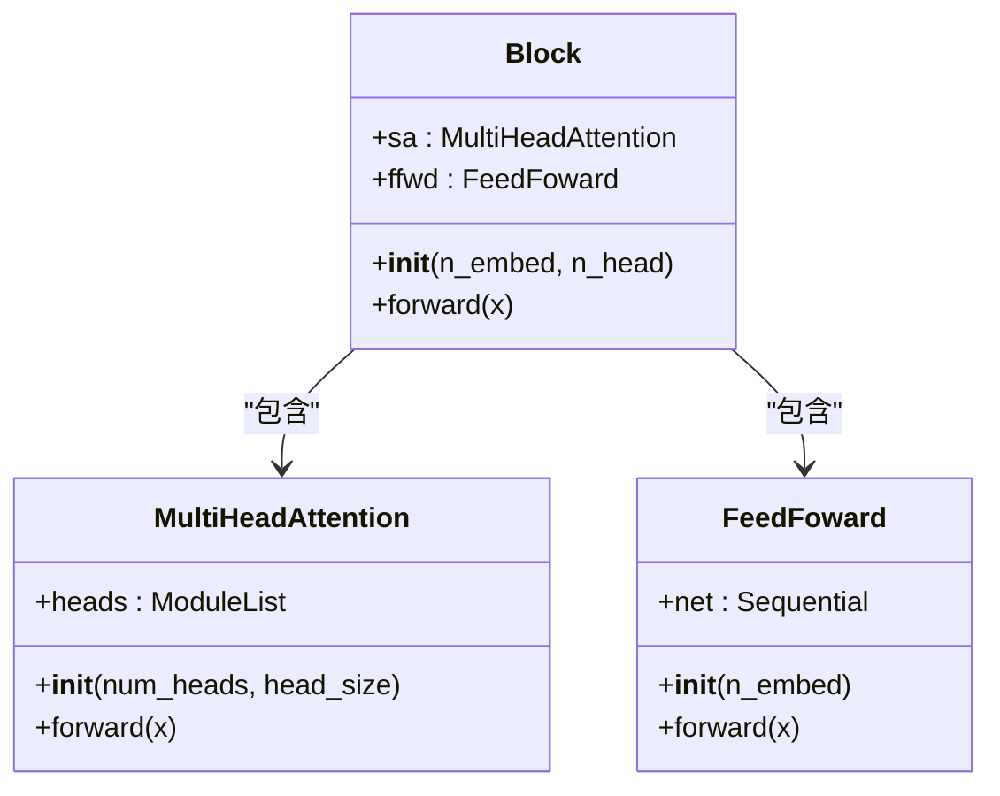
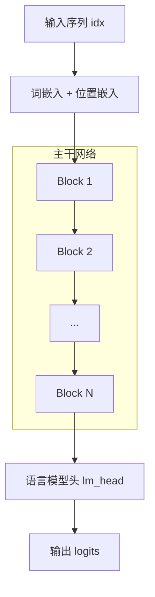

# v6：模块化设计

<cite>
**Referenced Files in This Document**   
- [babygpt_v6_block.py](file://babygpt_v6_block.py)
</cite>

## Table of Contents
1. [模块化设计概述](#模块化设计概述)
2. [Block类的实现](#block类的实现)
3. [BabyGPT主模型的构建](#babygpt主模型的构建)
4. [模块化设计的优势](#模块化设计的优势)

## 模块化设计概述

在v6版本中，代码库引入了关键的模块化设计思想，通过将Transformer的核心组件封装成可复用的模块，显著提升了代码的组织性和可维护性。这一版本的核心创新在于创建了一个名为`Block`的`nn.Module`子类，它将自注意力机制和前馈网络这两个核心功能单元整合为一个独立的、可堆叠的处理块。这种设计模式遵循了深度学习中构建深层网络的常见范式，即定义一个基础的“块”（block），然后通过堆叠多个相同的块来构建模型的主干网络。

**Section sources**
- [babygpt_v6_block.py](file://babygpt_v6_block.py#L40-L50)

## Block类的实现

`Block`类是v6版本模块化设计的核心。它继承自PyTorch的`nn.Module`，作为一个独立的神经网络模块，封装了Transformer中一个标准处理单元的全部逻辑。

### 初始化方法 (__init__)

`Block`类的`__init__`方法负责初始化其内部的两个主要组件：
1.  **`self.sa` (Self-Attention)**: 这是一个`MultiHeadAttention`实例，负责处理输入序列中各元素之间的依赖关系。在初始化时，它根据传入的嵌入维度`n_embed`和注意力头数`n_head`计算出每个头的维度`head_size`，并创建多头注意力层。
2.  **`self.ffwd` (Feed-Forward Network)**: 这是一个`FeedFoward`实例，负责对自注意力层的输出进行非线性变换和特征增强。它通常由一个或多个线性层和激活函数组成。

通过在`__init__`方法中声明这些组件，PyTorch会自动将它们注册为该模块的子模块，并管理它们的参数。

### 前向传播方法 (forward)

`Block`类的`forward`方法定义了数据流经该模块的顺序。其执行流程非常清晰：
1.  输入张量`x`首先被传递给自注意力组件`self.sa(x)`。
2.  自注意力的输出作为输入，被传递给前馈网络组件`self.ffwd(x)`。
3.  最终，前馈网络的输出被返回。

这种顺序执行的设计确保了每个`Block`都能独立完成一次完整的特征提取和转换过程。

**Diagram sources **
- [babygpt_v6_block.py](file://babygpt_v6_block.py#L40-L50)
- [babygpt_v6_block.py](file://babygpt_v6_block.py#L52-L60)
- [babygpt_v6_block.py](file://babygpt_v6_block.py#L62-L68)

**Section sources**
- [babygpt_v6_block.py](file://babygpt_v6_block.py#L40-L50)

## BabyGPT主模型的构建

`BabyGPT`主模型充分利用了`Block`类的模块化特性，通过`nn.Sequential`容器和列表推导式来构建其深层的主干网络。

### 堆叠Block组件

在`BabyGPT`的`__init__`方法中，`self.blocks`这一关键属性是通过以下一行代码创建的：
`self.blocks = nn.Sequential(*[Block(n_embed, n_head=n_head) for _ in range(n_layer)])`

这行代码的执行过程如下：
1.  **列表推导式** `[Block(...) for _ in range(n_layer)]`：根据配置的`n_layer`（层数）参数，创建一个包含`n_layer`个`Block`实例的Python列表。每个`Block`实例都使用相同的`n_embed`和`n_head`参数进行初始化。
2.  **解包操作符** `*`：将上述列表解包，将其元素作为独立的参数传递给`nn.Sequential`。
3.  **nn.Sequential容器**：`nn.Sequential`接收这些解包后的`Block`实例，并将它们按顺序连接起来，形成一个顺序执行的神经网络序列。

### 前向传播流程

在`BabyGPT`的`forward`方法中，经过词嵌入和位置嵌入处理后的输入张量`x`，会一次性通过整个`self.blocks`序列。`x`会依次流经每一个`Block`，在每个`Block`内部完成自注意力和前馈网络的计算，然后将结果传递给下一个`Block`。这种设计使得模型的深度（层数）可以通过简单地修改`n_layer`参数来灵活调整，而无需改变核心的网络结构代码。

**Diagram sources **
- [babygpt_v6_block.py](file://babygpt_v6_block.py#L90-L126)

**Section sources**
- [babygpt_v6_block.py](file://babygpt_v6_block.py#L90-L126)

## 模块化设计的优势

v6版本采用的模块化设计带来了多方面的显著优势：

1.  **可读性 (Readability)**：代码结构变得极其清晰。`Block`类的定义明确地展示了单个处理单元的内部结构，而`BabyGPT`类则清晰地展示了如何通过堆叠这些单元来构建整个模型。开发者可以快速理解模型的层次结构。
2.  **可维护性 (Maintainability)**：如果需要修改自注意力或前馈网络的实现，只需在`Block`类中进行一次修改，所有堆叠的`Block`实例都会自动继承这些更改。这避免了在多处重复修改相同逻辑的错误和麻烦。
3.  **可扩展性 (Extensibility)**：这种设计为未来的功能扩展提供了便利。例如，可以轻松地在`Block`内部添加残差连接、层归一化等新特性，或者创建不同类型的`Block`（如编码器块、解码器块），并让主模型选择性地使用它们。
4.  **灵活性 (Flexibility)**：模型的深度（`n_layer`）成为一个可配置的超参数。通过改变这个参数，可以快速实验不同深度的模型性能，而无需重写网络架构代码。

综上所述，v6版本通过引入`Block`模块和`nn.Sequential`堆叠模式，成功地将复杂的Transformer架构分解为简单、可复用的组件，是代码从基础实现迈向专业、可维护架构的重要一步。

**Section sources**
- [babygpt_v6_block.py](file://babygpt_v6_block.py)