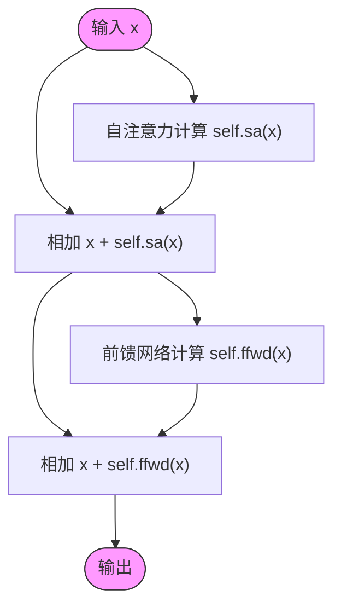

# v7：集成残差连接

<cite>
**Referenced Files in This Document**   
- [babygpt_v7_residual_connection.py](file://babygpt_v7_residual_connection.py)
- [babygpt_v6_block.py](file://babygpt_v6_block.py)
- [babygpt_v8_projection.py](file://babygpt_v8_projection.py)
</cite>

## 目录
1. [引言](#引言)
2. [残差连接技术详解](#残差连接技术详解)
3. [Block类的前向传播分析](#block类的前向传播分析)
4. [梯度流动与训练稳定性](#梯度流动与训练稳定性)
5. [代码演进对比](#代码演进对比)
6. [结论](#结论)

## 引言

在深度神经网络的训练过程中，随着网络层数的增加，模型往往会面临梯度消失或梯度爆炸的问题，这使得深层网络难以有效训练。v7版本通过引入残差连接（Residual Connection）技术，显著改善了这一问题。本文将详细解释残差连接的工作原理，分析其在Transformer块中的实现方式，并阐述其对深层模型训练稳定性的关键作用。

## 残差连接技术详解

残差连接是一种在深度神经网络中广泛采用的技术，其核心思想是通过"跳跃连接"（skip connection）将输入直接传递到后续层的输出上。这种设计允许网络学习输入与输出之间的残差（差异），而不是直接学习完整的映射函数。

在深层网络中，当信号经过多层非线性变换后，原始输入信息可能会逐渐衰减或失真。残差连接通过将原始输入x与经过变换的输出F(x)相加，形成x + F(x)的结构，确保了原始信息能够直接传递到后续层。这种机制有效地缓解了梯度消失问题，因为梯度可以通过跳跃连接直接回传到浅层，而不需要经过所有中间层的非线性变换。

**Section sources**
- [babygpt_v7_residual_connection.py](file://babygpt_v7_residual_connection.py#L40-L50)

## Block类的前向传播分析

### 残差连接的实现

在v7版本中，`Block`类的`forward`方法实现了残差连接的核心逻辑：



**Diagram sources**
- [babygpt_v7_residual_connection.py](file://babygpt_v7_residual_connection.py#L45-L50)

如上图所示，`Block`类的前向传播过程包含两个关键的残差连接步骤：

1. **自注意力残差连接**：输入x首先与自注意力机制的输出`self.sa(x)`相加，形成`x + self.sa(x)`。这确保了即使自注意力机制未能提取到有用信息，原始输入x仍然能够保留并传递到下一层。

2. **前馈网络残差连接**：经过自注意力处理后的结果再次与前馈网络的输出`self.ffwd(x)`相加，形成最终输出。这种双重残差结构为信息流动提供了多重保障。

### 与v6版本的对比

与v6版本相比，v7版本的关键改进在于`Block`类的`forward`方法：

```mermaid
graph LR
subgraph v6_version[v6版本]
A[输入x] --> B[自注意力 self.sa(x)]
B --> C[前馈网络 self.ffwd(x)]
C --> D[输出]
end
subgraph v7_version[v7版本]
E[输入x] --> F[自注意力 self.sa(x)]
E --> G[相加 x + self.sa(x)]
F --> G
G --> H[前馈网络 self.ffwd(x)]
G --> I[相加 x + self.ffwd(x)]
H --> I
I --> J[输出]
end
style v6_version fill:#f9f,stroke:#333
style v7_version fill:#bbf,stroke:#333
```

**Diagram sources**
- [babygpt_v6_block.py](file://babygpt_v6_block.py#L40-L50)
- [babygpt_v7_residual_connection.py](file://babygpt_v7_residual_connection.py#L40-L50)

在v6版本中，`forward`方法直接将输入依次通过自注意力和前馈网络，没有残差连接。这种设计在浅层网络中可能表现良好，但在深层网络中容易导致梯度消失问题。

**Section sources**
- [babygpt_v7_residual_connection.py](file://babygpt_v7_residual_connection.py#L45-L50)
- [babygpt_v6_block.py](file://babygpt_v6_block.py#L40-L50)

## 梯度流动与训练稳定性

### 梯度消失问题的挑战

在深层神经网络中，梯度消失问题源于链式法则的乘法性质。当多个小于1的梯度值连续相乘时，最终的梯度会变得非常小，导致浅层网络的权重几乎无法更新。对于Transformer架构，随着`n_layer`参数的增加（在本例中为3层），这一问题尤为突出。

### 残差连接的解决方案

残差连接通过改变梯度流动路径来解决这一问题。考虑`Block`类中自注意力部分的残差连接`x + self.sa(x)`，其反向传播时的梯度计算为：

```
∂L/∂x = ∂L/∂(x + self.sa(x)) * ∂(x + self.sa(x))/∂x
       = ∂L/∂(x + self.sa(x)) * (1 + ∂self.sa(x)/∂x)
```

这里的关键是`1 + ∂self.sa(x)/∂x`项。即使`∂self.sa(x)/∂x`很小或接近零，梯度仍然可以通过常数1的路径直接回传。这确保了浅层网络能够接收到足够大的梯度信号，从而保持有效的学习能力。

```mermaid
graph TB
subgraph GradientFlow[梯度流动路径]
L[损失函数] --> Add[残差连接节点]
Add --> SA[自注意力梯度 ∂self.sa(x)/∂x]
Add --> Direct[直接路径 1]
SA --> X[输入x]
Direct --> X
X --> Previous[前一层]
end
style GradientFlow fill:#f9f,stroke:#333
```

**Diagram sources**
- [babygpt_v7_residual_connection.py](file://babygpt_v7_residual_connection.py#L45-L50)

这种设计使得梯度能够"直接看到"损失函数的变化，而不必经过复杂的非线性变换链，大大提高了深层网络的训练稳定性。

**Section sources**
- [babygpt_v7_residual_connection.py](file://babygpt_v7_residual_connection.py#L45-L50)

## 代码演进对比

通过对不同版本代码的分析，可以清晰地看到残差连接技术的演进过程：

| 版本 | 残差连接 | 前馈网络 | 投影层 | 层归一化 |
|------|----------|----------|--------|----------|
| v6 | ❌ | 单层线性 | ❌ | ❌ |
| v7 | ✅ | 单层线性 | ❌ | ❌ |
| v8 | ✅ | 两层线性 | ✅ | ❌ |
| v9 | ✅ | 两层线性 | ✅ | ✅ |

从v6到v7的演进中，最显著的变化是引入了残差连接。这一变化为后续的架构改进奠定了基础，使得网络能够更稳定地堆叠多个`Block`，从而构建更深的模型。

**Section sources**
- [babygpt_v6_block.py](file://babygpt_v6_block.py#L40-L50)
- [babygpt_v7_residual_connection.py](file://babygpt_v7_residual_connection.py#L40-L50)
- [babygpt_v8_projection.py](file://babygpt_v8_projection.py#L40-L50)

## 结论

v7版本通过引入残差连接技术，解决了深层Transformer网络训练中的梯度消失问题。`Block`类中`x + self.sa(x)`和`x + self.ffwd(x)`的设计，不仅保留了原始输入信息，还为梯度提供了直接回传的路径。这种"跳跃连接"机制是实现堆叠多个Transformer块的关键技术，为构建更深、更强大的语言模型奠定了基础。残差连接的引入标志着从简单网络到深度网络的重要跨越，是现代深度学习架构中的核心组件之一。