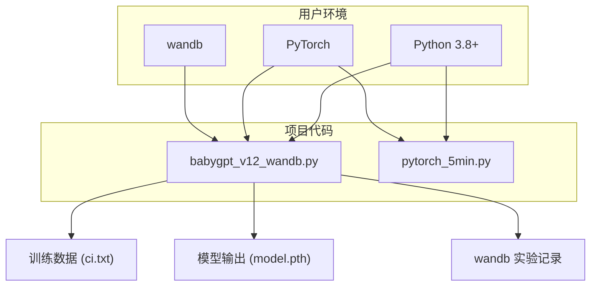
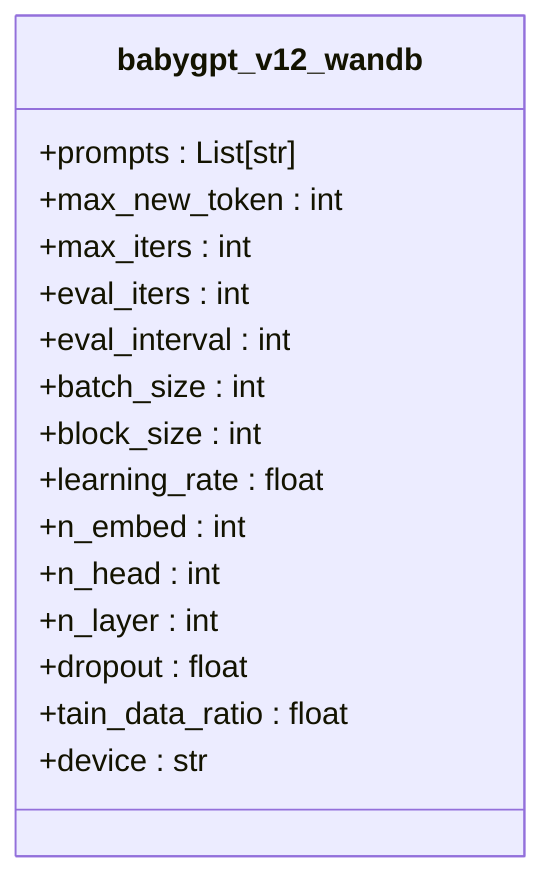
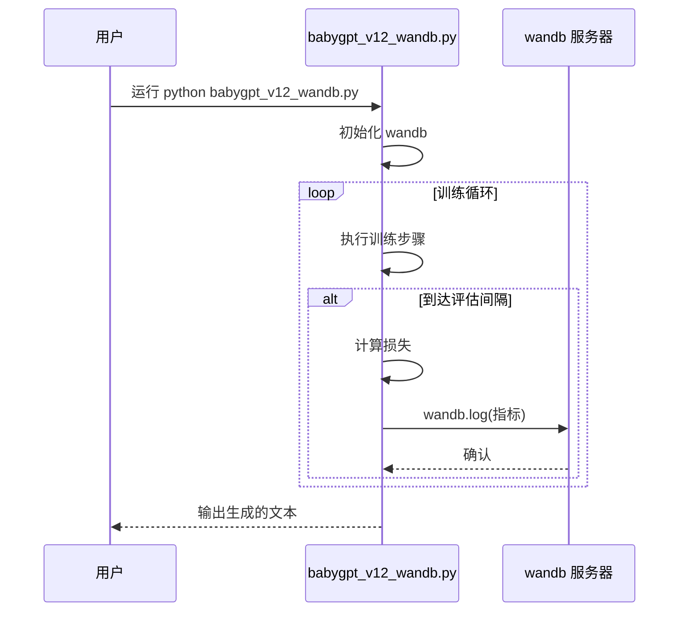
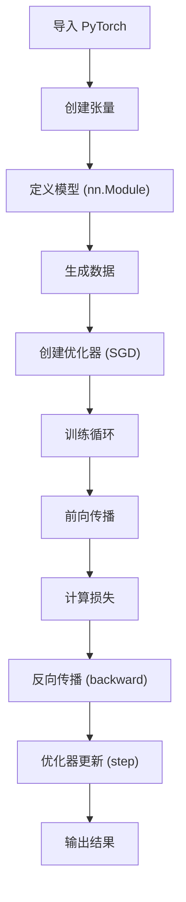
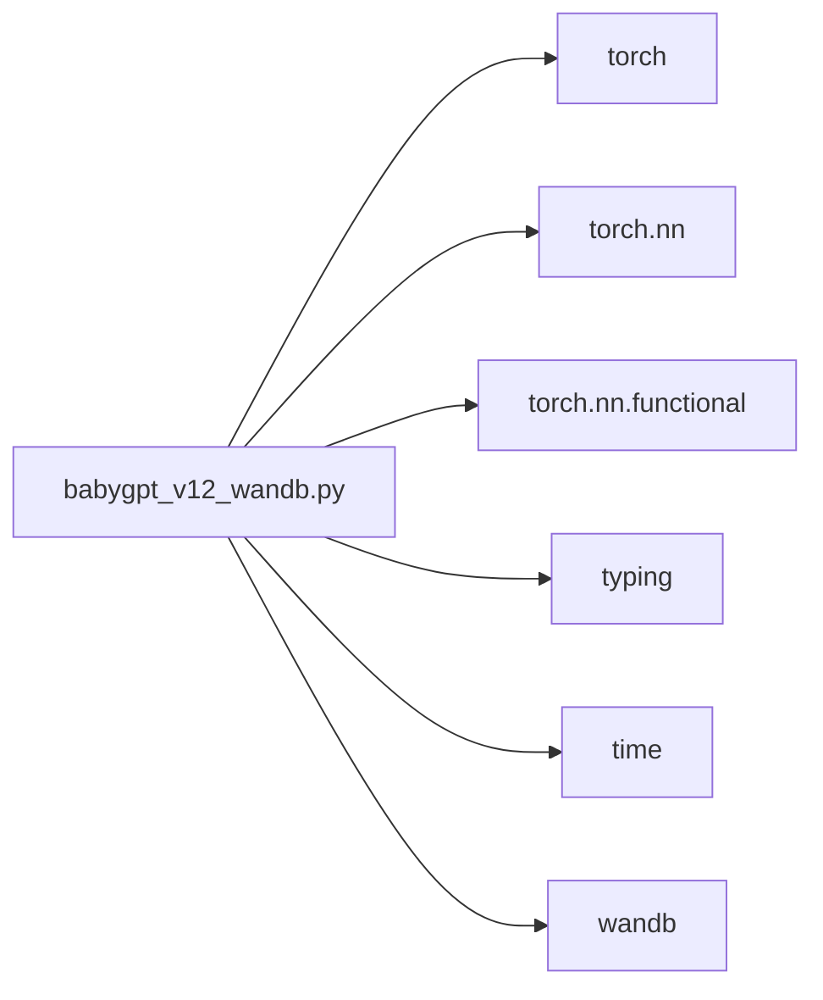

# 环境配置

<cite>
**本文档中引用的文件**
- [babygpt_v12_wandb.py](file://babygpt_v12_wandb.py)
- [pytorch_5min.py](file://pytorch_5min.py)
</cite>

## 目录
1. [简介](#简介)
2. [项目结构](#项目结构)
3. [核心组件](#核心组件)
4. [架构概述](#架构概述)
5. [详细组件分析](#详细组件分析)
6. [依赖分析](#依赖分析)
7. [性能考虑](#性能考虑)
8. [故障排除指南](#故障排除指南)
9. [结论](#结论)
10. [附录](#附录)（如有必要）

## 简介
本文档旨在为用户提供一份清晰、完整的环境配置和安装指南，帮助用户快速搭建 `babygpt` 项目的运行环境。基于 `babygpt_v12_wandb.py` 文件中的导入语句，明确列出项目所需的所有外部 Python 库，主要包括 PyTorch 和 wandb。文档将提供使用 pip 或 conda 安装这些依赖的具体命令。同时，参考 `pytorch_5min.py` 的内容，加入一个简短的“PyTorch五分钟入门”，帮助用户快速熟悉张量操作、自动微分等核心概念。此外，还将详细说明如何配置 wandb，包括账户注册、命令行登录以及代码中初始化实验的方法。最后，提供一个从创建虚拟环境到成功运行示例脚本的完整步骤清单，并列出可能遇到的常见环境问题及其解决方案。

## 项目结构
本项目是一个逐步构建 GPT 模型的教学仓库，包含多个版本的 Python 脚本，每个脚本代表模型构建的一个阶段。项目根目录下包含多个以 `babygpt_vX_*.py` 命名的文件，从 `v1` 到 `v12`，逐步引入了位置编码、自注意力、多头注意力、前馈网络、残差连接、层归一化、Dropout、超参数配置以及 wandb 集成等特性。`babygpt_v12_wandb.py` 是当前最完整的版本，集成了 wandb 用于实验跟踪。此外，`pytorch_5min.py` 文件提供了一个极简的 PyTorch 入门示例，用于演示基本的张量操作和模型训练流程。项目还需要一个名为 `ci.txt` 的文本文件作为训练数据。

```mermaid
graph TD
A[项目根目录] --> B[babygpt_v1.py]
A --> C[babygpt_v2_position.py]
A --> D[babygpt_v3_self_attention.py]
A --> E[babygpt_v4_multihead_attention.py]
A --> F[babygpt_v5_feedforward.py]
A --> G[babygpt_v6_block.py]
A --> H[babygpt_v7_residual_connection.py]
A --> I[babygpt_v8_projection.py]
A --> J[babygpt_v9_layer_norm.py]
A --> K[babygpt_v10_dropout.py]
A --> L[babygpt_v11_hyper_params.py]
A --> M[babygpt_v12_wandb.py]
A --> N[pytorch_5min.py]
A --> O[ci.txt]
```



**Diagram sources**
- [babygpt_v12_wandb.py](file://babygpt_v12_wandb.py#L0-L363)
- [pytorch_5min.py](file://pytorch_5min.py#L0-L77)

**Section sources**
- [babygpt_v12_wandb.py](file://babygpt_v12_wandb.py#L0-L363)
- [pytorch_5min.py](file://pytorch_5min.py#L0-L77)

## 核心组件
本项目的核心是 `babygpt_v12_wandb.py` 文件，它实现了一个简化版的 GPT 模型。该模型由多个 `Block` 组成，每个 `Block` 包含一个 `MultiHeadAttention` 层和一个 `FeedFoward` 网络，并使用 `LayerNorm` 和残差连接。模型通过 `Tokenizer` 类处理中文文本，将字符编码为整数索引。训练过程使用 AdamW 优化器，并通过 `wandb` 库记录训练指标。`pytorch_5min.py` 文件则是一个独立的、更基础的组件，用于演示 PyTorch 的基本用法。

**Section sources**
- [babygpt_v12_wandb.py](file://babygpt_v12_wandb.py#L0-L363)
- [pytorch_5min.py](file://pytorch_5min.py#L0-L77)

## 架构概述
项目的整体架构分为两个主要部分：环境与依赖管理、模型与训练流程。
1.  **环境与依赖管理**：用户需要配置 Python 环境，安装 PyTorch（用于深度学习计算）和 wandb（用于实验跟踪）。
2.  **模型与训练流程**：`babygpt_v12_wandb.py` 定义了模型架构（`BabyGPT`）、数据处理（`Tokenizer`）、训练循环和 wandb 集成。`pytorch_5min.py` 提供了一个独立的、更简单的模型训练示例。



**Diagram sources**
- [babygpt_v12_wandb.py](file://babygpt_v12_wandb.py#L0-L363)
- [pytorch_5min.py](file://pytorch_5min.py#L0-L77)

## 详细组件分析

### babygpt_v12_wandb.py 分析
该文件是项目的核心，实现了 GPT 模型的完整训练流程。

#### 依赖导入与配置
文件开头导入了必要的库：`torch` 用于构建和训练模型，`torch.nn` 及其 `functional` 用于定义网络层，`typing` 用于类型提示，`time` 用于性能计时，以及 `wandb` 用于实验跟踪。随后定义了一系列超参数，如 `batch_size`、`block_size`、`n_embed` 等，并根据硬件情况自动选择运行设备（CUDA、MPS 或 CPU）。



**Diagram sources**
- [babygpt_v12_wandb.py](file://babygpt_v12_wandb.py#L7-L23)

#### 模型定义
文件定义了 `Tokenizer`、`Head`、`MultiHeadAttention`、`FeedFoward`、`Block` 和 `BabyGPT` 等类。`BabyGPT` 类是模型的主干，其 `forward` 方法执行前向传播，`generate` 方法用于生成文本。

#### 训练与 wandb 集成
训练循环中，模型在每个 `eval_interval` 步会调用 `estimate_loss` 函数评估损失，并使用 `wandb.log()` 将训练损失、验证损失、处理速度和迭代次数等指标发送到 wandb 服务器，实现实验的可视化和追踪。



**Diagram sources**
- [babygpt_v12_wandb.py](file://babygpt_v12_wandb.py#L199-L221)
- [babygpt_v12_wandb.py](file://babygpt_v12_wandb.py#L24-L25)

### pytorch_5min.py 分析
该文件是一个独立的 PyTorch 入门教程。

#### PyTorch 核心概念演示
该脚本清晰地展示了 PyTorch 的核心工作流程：
1.  **张量（Tensor）**：创建和操作张量，如 `torch.tensor()` 和 `torch.rand()`。
2.  **模型定义**：通过继承 `nn.Module` 定义 `SimpleNet` 模型。
3.  **自动微分**：使用 `loss.backward()` 自动计算梯度。
4.  **优化器**：使用 `torch.optim.SGD` 更新模型参数。
5.  **设备管理**：使用 `.to(device)` 将数据和模型移动到 GPU 或 CPU。



**Diagram sources**
- [pytorch_5min.py](file://pytorch_5min.py#L0-L77)

**Section sources**
- [babygpt_v12_wandb.py](file://babygpt_v12_wandb.py#L0-L363)
- [pytorch_5min.py](file://pytorch_5min.py#L0-L77)

## 依赖分析
通过分析 `babygpt_v12_wandb.py` 的导入语句，可以明确项目依赖的外部库。



**Diagram sources**
- [babygpt_v12_wandb.py](file://babygpt_v12_wandb.py#L0-L5)

**Section sources**
- [babygpt_v12_wandb.py](file://babygpt_v12_wandb.py#L0-L5)

## 性能考虑
`babygpt_v12_wandb.py` 中通过 `time` 模块对训练过程进行了性能监控。它记录了从训练开始到当前迭代的总耗时，并计算了每秒处理的 token 数量（`tokens_per_sec`），这个指标被作为关键性能指标之一通过 `wandb.log()` 进行记录。这有助于用户评估模型在不同硬件（如 CPU、GPU）上的训练效率。

## 故障排除指南
以下是一些在配置环境时可能遇到的常见问题及解决方案。

### CUDA 版本不兼容
**问题**：安装 PyTorch 后，`torch.cuda.is_available()` 返回 `False`。
**解决方案**：
1.  确认您的 GPU 支持 CUDA。
2.  访问 [PyTorch 官网](https://pytorch.org/get-started/locally/)，根据您的操作系统、包管理器（pip/conda）、Python 版本和 CUDA 版本，获取正确的安装命令。例如，对于 CUDA 11.8，应使用：
    ```bash
    pip install torch torchvision torchaudio --index-url https://download.pytorch.org/whl/cu118
    ```

### wandb 认证失败
**问题**：运行脚本时，wandb 提示需要登录。
**解决方案**：
1.  访问 [wandb 官网](https://wandb.ai/) 并注册一个账户。
2.  在终端运行 `wandb login`，然后按照提示复制您的 API 密钥进行登录。
3.  登录成功后，再次运行 Python 脚本即可。

**Section sources**
- [babygpt_v12_wandb.py](file://babygpt_v12_wandb.py#L223-L242)

## 结论
本文档提供了一个全面的环境配置指南，涵盖了从依赖安装、PyTorch 入门到 wandb 配置的全过程。通过遵循这些步骤，用户可以成功搭建 `babygpt` 项目的运行环境，并理解其核心组件和工作流程。`babygpt_v12_wandb.py` 和 `pytorch_5min.py` 两个文件相辅相成，前者展示了完整的模型实现，后者则提供了必要的背景知识。

## 附录

### 完整的环境设置步骤清单
1.  **创建虚拟环境**：
    ```bash
    python -m venv babygpt_env
    source babygpt_env/bin/activate  # Linux/Mac
    # 或 babygpt_env\Scripts\activate  # Windows
    ```
2.  **安装 PyTorch**（根据您的 CUDA 版本选择）：
    ```bash
    # 例如，使用 CUDA 11.8
    pip install torch torchvision torchaudio --index-url https://download.pytorch.org/whl/cu118
    ```
3.  **安装 wandb**：
    ```bash
    pip install wandb
    ```
4.  **登录 wandb**：
    ```bash
    wandb login
    ```
5.  **准备数据**：确保项目根目录下有一个名为 `ci.txt` 的文本文件。
6.  **运行示例脚本**：
    ```bash
    python babygpt_v12_wandb.py
    ```
7.  **（可选）运行 PyTorch 入门示例**：
    ```bash
    python pytorch_5min.py
    ```