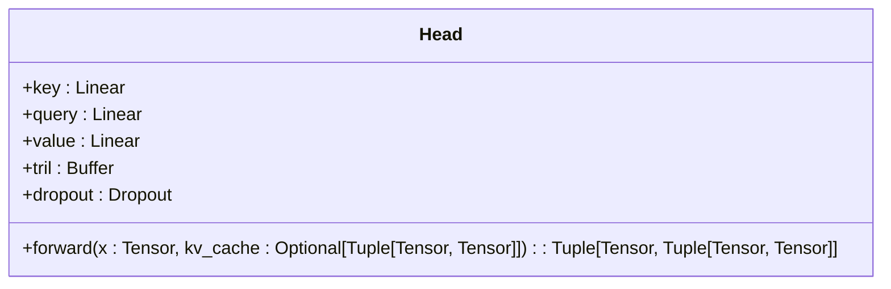
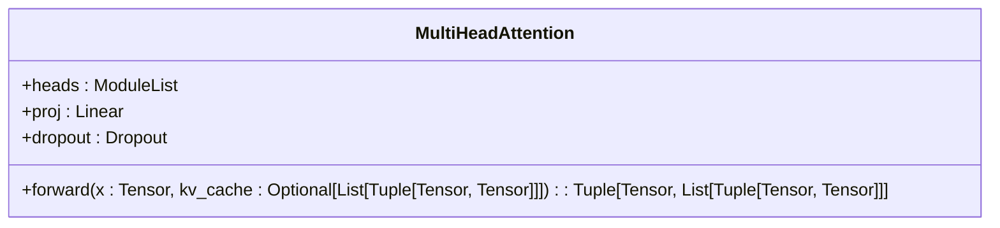
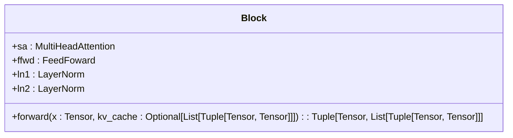
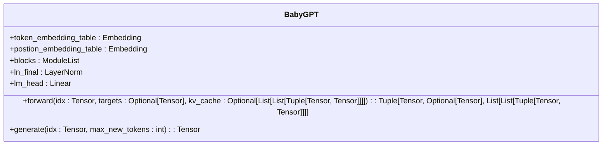

# KV缓存优化

<cite>
**Referenced Files in This Document**   
- [babygpt_sample_with_kvcache.py](file://babygpt_sample_with_kvcache.py)
- [Head](file://babygpt_sample_with_kvcache.py#L100-L150)
- [MultiHeadAttention](file://babygpt_sample_with_kvcache.py#L70-L100)
- [Block](file://babygpt_sample_with_kvcache.py#L50-L70)
- [BabyGPT](file://babygpt_sample_with_kvcache.py#L150-L230)
</cite>

## 目录
1. [引言](#引言)
2. [标准自回归生成的效率问题](#标准自回归生成的效率问题)
3. [KV缓存实现原理](#kv缓存实现原理)
4. [核心组件分析](#核心组件分析)
5. [KV缓存的内存开销与权衡](#kv缓存的内存开销与权衡)
6. [结论](#结论)

## 引言

本文档深入解析KV缓存（Key-Value Cache）的实现原理及其在推理过程中的性能优势。通过分析`babygpt_sample_with_kvcache.py`中的代码，详细阐述了如何通过KV缓存机制显著提升长序列生成的效率。文档将从标准自回归生成的效率瓶颈出发，逐步解析KV缓存在Head、MultiHeadAttention、Block和BabyGPT等核心模块中的实现细节，最终讨论其内存开销与实际应用中的权衡。

## 标准自回归生成的效率问题

在标准的自回归生成过程中，模型每次预测新token时都需要重新计算整个上下文序列的注意力键（Key）和值（Value）向量。这种重复计算导致了严重的效率问题。

具体来说，对于一个长度为T的序列，计算注意力机制的时间复杂度为O(T²)。随着生成序列的增长，每次预测新token都需要重新处理所有历史token，计算量呈平方级增长。例如，当序列长度从100增长到1000时，计算量将增加100倍。这种低效性在生成长文本时尤为明显，极大地限制了模型的推理速度和实际应用。

## KV缓存实现原理

KV缓存的核心思想是通过存储和复用历史token的K/V状态，避免在每次推理时重复计算。这一机制将注意力计算的复杂度从O(T²)降低到O(T)，实现了推理效率的显著提升。

### KV缓存工作机制

KV缓存的工作机制可以概括为以下步骤：

1. **初始化**：在生成过程开始时，KV缓存被初始化为None。
2. **首次计算**：当kv_cache为None时，模型执行完整的注意力计算，处理整个输入序列，并将计算得到的K和V向量存储在缓存中。
3. **增量更新**：当kv_cache存在时，模型仅对当前最新token计算其Q、K、V向量，然后将新计算的K、V与缓存中的历史K、V进行拼接（concatenate）。
4. **状态传递**：更新后的KV缓存作为new_kv_cache返回，供下一次推理调用使用。

这种机制的关键在于，历史token的K/V状态一旦计算完成就被缓存起来，后续推理只需计算当前token的Q向量，并与缓存的历史K/V进行注意力计算，从而避免了重复计算。

## 核心组件分析

### Head模块分析

Head模块是KV缓存机制的基础实现单元，负责单个注意力头的计算。

**Diagram sources**
- [Head](file://babygpt_sample_with_kvcache.py#L100-L150)

**Section sources**
- [Head](file://babygpt_sample_with_kvcache.py#L100-L150)

在`forward`方法中，当`kv_cache`参数为None时，模型对整个输入序列x计算K、V向量；当`kv_cache`存在时，模型仅对当前token计算K、V，并与缓存中的历史K、V进行拼接。这种方法确保了历史信息的复用，同时只对新信息进行增量计算。

### MultiHeadAttention模块分析

MultiHeadAttention模块负责管理多个注意力头的KV缓存。

**Diagram sources**
- [MultiHeadAttention](file://babygpt_sample_with_kvcache.py#L70-L100)

**Section sources**
- [MultiHeadAttention](file://babygpt_sample_with_kvcache.py#L70-L100)

该模块通过遍历每个注意力头，分别处理其对应的KV缓存。对于每个头，它提取相应的缓存状态，调用Head的`forward`方法，并收集新的KV缓存。最后，将所有头的输出连接起来，并通过投影层和dropout层得到最终输出。这种设计确保了多头注意力机制中每个头的KV状态都能被独立管理和更新。

### Block模块分析

Block模块是Transformer架构中的基本构建单元，集成了注意力机制和前馈网络。

**Diagram sources**
- [Block](file://babygpt_sample_with_kvcache.py#L50-L70)

**Section sources**
- [Block](file://babygpt_sample_with_kvcache.py#L50-L70)

在`forward`方法中，Block模块接收输入x和kv_cache参数，通过残差连接和层归一化，将输入传递给MultiHeadAttention模块。它处理当前块的KV缓存，并将新的缓存状态传递给下一层。这种设计确保了每个Block都能维护自己的KV状态，实现了跨层的缓存管理。

### BabyGPT主模型分析

BabyGPT主模型是KV缓存机制的顶层实现，负责协调整个生成过程。

**Diagram sources**
- [BabyGPT](file://babygpt_sample_with_kvcache.py#L150-L230)

**Section sources**
- [BabyGPT](file://babygpt_sample_with_kvcache.py#L150-L230)

在`forward`方法中，模型首先根据是否存在kv_cache来决定处理策略：如果存在缓存，则只处理最新token；如果不存在，则处理完整序列。然后，模型遍历所有Block，逐层传递和更新KV缓存。在`generate`方法中，模型初始化kv_cache为None，并在每一步生成中将其传递给`forward`调用，实现了KV缓存的持续更新和复用。

## KV缓存的内存开销与权衡

尽管KV缓存显著提升了推理速度，但它也带来了额外的内存开销。这种内存开销主要体现在以下几个方面：

1. **存储需求**：KV缓存需要存储每个注意力头的历史K和V向量。对于一个有n_layer层、n_head个头的模型，缓存的总大小与序列长度成正比。
2. **内存增长**：随着生成序列的增长，KV缓存的大小线性增加，可能成为长序列生成的内存瓶颈。
3. **显存占用**：在GPU上，KV缓存会占用宝贵的显存资源，可能限制批量大小或模型规模。

在实际应用中，需要在推理速度和内存使用之间进行权衡：

- **长序列生成**：对于需要生成长文本的应用，KV缓存的性能优势远大于其内存开销，是必不可少的优化手段。
- **内存受限环境**：在显存有限的设备上，可能需要限制最大序列长度或使用缓存清理策略来平衡性能和资源使用。
- **批量推理**：在批量推理场景中，每个样本都需要独立的KV缓存，内存开销会成倍增加，需要仔细规划资源分配。

KV缓存在大模型部署中扮演着关键角色，它使得实时、高效的文本生成成为可能，是现代大语言模型推理系统的核心组件之一。

## 结论

KV缓存是一种高效的推理优化技术，通过存储和复用历史token的注意力键值状态，将自回归生成的计算复杂度从O(T²)降低到O(T)。本文档通过分析`babygpt_sample_with_kvcache.py`中的实现，详细阐述了KV缓存在Head、MultiHeadAttention、Block和BabyGPT等模块中的工作原理。尽管KV缓存带来了额外的内存开销，但其在提升推理速度方面的优势使其成为大模型部署中的关键技术。在实际应用中，需要根据具体场景权衡内存使用与推理性能，以实现最优的系统表现。