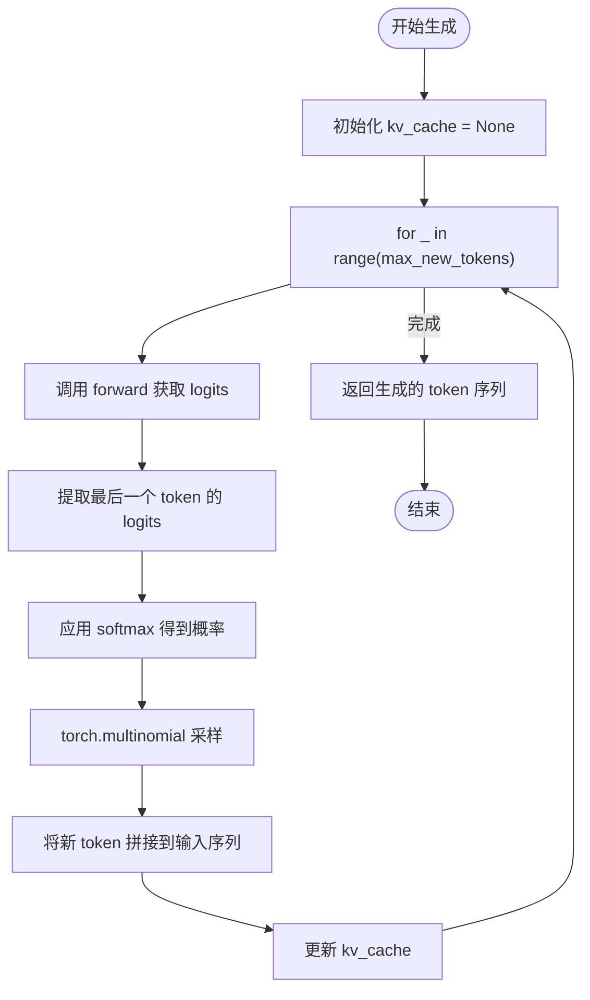

# 推理流程

<cite>
**本文档中引用的文件**
- [babygpt_sample_with_kvcache.py](file://babygpt_sample_with_kvcache.py)
</cite>

## 目录
1. [模型加载与评估模式设置](#模型加载与评估模式设置)
2. [generate方法实现逻辑](#generate方法实现逻辑)
3. [自回归生成过程详解](#自回归生成过程详解)
4. [交互式推理示例](#交互式推理示例)
5. [常见问题与优化策略](#常见问题与优化策略)

## 模型加载与评估模式设置

在推理开始前，首先需要加载训练阶段保存的模型权重文件 `model.pth`。通过调用 `torch.load('model.pth')` 加载权重后，使用 `model.load_state_dict()` 将其应用到模型实例中。为确保模型在推理时行为正确，必须调用 `model.eval()` 方法，将模型切换至评估模式。该操作会禁用如 Dropout 等仅在训练阶段启用的随机性行为，保证推理过程的确定性和稳定性。

**Section sources**
- [babygpt_sample_with_kvcache.py](file://babygpt_sample_with_kvcache.py#L214-L216)

## generate方法实现逻辑

`generate` 方法是文本生成的核心函数，其逻辑从输入提示（prompt）的编码开始。首先，使用 `Tokenizer` 将输入文本转换为对应的 token ID 序列，并封装为 PyTorch 张量。该张量作为初始输入传递给模型。生成过程采用自回归方式，即每一步生成一个新 token，并将其追加到输入序列末尾，作为下一步的输入，直至生成指定数量（`max_new_tokens`）的 token。

**Section sources**
- [babygpt_sample_with_kvcache.py](file://babygpt_sample_with_kvcache.py#L187-L194)

## 自回归生成过程详解

### KV缓存机制
模型在 `forward` 方法中支持 `kv_cache` 参数，用于存储每个注意力头的 Key 和 Value 状态。在生成过程中，`kv_cache` 被初始化为 `None`。随着每一步生成，新的 Key 和 Value 会被计算并追加到缓存中。后续步骤中，模型仅需处理当前最新的 token，并结合历史缓存的 KV 值进行注意力计算，从而避免重复计算，显著提升推理效率。

### 生成循环
生成循环通过 `for` 循环执行 `max_new_tokens` 次。每次循环中：
1. 调用 `self(idx, kv_cache=kv_cache)` 获取模型输出。
2. 提取 `logits` 的最后一个时间步（`[:, -1, :]`），即对下一个 token 的预测。
3. 使用 `F.softmax` 对 logits 进行归一化，得到概率分布。
4. 通过 `torch.multinomial` 进行随机采样，增加生成文本的多样性。
5. 将采样的 token ID 拼接到输入序列 `idx` 末尾，更新 `kv_cache`。

最终，返回完整的 token 序列。

**Diagram sources**
- [babygpt_sample_with_kvcache.py](file://babygpt_sample_with_kvcache.py#L187-L205)

**Section sources**
- [babygpt_sample_with_kvcache.py](file://babygpt_sample_with_kvcache.py#L187-L205)

## 交互式推理示例

代码末尾提供了一个交互式推理循环。通过 `input("请输入文字: ")` 接收用户输入的提示文本。该文本经 `Tokenizer.encode` 编码并转换为设备上的张量后，传入 `model.generate` 方法。生成完成后，使用 `tokenizer.decode` 将 token ID 序列转换回可读文本并输出。同时，代码记录并打印生成速度（tokens/s），便于性能监控。

**Section sources**
- [babygpt_sample_with_kvcache.py](file://babygpt_sample_with_kvcache.py#L218-L231)

## 常见问题与优化策略

### 生成质量差
可能出现重复、无意义或逻辑混乱的文本。这通常源于模型训练不充分或数据质量不佳。解决方案包括：
- 检查训练损失是否已充分收敛。
- 增加训练数据量或优化数据预处理。
- 调整采样策略，如引入温度参数（temperature）控制 softmax 的锐度，或使用 top-k/top-p 采样限制候选 token 范围，提升生成质量。

### 生成速度慢
尽管 KV 缓存已优化计算，但长序列生成仍可能较慢。可考虑：
- 确保模型在 GPU 或 MPS 设备上运行。
- 优化 `block_size` 和批处理大小。
- 探索更高效的注意力实现或模型量化技术。

**Section sources**
- [babygpt_sample_with_kvcache.py](file://babygpt_sample_with_kvcache.py#L111-L147)