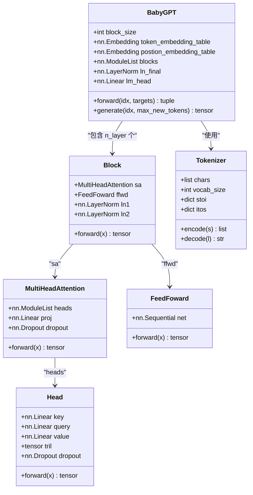
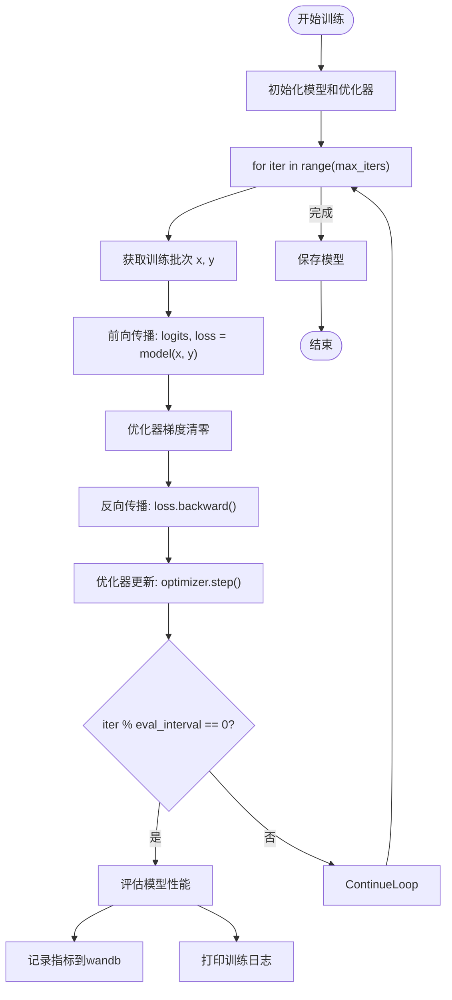
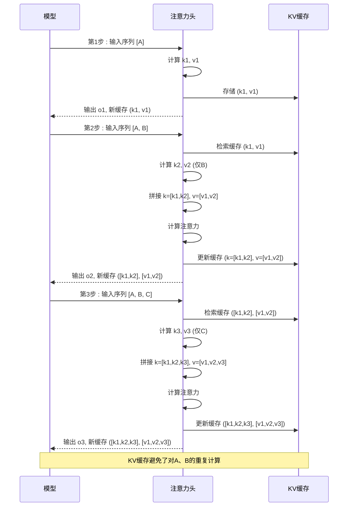

# 训练与推理

<cite>
**本文档中引用的文件**   
- [babygpt_v12_wandb.py](file://babygpt_v12_wandb.py)
- [babygpt_sample_with_kvcache.py](file://babygpt_sample_with_kvcache.py)
</cite>

## 目录
1. [训练流程详解](#训练流程详解)
2. [推理与KV缓存机制](#推理与kv缓存机制)
3. [常见问题与调试建议](#常见问题与调试建议)

## 训练流程详解

本节详细说明基于 `babygpt_v12_wandb.py` 的完整模型训练流程，涵盖数据预处理、模型构建、训练循环及实验管理。

### 数据加载与预处理

训练流程首先从 `ci.txt` 文件中读取原始文本数据，并通过 `Tokenizer` 类进行编码处理。`Tokenizer` 会构建字符级词汇表，将文本转换为整数序列。数据集随后被划分为训练集和验证集，比例由 `tain_data_ratio` 超参数控制（默认为0.9）。`get_batch` 函数负责从数据集中随机采样，生成用于训练和评估的批次数据。

**Section sources**
- [babygpt_v12_wandb.py](file://babygpt_v12_wandb.py#L38-L40)
- [babygpt_v12_wandb.py](file://babygpt_v12_wandb.py#L140-L148)

### 模型架构与实例化

模型的核心是 `BabyGPT` 类，它由多个 `Block` 组件堆叠而成。每个 `Block` 包含一个 `MultiHeadAttention` 层和一个 `FeedFoward` 前馈网络，并使用层归一化（LayerNorm）和残差连接。`MultiHeadAttention` 通过多个 `Head` 并行计算注意力，最后将结果拼接并通过投影层。模型实例化时，需要指定词汇表大小 `vocab_size`、序列长度 `block_size` 和嵌入维度 `n_embed`。

**Diagram sources **
- [babygpt_v12_wandb.py](file://babygpt_v12_wandb.py#L100-L138)
- [babygpt_v12_wandb.py](file://babygpt_v12_wandb.py#L52-L65)
- [babygpt_v12_wandb.py](file://babygpt_v12_wandb.py#L78-L90)
- [babygpt_v12_wandb.py](file://babygpt_v12_wandb.py#L66-L77)
- [babygpt_v12_wandb.py](file://babygpt_v12_wandb.py#L91-L100)
- [babygpt_v12_wandb.py](file://babygpt_v12_wandb.py#L40-L51)

**Section sources**
- [babygpt_v12_wandb.py](file://babygpt_v12_wandb.py#L100-L138)
- [babygpt_v12_wandb.py](file://babygpt_v12_wandb.py#L52-L65)
- [babygpt_v12_wandb.py](file://babygpt_v12_wandb.py#L78-L90)

### 训练循环与损失计算

训练循环通过 `AdamW` 优化器执行。在每个迭代步骤中，系统会获取一个训练批次，前向传播计算 `logits` 和损失。损失函数使用 `F.cross_entropy`，它结合了 `log_softmax` 和 `NLLLoss`，直接计算预测 `logits` 与真实 `targets` 之间的交叉熵。反向传播后，优化器更新模型参数。

**Diagram sources **
- [babygpt_v12_wandb.py](file://babygpt_v12_wandb.py#L168-L199)
- [babygpt_v12_wandb.py](file://babygpt_v12_wandb.py#L199-L223)

**Section sources**
- [babygpt_v12_wandb.py](file://babygpt_v12_wandb.py#L199-L223)

### 使用Wandb进行实验管理

`wandb` 库被用于跟踪和可视化训练过程。在训练开始时，`wandb.init()` 会初始化一个实验项目，并将关键超参数（如学习率、批次大小等）记录到配置中。在每个评估间隔，系统会调用 `estimate_loss` 函数计算训练集和验证集的平均损失，并将 `train_loss`、`val_loss`、`tokens_per_sec` 等指标通过 `wandb.log()` 发送到云端，便于实时监控和分析。

**Section sources**
- [babygpt_v12_wandb.py](file://babygpt_v12_wandb.py#L22-L35)
- [babygpt_v12_wandb.py](file://babygpt_v12_wandb.py#L210-L223)

### 关键训练超参数

训练过程中的关键超参数及其作用如下：
- **`learning_rate` (3e-4)**: 控制优化器更新模型权重的步长。过大会导致训练不稳定，过小则收敛缓慢。
- **`batch_size` (64)**: 每次迭代使用的样本数量。较大的批次可以提供更稳定的梯度估计，但需要更多内存。
- **`block_size` (256)**: 模型处理的序列最大长度。它决定了模型的上下文窗口大小。
- **`max_iters` (5000)**: 训练的最大迭代次数。
- **`n_embed` (384)**: 词嵌入的维度，决定了模型表示能力的强弱。
- **`n_head` (6)** 和 **`n_layer` (6)**: 分别控制多头注意力的头数和Transformer块的数量，影响模型的复杂度和性能。

## 推理与KV缓存机制

本节阐述 `babygpt_sample_with_kvcache.py` 中的推理流程，重点解析KV缓存的实现原理。

### KV缓存的实现原理

在自回归生成中，模型需要逐个生成token。传统的 `generate` 方法在生成每个新token时，都会重新计算整个历史序列的注意力键（Key）和值（Value），这导致了严重的计算冗余。KV缓存通过在 `Head` 和 `Block` 的 `forward` 方法中引入 `kv_cache` 参数来解决此问题。

在 `Head` 类中，当 `kv_cache` 存在时，新的 `k` 和 `v` 会与缓存中的旧 `k` 和 `v` 在序列维度上拼接，形成完整的键值对矩阵。这样，模型在计算注意力时，可以直接利用之前已计算并缓存的键值对，只需为当前的新token计算查询（Query）即可。

**Diagram sources **
- [babygpt_sample_with_kvcache.py](file://babygpt_sample_with_kvcache.py#L110-L138)
- [babygpt_sample_with_kvcache.py](file://babygpt_sample_with_kvcache.py#L54-L65)

**Section sources**
- [babygpt_sample_with_kvcache.py](file://babygpt_sample_with_kvcache.py#L110-L138)

### KV缓存的优势

KV缓存的主要优势是显著提升了推理效率。随着生成序列的增长，传统方法的计算量会呈平方级增长（O(n²)），而使用KV缓存后，每次生成新token的计算量基本保持不变（O(1)），因为历史序列的键值对已经缓存。这使得长文本生成变得非常高效。

### 完整的推理代码示例

从加载训练好的模型权重到生成文本的完整步骤如下：
1.  实例化 `Tokenizer` 和 `BabyGPT` 模型。
2.  使用 `torch.load()` 加载 `model.pth` 文件中的权重。
3.  调用 `model.eval()` 将模型切换到评估模式。
4.  将输入提示（prompt）编码为token，并转换为张量。
5.  调用 `model.generate()` 方法生成新文本。
6.  将生成的token序列解码为可读文本并输出。

**Section sources**
- [babygpt_sample_with_kvcache.py](file://babygpt_sample_with_kvcache.py#L187-L231)

## 常见问题与调试建议

### 内存不足（OOM）

**问题**: 训练或推理时出现 `CUDA out of memory` 错误。
**解决方案**:
1.  **减小 `batch_size`**: 这是最直接有效的方法。
2.  **减小 `block_size`**: 降低序列长度可以显著减少显存占用。
3.  **使用更小的模型**: 减少 `n_embed`、`n_head` 或 `n_layer` 的值。
4.  **启用梯度累积**: 在小批次上累积梯度，模拟大批次的效果。

### 生成文本质量不佳

**问题**: 生成的文本重复、无意义或偏离主题。
**解决方案**:
1.  **检查训练损失**: 确保训练损失已充分下降。如果损失过高，说明模型未充分学习。
2.  **调整采样策略**: 在 `generate` 方法中，可以尝试使用 `top-k` 或 `top-p` (nucleus) 采样代替 `torch.multinomial`，以提高生成文本的多样性。
3.  **增加训练数据**: 更多、更高质量的数据通常能带来更好的生成效果。
4.  **调整超参数**: 尝试不同的学习率、dropout率等。

**Section sources**
- [babygpt_v12_wandb.py](file://babygpt_v12_wandb.py#L210-L223)
- [babygpt_sample_with_kvcache.py](file://babygpt_sample_with_kvcache.py#L200-L205)