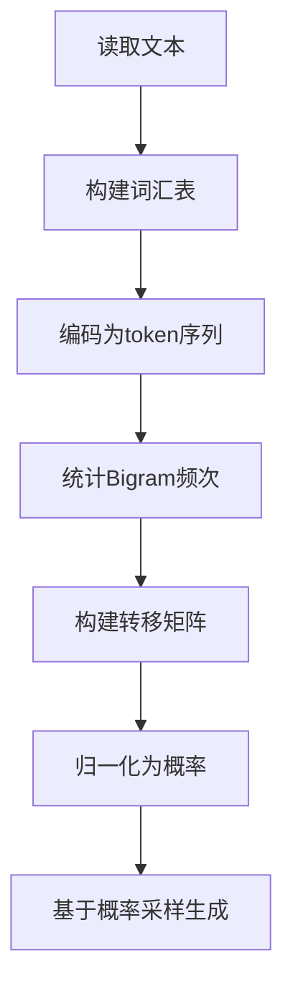
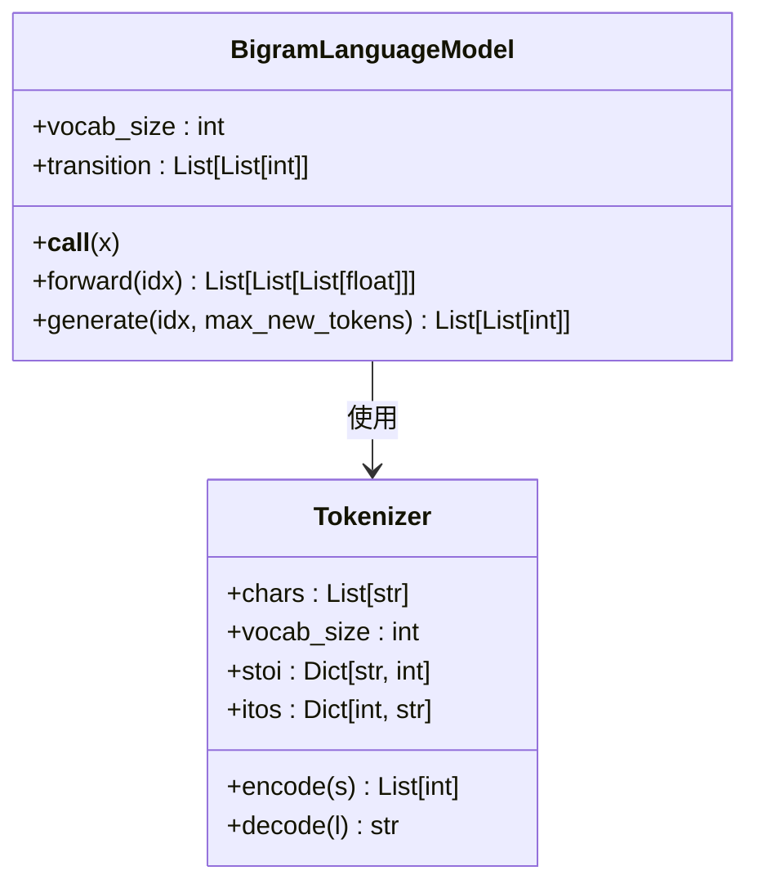
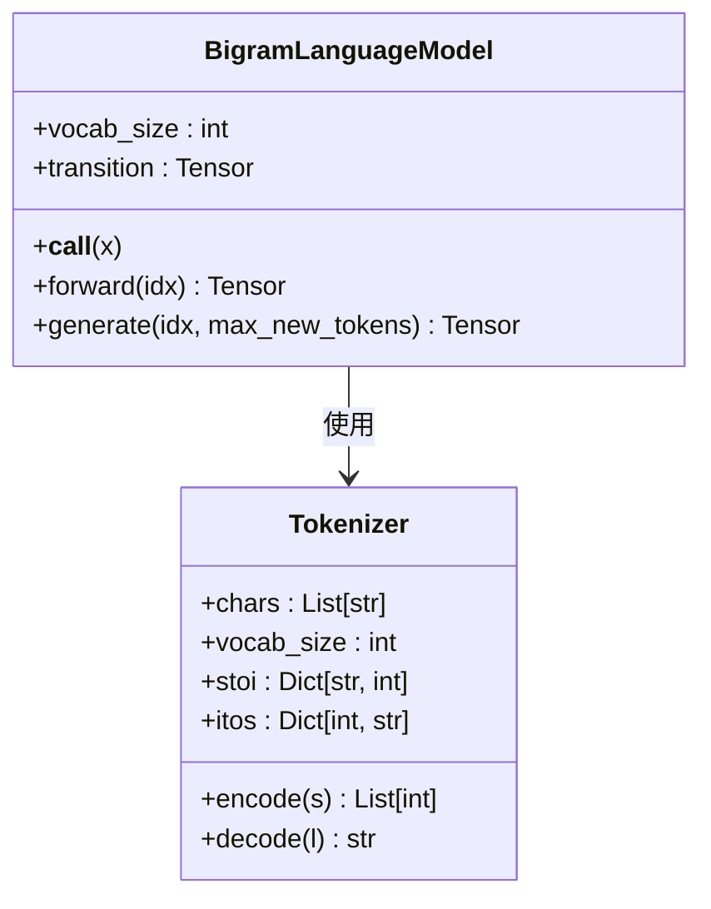
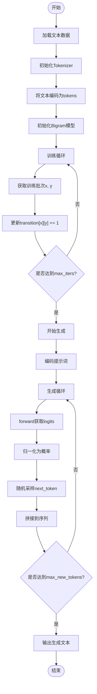
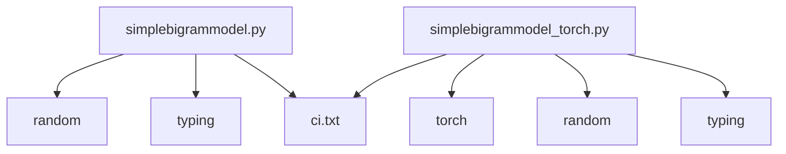

# Bigram模型

<cite>
**本文档中引用的文件**  
- [simplebigrammodel.py](file://simplebigrammodel.py)
- [simplebigrammodel_with_comments.py](file://simplebigrammodel_with_comments.py)
- [simplebigrammodel_torch.py](file://simplebigrammodel_torch.py)
</cite>

## 目录
1. [简介](#简介)
2. [项目结构](#项目结构)
3. [核心组件](#核心组件)
4. [架构概述](#架构概述)
5. [详细组件分析](#详细组件分析)
6. [依赖分析](#依赖分析)
7. [性能考量](#性能考量)
8. [故障排除指南](#故障排除指南)
9. [结论](#结论)

## 简介
Bigram模型是语言建模中最基础的统计方法之一，其核心思想基于马尔可夫假设：当前字符的出现概率仅依赖于前一个字符。本文档将深入解析`simplebigrammodel.py`、`simplebigrammodel_with_comments.py`和`simplebigrammodel_torch.py`三个实现版本，揭示如何通过计数统计构建字符转移矩阵，并基于该矩阵进行概率归一化与文本生成。同时，对比原生Python字典与PyTorch张量在实现上的差异，突出张量操作的高效性及其作为神经网络模型前驱的教学意义。

## 项目结构
本项目包含多个逐步演进的语言模型实现文件，其中Bigram模型作为最基础的起点，为后续更复杂的GPT变体提供基准参考。Bigram相关实现位于项目根目录下，采用简洁的模块化设计，便于理解语言模型的基本训练与推理流程。

**Section sources**
- [simplebigrammodel.py](file://simplebigrammodel.py#L1-L103)
- [simplebigrammodel_with_comments.py](file://simplebigrammodel_with_comments.py#L1-L131)
- [simplebigrammodel_torch.py](file://simplebigrammodel_torch.py#L1-L93)

## 核心组件
Bigram模型的核心由三部分构成：**Tokenizer**（分词器）、**BigramLanguageModel**（语言模型类）和**训练/推理流程**。Tokenizer负责将文本映射为整数索引，BigramLanguageModel维护一个二维转移矩阵`transition`，记录每个字符后接其他字符的频次。训练过程通过遍历语料库更新该矩阵，推理时则利用归一化后的概率分布采样生成新文本。

**Section sources**
- [simplebigrammodel.py](file://simplebigrammodel.py#L15-L84)
- [simplebigrammodel_with_comments.py](file://simplebigrammodel_with_comments.py#L15-L84)
- [simplebigrammodel_torch.py](file://simplebigrammodel_torch.py#L32-L55)

## 架构概述
Bigram模型采用简单的统计学习范式，整体流程包括数据加载、分词编码、频次统计、概率归一化和文本生成。模型不包含可训练参数或梯度更新机制，完全依赖于最大似然估计构建条件概率表。其架构虽简单，但完整体现了语言模型的基本要素：输入表示、上下文依赖建模、输出概率分布与采样策略。

**Diagram sources**
- [simplebigrammodel.py](file://simplebigrammodel.py#L8-L103)
- [simplebigrammodel_torch.py](file://simplebigrammodel_torch.py#L8-L93)

## 详细组件分析

### Tokenizer 分析
Tokenizer类负责将原始文本转换为模型可处理的整数序列。它通过扫描整个语料库提取唯一字符并排序，建立从字符到索引（stoi）和索引到字符（itos）的双向映射。该组件是所有语言模型的前置步骤，确保文本数据的标准化表示。

**Section sources**
- [simplebigrammodel.py](file://simplebigrammodel.py#L15-L25)
- [simplebigrammodel_with_comments.py](file://simplebigrammodel_with_comments.py#L15-L25)
- [simplebigrammodel_torch.py](file://simplebigrammodel_torch.py#L23-L31)

### BigramLanguageModel 分析
BigramLanguageModel类是模型的核心实现，其关键属性为`transition`矩阵，用于存储字符间的共现频次。

#### 原生Python实现（simplebigrammodel.py）
使用嵌套列表构建二维计数矩阵，训练时通过双重循环遍历批次数据，逐个更新`transition[x][y]`的值。推理时，`forward`方法返回当前token对应的下一位概率分布，`generate`方法通过`random.choices`进行加权采样。

**Diagram sources**
- [simplebigrammodel.py](file://simplebigrammodel.py#L27-L84)
- [simplebigrammodel_with_comments.py](file://simplebigrammodel_with_comments.py#L27-L84)

#### PyTorch实现（simplebigrammodel_torch.py）
该版本使用`torch.zeros`创建张量形式的转移矩阵，其余逻辑与原生版本一致。关键区别在于数据类型为`torch.Tensor`，支持后续与深度学习框架无缝集成。尽管训练循环仍为显式Python循环，但为迁移到向量化操作奠定了基础。

**Diagram sources**
- [simplebigrammodel_torch.py](file://simplebigrammodel_torch.py#L32-L55)

### 训练与推理流程分析
训练流程通过`get_batch`函数随机采样文本片段，构造输入`x`与目标`y`（即x的下一个字符）。模型通过累加频次直接学习P(w_t | w_{t-1})的联合分布。推理时，从提示词（prompt）开始，迭代调用`generate`方法，每次基于最后一个字符的概率分布采样新字符，直至达到最大长度。

**Diagram sources**
- [simplebigrammodel.py](file://simplebigrammodel.py#L85-L103)
- [simplebigrammodel_torch.py](file://simplebigrammodel_torch.py#L75-L93)

## 依赖分析
Bigram模型实现仅依赖标准库（random, typing）及PyTorch（torch版本），无外部复杂依赖。其内部组件耦合度低，Tokenizer与模型类职责分离清晰。转移矩阵的构建不依赖任何预训练资源或外部知识库，完全从给定语料中学习。

**Diagram sources**
- [simplebigrammodel.py](file://simplebigrammodel.py#L1-L3)
- [simplebigrammodel_torch.py](file://simplebigrammodel_torch.py#L1-L4)

## 性能考量
- **效率**：原生Python实现因使用嵌套列表和显式循环，训练速度较慢；PyTorch版本虽使用张量，但未利用向量化操作，性能提升有限。
- **内存**：转移矩阵空间复杂度为O(V²)，V为词汇表大小，对大规模词汇不友好。
- **扩展性**：模型结构简单，易于理解和调试，但无法捕捉长距离依赖，是典型的n-gram局限性。

## 故障排除指南
- **生成文本重复或无意义**：检查转移矩阵是否正确归一化，确保`sum(logits) > 0`以避免除零错误。
- **训练不收敛**：确认`get_batch`函数采样范围正确（`len(tokens) - block_size`），防止索引越界。
- **PyTorch设备错误**：确保所有张量创建时指定正确`device`，避免CPU与GPU操作混合。
- **随机性问题**：若结果不可复现，检查`random.seed`和`torch.manual_seed`是否设置。

**Section sources**
- [simplebigrammodel.py](file://simplebigrammodel.py#L60-L70)
- [simplebigrammodel_torch.py](file://simplebigrammodel_torch.py#L58-L68)

## 结论
Bigram模型作为最基础的语言模型，完美诠释了马尔可夫假设在自然语言处理中的应用。通过`simplebigrammodel.py`系列文件的对比，展示了从原生数据结构到深度学习框架的过渡路径。该模型虽在表达能力和上下文建模上存在明显局限，但其简洁性使其成为教学的理想起点，帮助学习者理解语言模型的核心概念（如困惑度、平滑技术）以及后续神经网络模型（如RNN、Transformer）的改进动机。项目中将其作为性能基准，为评估更复杂模型的有效性提供了重要参照。