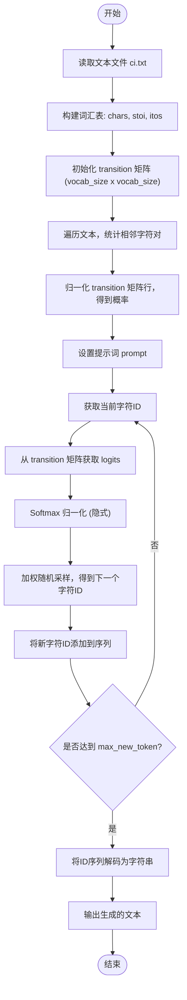
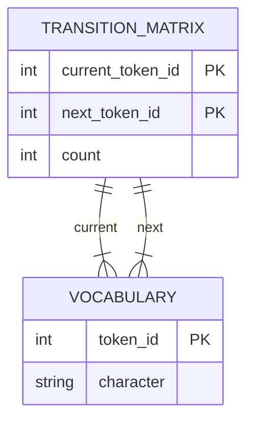
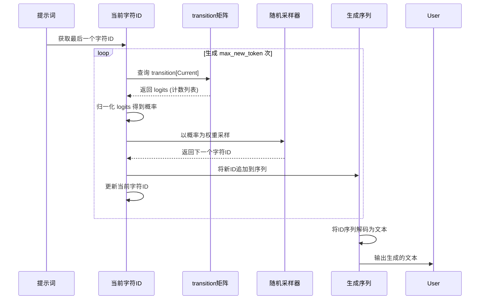

# 简单神经网络模型

<cite>
**本文档中引用的文件**  
- [simplemodel.py](file://simplemodel.py)
- [simplemodel_with_comments.py](file://simplemodel_with_comments.py)
</cite>

## 目录
1. [简介](#简介)
2. [项目结构](#项目结构)
3. [核心组件](#核心组件)
4. [架构概述](#架构概述)
5. [详细组件分析](#详细组件分析)
6. [依赖分析](#依赖分析)
7. [性能考虑](#性能考虑)
8. [故障排除指南](#故障排除指南)
9. [结论](#结论)

## 简介
本文档旨在深入解析一个从n-gram向Transformer过渡的简单神经网络语言模型。通过分析`simplemodel.py`和`simplemodel_with_comments.py`，我们将揭示该模型如何利用字符级嵌入与线性投影层，结合Softmax输出下一个字符的概率分布。文档将阐述其训练机制，包括交叉熵损失函数的应用与梯度更新过程，并强调其相较于Bigram模型的优势：能够学习分布式表示并泛化至未见序列。同时，我们将探讨嵌入维度、词汇表大小等关键参数的作用，并与后续BabyGPT系列中的嵌入层设计建立联系，为初学者提供理解神经网络语言模型核心思想的直观入口。

## 项目结构
本项目包含多个逐步演进的语言模型实现文件，从最基础的Bigram模型到具备Dropout、LayerNorm、多头注意力等现代特性的BabyGPT变体。当前分析聚焦于`simplemodel.py`和`simplemodel_with_comments.py`，它们代表了从统计方法向神经网络方法过渡的关键一步。这些文件位于项目根目录下，与`babygpt_v*.py`系列文件共同构成了一个完整的学习路径。

**Section sources**
- [simplemodel.py](file://simplemodel.py#L1-L37)
- [simplemodel_with_comments.py](file://simplemodel_with_comments.py#L1-L50)

## 核心组件
该模型的核心在于使用一个二维数组`transition`来统计文本中相邻字符的共现频率。通过`encode`和`decode`函数实现字符与整数ID之间的映射，构建了一个基于频率的预测系统。模型通过归一化转移计数得到概率分布，并使用加权随机采样生成下一个字符。这虽然不是真正的神经网络，但为理解后续模型中的嵌入层和Softmax输出奠定了基础。

**Section sources**
- [simplemodel.py](file://simplemodel.py#L15-L36)
- [simplemodel_with_comments.py](file://simplemodel_with_comments.py#L20-L49)

## 架构概述
该模型的架构本质上是一个基于频率的马尔可夫模型。输入文本首先被处理成一个唯一的字符集合，形成词汇表。每个字符被赋予一个唯一的ID。随后，遍历整个文本，统计每对相邻字符的出现次数，填充`transition`矩阵。在生成阶段，模型从提示词开始，根据当前字符ID查找`transition`矩阵中的对应行，归一化后作为概率分布，采样得到下一个字符，循环往复。

**Diagram sources**
- [simplemodel.py](file://simplemodel.py#L10-L36)
- [simplemodel_with_comments.py](file://simplemodel_with_comments.py#L15-L49)

## 详细组件分析

### 词汇表与编码组件分析
该组件负责将原始文本字符转换为模型可处理的数值形式。`chars`列表存储了所有唯一字符，`stoi`和`itos`字典实现了字符与整数ID的双向映射。`encode`和`decode`函数作为便捷的转换接口。`vocab_size`是整个模型的规模基础，决定了`transition`矩阵的大小。

**Section sources**
- [simplemodel.py](file://simplemodel.py#L10-L14)
- [simplemodel_with_comments.py](file://simplemodel_with_comments.py#L15-L19)

### 转移矩阵组件分析
`transition`矩阵是模型的核心知识库。它是一个`vocab_size x vocab_size`的二维列表，`transition[i][j]`记录了字符`i`后面紧跟字符`j`的次数。通过遍历文本并累加计数来构建。在推理时，该矩阵的每一行代表了给定当前字符下，所有可能的下一个字符的未归一化对数概率（logits）。

**Diagram sources**
- [simplemodel.py](file://simplemodel.py#L16-L21)
- [simplemodel_with_comments.py](file://simplemodel_with_comments.py#L22-L28)

### 文本生成流程分析
生成流程是一个循环过程。从提示词的最后一个字符ID开始，查找`transition`矩阵中对应的行作为logits。计算该行的总和并进行归一化，得到一个有效的概率分布。使用`random.choices`根据此概率分布进行采样，得到下一个字符的ID。将新ID追加到生成序列中，并更新当前字符ID，重复此过程直到达到最大生成长度。

**Diagram sources**
- [simplemodel.py](file://simplemodel.py#L23-L35)
- [simplemodel_with_comments.py](file://simplemodel_with_comments.py#L30-L48)

## 依赖分析
该模型仅依赖于Python标准库中的`random`模块和文件系统I/O。它不依赖任何外部机器学习框架（如PyTorch），因此是一个纯粹的基于规则和统计的模型。其功能完全由`ci.txt`数据文件驱动，模型参数（即`transition`矩阵）直接从数据中计数得出，而非通过梯度下降学习。

**Section sources**
- [simplemodel.py](file://simplemodel.py#L1-L3)
- [simplemodel_with_comments.py](file://simplemodel_with_comments.py#L1-L3)

## 性能考虑
该模型的训练（计数）时间复杂度为O(N)，其中N是文本长度。空间复杂度为O(V²)，V是词汇表大小，主要由`transition`矩阵占用。对于中文文本，V可能较大，导致内存消耗显著。推理速度很快，每次生成只需一次矩阵行查找和一次归一化计算。然而，它无法泛化，对于训练数据中未出现的字符对，其概率为零。

## 故障排除指南
常见问题包括文件`ci.txt`不存在或路径错误，导致`FileNotFoundError`。确保该文件位于脚本同一目录下。另一个问题是`transition`矩阵的归一化分母为零，这在`max(sum(logits),1)`中已通过取最大值为1来避免。若生成结果过于重复，可能是由于训练数据不足或`random.seed(42)`固定了随机性，可移除该行以获得不同结果。

**Section sources**
- [simplemodel.py](file://simplemodel.py#L5-L8)
- [simplemodel_with_comments.py](file://simplemodel_with_comments.py#L5-L8)

## 结论
尽管`simplemodel.py`并非真正的神经网络，但它清晰地展示了语言模型的核心思想：预测下一个token的概率分布。它作为从Bigram到神经网络模型的桥梁，其`transition`矩阵可类比于神经网络中的权重矩阵。后续的BabyGPT系列通过引入可学习的嵌入层（`nn.Embedding`）和线性投影层（`nn.Linear`），将这种基于计数的静态知识库转变为可通过梯度下降优化的动态参数，从而能够学习更深层次的语义和句法特征，实现更强的泛化能力。理解此简单模型是掌握复杂Transformer架构的重要基石。