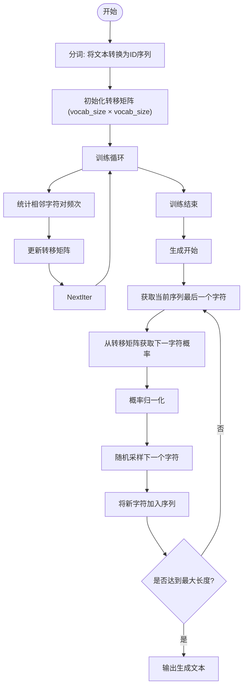
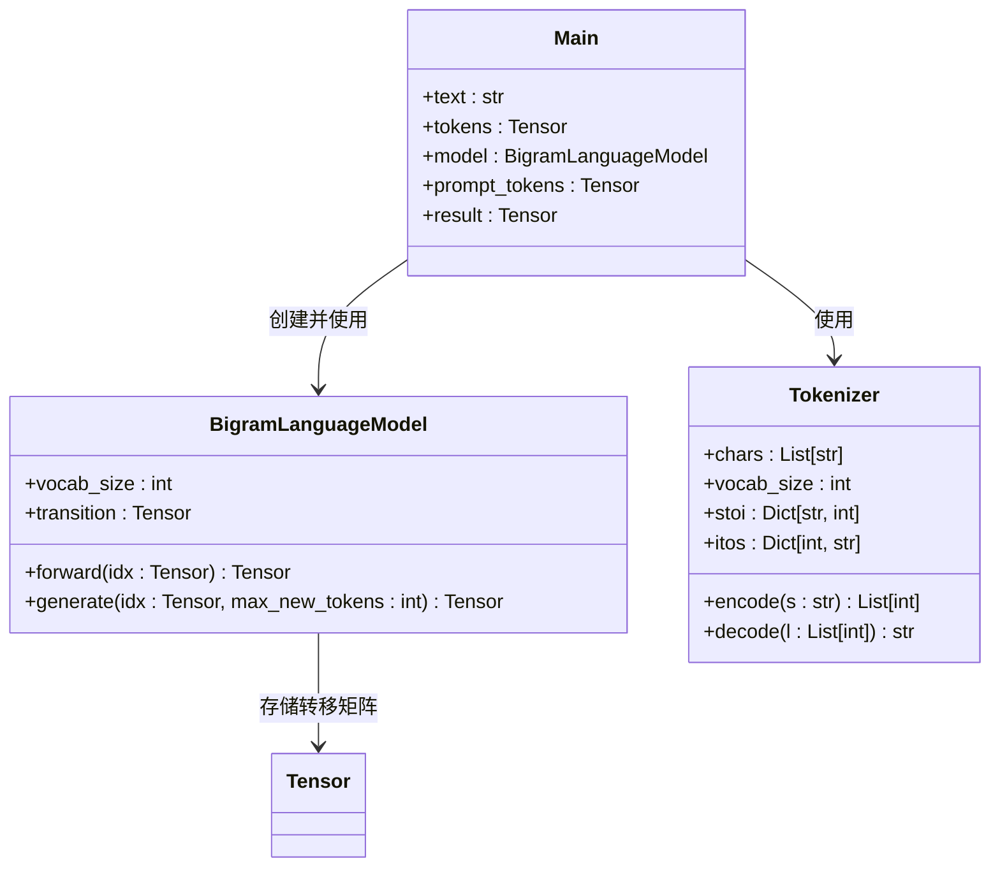

# 辅助模型

<cite>
**本文档中引用的文件**  
- [simplebigrammodel.py](file://simplebigrammodel.py)
- [simplebigrammodel_with_comments.py](file://simplebigrammodel_with_comments.py)
- [simplebigrammodel_torch.py](file://simplebigrammodel_torch.py)
- [simplemodel.py](file://simplemodel.py)
- [simplemodel_with_comments.py](file://simplemodel_with_comments.py)
</cite>

## 目录
1. [引言](#引言)
2. [Bigram模型基础](#bigram模型基础)
3. [字符级Bigram模型实现](#字符级bigram模型实现)
4. [基于PyTorch的Bigram模型](#基于pytorch的bigram模型)
5. [简单神经网络语言模型](#简单神经网络语言模型)
6. [辅助模型的教学意义](#辅助模型的教学意义)

## 引言
本项目通过一系列逐步复杂的语言模型，帮助学习者理解从传统统计方法到现代神经网络语言模型的演进过程。其中，`simplebigrammodel.py` 和 `simplemodel.py` 等文件作为基线和教学辅助模型，提供了理解语言建模基本原理的入口。这些模型不仅展示了语言建模的核心思想，还为后续更复杂的模型（如BabyGPT系列）提供了性能基准和学习跳板。

## Bigram模型基础
Bigram模型是n-gram语言模型中最基础的形式之一，基于马尔可夫假设：一个词的出现概率仅依赖于其前一个词。该模型通过统计语料中相邻字符（或词）的共现频率，构建转移矩阵，从而预测下一个字符的概率分布。这种模型虽然简单，但能捕捉到基本的语言结构特征，是理解语言建模的起点。

**Section sources**
- [simplebigrammodel.py](file://simplebigrammodel.py#L27-L69)
- [simplebigrammodel_with_comments.py](file://simplebigrammodel_with_comments.py#L27-L87)

## 字符级Bigram模型实现
在 `simplebigrammodel.py` 和 `simplebigrammodel_with_comments.py` 中，实现了一个字符级的Bigram语言模型。该模型首先对文本进行字符级分词，构建词汇表，并初始化一个 `vocab_size × vocab_size` 的转移矩阵 `transition`，用于记录每个字符后接其他字符的频次。

训练过程通过遍历文本，统计每对相邻字符的出现次数，更新转移矩阵。推理阶段，模型根据当前字符在转移矩阵中查找对应的概率分布（通过归一化频次获得），并按概率采样生成下一个字符。该实现支持批量处理多个输入序列，并可基于提示词（prompt）生成连续文本。

**Diagram sources**
- [simplebigrammodel.py](file://simplebigrammodel.py#L27-L69)
- [simplebigrammodel_with_comments.py](file://simplebigrammodel_with_comments.py#L27-L87)

**Section sources**
- [simplebigrammodel.py](file://simplebigrammodel.py#L0-L103)
- [simplebigrammodel_with_comments.py](file://simplebigrammodel_with_comments.py#L0-L131)

## 基于PyTorch的Bigram模型
`simplebigrammodel_torch.py` 展示了如何使用PyTorch张量来实现相同的Bigram模型。与使用Python原生列表不同，该版本使用 `torch.zeros` 创建转移矩阵，并将输入数据转换为 `torch.Tensor` 类型。这不仅提高了数值计算的效率，还为后续引入梯度计算和神经网络层奠定了基础。

尽管该模型本身仍是无参数学习的统计模型（直接计数而非反向传播优化），但其代码结构（如 `forward` 方法、张量操作）已与现代深度学习框架接轨。例如，`generate` 方法中使用 `torch.multinomial` 进行采样，`get_batch` 使用 `torch.randint` 和 `torch.stack` 构建批次数据，体现了向神经网络编程范式的过渡。

**Diagram sources**
- [simplebigrammodel_torch.py](file://simplebigrammodel_torch.py#L32-L59)

**Section sources**
- [simplebigrammodel_torch.py](file://simplebigrammodel_torch.py#L0-L93)

## 简单神经网络语言模型
`simplemodel.py` 和 `simplemodel_with_comments.py` 实现了一个比Bigram模型更复杂但远比Transformer简单的神经网络语言模型。虽然当前代码中仍为统计模型，但从命名和结构上看，它为引入嵌入层（Embedding Layer）和线性层（Linear Layer）预留了空间。此类模型通常将字符ID映射到低维嵌入向量，再通过线性变换预测下一个字符的 logits，最后通过 softmax 获得概率分布。

该模型的教学价值在于展示神经网络语言模型的基本流程：输入编码 → 嵌入查找 → 前向传播 → 概率计算 → 采样生成。它比Bigram模型具有更强的表达能力，能够通过学习捕捉更复杂的语言模式，是通往BabyGPT等Transformer模型的中间步骤。

**Diagram sources**
- [simplemodel.py](file://simplemodel.py#L0-L36)
- [simplemodel_with_comments.py](file://simplemodel_with_comments.py#L0-L49)

**Section sources**
- [simplemodel.py](file://simplemodel.py#L0-L36)
- [simplemodel_with_comments.py](file://simplemodel_with_comments.py#L0-L49)

## 辅助模型的教学意义
这些辅助模型在项目中扮演着至关重要的教学角色。首先，`simplebigrammodel` 系列作为最基础的基线模型，提供了语言建模的直观理解，其生成结果可作为后续模型改进的参照。其次，从纯Python实现到PyTorch张量的过渡，帮助学习者平滑地适应深度学习框架的编程范式。最后，`simplemodel` 作为神经网络模型的雏形，建立了嵌入、前向传播、生成等核心概念，为理解BabyGPT中复杂的自注意力机制和残差连接打下坚实基础。整体上，这些模型构成了一个由浅入深、循序渐进的学习曲线，使初学者能够逐步掌握大语言模型的构建原理。

**Section sources**
- [simplebigrammodel.py](file://simplebigrammodel.py#L0-L103)
- [simplebigrammodel_torch.py](file://simplebigrammodel_torch.py#L0-L93)
- [simplemodel.py](file://simplemodel.py#L0-L36)