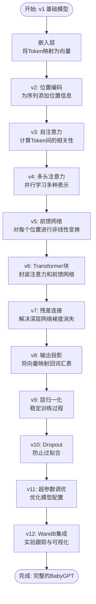
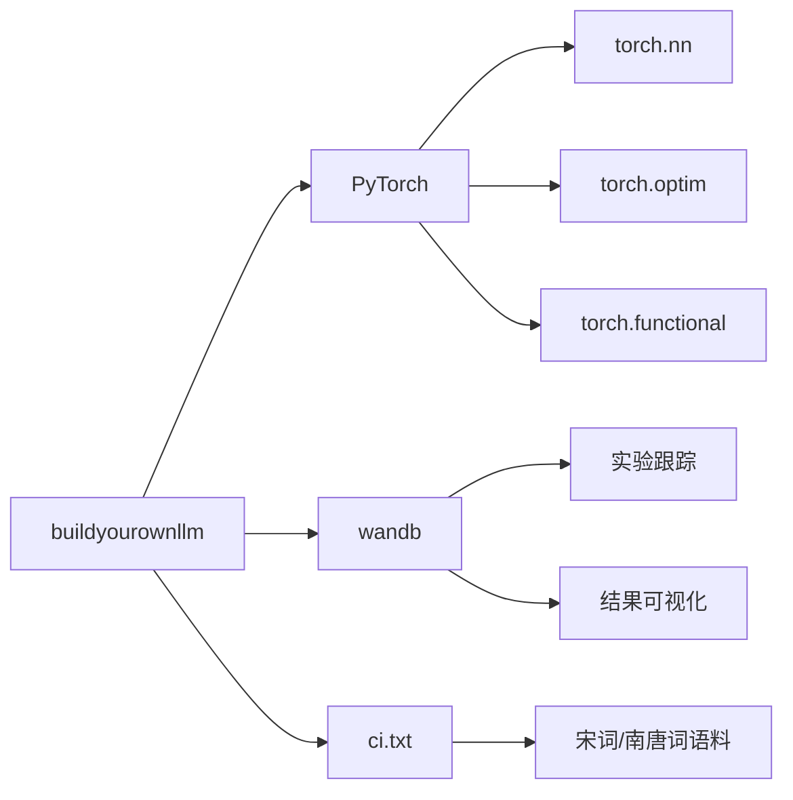

# 项目概述

<cite>
**本文档引用的文件**
- [README.md](file://README.md)
- [babygpt_v1.py](file://babygpt_v1.py)
- [babygpt_v2_position.py](file://babygpt_v2_position.py)
- [babygpt_v3_self_attention.py](file://babygpt_v3_self_attention.py)
- [babygpt_v4_multihead_attention.py](file://babygpt_v4_multihead_attention.py)
- [babygpt_v5_feedforward.py](file://babygpt_v5_feedforward.py)
- [babygpt_v6_block.py](file://babygpt_v6_block.py)
- [babygpt_v7_residual_connection.py](file://babygpt_v7_residual_connection.py)
- [babygpt_v8_projection.py](file://babygpt_v8_projection.py)
- [babygpt_v9_layer_norm.py](file://babygpt_v9_layer_norm.py)
- [babygpt_v10_dropout.py](file://babygpt_v10_dropout.py)
- [babygpt_v11_hyper_params.py](file://babygpt_v11_hyper_params.py)
- [babygpt_v12_wandb.py](file://babygpt_v12_wandb.py)
- [simplebigrammodel.py](file://simplebigrammodel.py)
- [simplebigrammodel_with_comments.py](file://simplebigrammodel_with_comments.py)
- [simplemodel.py](file://simplemodel.py)
- [simplemodel_with_comments.py](file://simplemodel_with_comments.py)
- [pytorch_5min.py](file://pytorch_5min.py)
- [babygpt_sample_with_kvcache.py](file://babygpt_sample_with_kvcache.py)
</cite>

## 目录
1. [简介](#简介)
2. [项目结构](#项目结构)
3. [核心组件](#核心组件)
4. [架构概览](#架构概览)
5. [详细组件分析](#详细组件分析)
6. [依赖分析](#依赖分析)
7. [性能考虑](#性能考虑)
8. [故障排除指南](#故障排除指南)
9. [结论](#结论)

## 简介
`buildyourownllm` 是一个教学导向的开源项目，旨在通过一系列渐进式Python脚本，帮助开发者从零开始理解并构建类GPT语言模型。该项目的核心价值在于其“拆解式”教学方法，将复杂的Transformer架构分解为一系列易于理解的步骤，从最基础的嵌入层到完整的多层解码器结构。项目使用中国宋词和南唐词作为训练语料，使学习过程更具文化亲和力。通过从`babygpt_v1.py`到`v12`的12个版本迭代，学习者可以清晰地看到一个语言模型是如何逐步演进的，每个版本都专注于引入一个关键的深度学习概念，如位置编码、自注意力、多头注意力、残差连接等。该项目不仅适合深度学习初学者建立直观理解，也为有经验的开发者提供了一个清晰的LLM内部工作机制参考。

## 项目结构
该项目采用扁平化的文件组织结构，所有核心脚本均位于根目录下，这种设计刻意避免了复杂的包管理，以降低初学者的入门门槛。项目主要由三大类文件构成：核心的`babygpt_vX.py`系列脚本构成了学习的主干；辅助的基线模型（如`simplebigrammodel.py`）提供了性能对比基准；以及工具脚本（如`pytorch_5min.py`）用于快速入门PyTorch框架。这种结构清晰地反映了其教学目的：学习者可以按顺序打开文件，无需在复杂的目录树中导航，即可专注于代码逻辑本身。

```mermaid
graph TD
A[项目根目录] --> B[babygpt_vX.py系列]
A --> C[基线模型]
A --> D[工具脚本]
A --> E[数据文件]
B --> B1[babygpt_v1.py]
B --> B2[babygpt_v2_position.py]
B --> B3[babygpt_v3_self_attention.py]
B --> B4[babygpt_v4_multihead_attention.py]
B --> B5[babygpt_v5_feedforward.py]
B --> B6[babygpt_v6_block.py]
B --> B7[babygpt_v7_residual_connection.py]
B --> B8[babygpt_v8_projection.py]
B --> B9[babygpt_v9_layer_norm.py]
B --> B10[babygpt_v10_dropout.py]
B --> B11[babygpt_v11_hyper_params.py]
B --> B12[babygpt_v12_wandb.py]
C --> C1[simplebigrammodel.py]
C --> C2[simplebigrammodel_torch.py]
C --> C3[simplebigrammodel_with_comments.py]
C --> C4[simplemodel.py]
C --> C5[simplemodel_with_comments.py]
D --> D1[pytorch_5min.py]
D --> D2[babygpt_sample_with_kvcache.py]
E --> E1[ci.txt]
```

**图示来源**
- [README.md](file://README.md)
- [项目结构](file://.)

**本节来源**
- [README.md](file://README.md)
- [项目结构](file://.)

## 核心组件
`buildyourownllm`项目的核心是`babygpt_vX.py`系列脚本，它们构成了一个系统性的学习路径。该系列从`v1`开始，仅包含一个简单的嵌入层和线性投影层，实现了一个基础的语言模型。随着版本号的递增，每一个新脚本都在前一个版本的基础上增加一个关键的Transformer组件。例如，`v2`引入了位置编码以解决序列顺序问题，`v3`实现了自注意力机制，`v4`将其扩展为多头注意力。这一系列脚本共同展示了现代LLM的构建模块是如何协同工作的。此外，`simplebigrammodel.py`作为基线模型，实现了一个简单的双字母组（Bigram）语言模型，为学习者提供了一个性能基准，使其能够直观地感受到从传统NLP方法到深度学习模型的巨大飞跃。

**本节来源**
- [babygpt_v1.py](file://babygpt_v1.py)
- [babygpt_v2_position.py](file://babygpt_v2_position.py)
- [babygpt_v3_self_attention.py](file://babygpt_v3_self_attention.py)
- [babygpt_v4_multihead_attention.py](file://babygpt_v4_multihead_attention.py)
- [simplebigrammodel.py](file://simplebigrammodel.py)

## 架构概览
该项目的整体架构遵循一个清晰的渐进式演进路径。其设计哲学是“一次只学一个概念”，因此最终的架构并非一个独立的、高度优化的系统，而是一系列相互关联的实验性脚本。每个`babygpt_vX.py`脚本都实现了一个独立的、可运行的模型，其架构复杂度随版本递增。从`v1`的简单嵌入-投影结构，到`v12`的完整Transformer解码器块（包含多头注意力、前馈网络、层归一化、残差连接和Dropout），学习者可以清晰地看到模型是如何一步步构建起来的。这种架构与传统软件项目追求的模块化、复用性不同，它更注重教学的连贯性和概念的清晰性。

```mermaid
graph LR
A[babygpt_v1: 嵌入 + 投影] --> B[babygpt_v2: + 位置编码]
B --> C[babygpt_v3: + 自注意力]
C --> D[babygpt_v4: + 多头注意力]
D --> E[babygpt_v5: + 前馈网络]
E --> F[babygpt_v6: + Transformer块]
F --> G[babygpt_v7: + 残差连接]
G --> H[babygpt_v8: + 输出投影]
H --> I[babygpt_v9: + 层归一化]
I --> J[babygpt_v10: + Dropout]
J --> K[babygpt_v11: + 超参数调优]
K --> L[babygpt_v12: + WandB集成]
```

**图示来源**
- [babygpt_v1.py](file://babygpt_v1.py)
- [babygpt_v12_wandb.py](file://babygpt_v12_wandb.py)

## 详细组件分析
### BabyGPT模型演进分析
`BabyGPT`系列脚本是本项目的核心教学工具，通过12个版本的迭代，系统性地构建了一个类GPT模型。每个版本都专注于一个特定的深度学习概念，使学习者能够循序渐进地掌握复杂知识。

#### 模型演进流程图

**图示来源**
- [babygpt_v1.py](file://babygpt_v1.py)
- [babygpt_v12_wandb.py](file://babygpt_v12_wandb.py)

**本节来源**
- [babygpt_v1.py](file://babygpt_v1.py)
- [babygpt_v12_wandb.py](file://babygpt_v12_wandb.py)

### 基线模型分析
`simplebigrammodel.py` 实现了一个经典的N-gram语言模型，作为深度学习模型的性能基准。该模型通过统计语料库中相邻字符（Bigram）的共现频率来预测下一个字符。其核心是一个二维的转移矩阵 `transition`，其中 `transition[i][j]` 表示字符 `i` 后面出现字符 `j` 的次数。在推理时，模型根据当前字符的转移概率分布进行随机采样，生成下一个字符。这个简单的模型虽然无法捕捉长距离依赖关系，但其实现直观，为理解更复杂的神经网络模型提供了一个重要的参照点。

**本节来源**
- [simplebigrammodel.py](file://simplebigrammodel.py)

### PyTorch入门示例
`pytorch_5min.py` 脚本是一个极简的PyTorch入门教程，旨在让初学者在5分钟内掌握PyTorch的核心概念。它通过一个简单的线性回归任务（拟合 y = 2x + 1 函数）演示了PyTorch的关键流程：张量（Tensor）操作、神经网络模块（nn.Module）定义、损失函数（MSELoss）、优化器（SGD）以及完整的训练循环。该脚本还展示了如何将模型和数据移动到GPU上进行加速计算，为后续学习更复杂的`BabyGPT`模型奠定了坚实的基础。

**本节来源**
- [pytorch_5min.py](file://pytorch_5min.py)

## 依赖分析
该项目的外部依赖关系极为简单，主要依赖于`PyTorch`深度学习框架和`wandb`（Weights & Biases）实验跟踪工具。`PyTorch`是所有`babygpt_vX.py`和`pytorch_5min.py`脚本的基础，提供了张量计算和自动微分功能。`wandb`仅在`babygpt_v12_wandb.py`中被使用，用于记录训练过程中的损失、速度等指标，并提供可视化界面。项目内部的依赖关系则体现在`babygpt_vX.py`系列脚本的版本演进上，每个新版本都“依赖”于前一个版本所建立的概念和代码结构，形成了一条清晰的学习路径。

**图示来源**
- [babygpt_v12_wandb.py](file://babygpt_v12_wandb.py)
- [pytorch_5min.py](file://pytorch_5min.py)
- [README.md](file://README.md)

**本节来源**
- [babygpt_v12_wandb.py](file://babygpt_v12_wandb.py)
- [pytorch_5min.py](file://pytorch_5min.py)

## 性能考虑
该项目的主要目的并非追求极致的性能或效率，而是教学清晰性。因此，在性能方面做出了一些权衡。例如，模型的训练数据集（`ci.txt`）相对较小，模型尺寸（如`n_embed=32`）也远小于工业级LLM，这使得模型可以在普通CPU或消费级GPU上快速训练和迭代。`babygpt_v12_wandb.py`脚本中集成了性能监控，通过计算每秒处理的token数量（tokens/sec）来评估训练速度。虽然`v10`版本引入了`Dropout`来防止过拟合，`v9`版本引入了`LayerNorm`来稳定训练，但这些优化主要是为了教学完整性，而非针对特定硬件的性能调优。对于学习者而言，理解这些技术如何影响模型的收敛速度和最终损失更为重要。

## 故障排除指南
当运行项目中的脚本时，可能会遇到一些常见问题。最常见的问题是缺少依赖库，如运行`babygpt_v12_wandb.py`时提示`ModuleNotFoundError: No module named 'wandb'`，此时需要通过`pip install wandb`进行安装。另一个常见问题是数据文件`ci.txt`缺失或路径错误，确保该文件与脚本位于同一目录下。在训练过程中，如果损失值不下降，可以检查学习率（`learning_rate`）是否设置得过高或过低。对于`pytorch_5min.py`，如果无法使用GPU，脚本会自动回退到CPU，但训练速度会显著变慢。建议初学者先确保脚本能在CPU上正常运行，再尝试解决GPU环境配置问题。

**本节来源**
- [babygpt_v12_wandb.py](file://babygpt_v12_wandb.py)
- [pytorch_5min.py](file://pytorch_5min.py)

## 结论
`buildyourownllm`项目是一个卓越的教学工具，它通过“从零开始”的方法，成功地将一个看似高深的领域——大语言模型——变得触手可及。其核心价值在于将复杂的Transformer架构解构为一系列微小、可管理的步骤，让学习者能够亲手实现每一个组件，从而获得深刻的理解。该项目不仅教授了PyTorch编程技能，更重要的是培养了对深度学习模型内部工作机制的直觉。对于希望理解LLM工作原理的开发者而言，该项目提供了一条清晰、高效且富有成就感的学习路径。通过完成从`v1`到`v12`的全部实验，学习者将建立起对现代LLM技术栈的坚实信心。