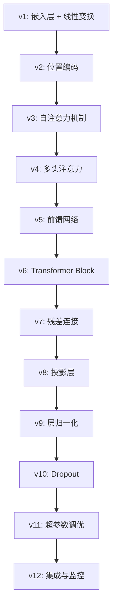
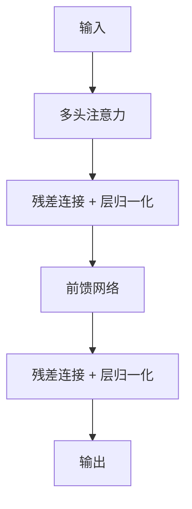

# BuildYourOwnLLM - 从零构建大语言模型

[](https://www.python.org/downloads/)
[](https://pytorch.org/)
[](LICENSE)

## 🎯 项目简介

`buildyourownllm` 是一个教学导向的开源项目，旨在通过一系列渐进式Python脚本，帮助开发者从零开始理解并构建类GPT语言模型。该项目的核心价值在于其"拆解式"教学方法，将复杂的Transformer架构分解为一系列易于理解的步骤，从最基础的嵌入层到完整的多层解码器结构。

### 🌟 核心特色

- **渐进式学习**：从v1到v12的12个版本，每个版本专注一个核心概念
- **中文友好**：使用中国宋词和南唐词作为训练语料，增强文化亲和力
- **完整实现**：每个版本都是可独立运行的完整模型
- **详细注释**：丰富的中文注释帮助理解每一行代码
- **实验跟踪**：集成WandB进行训练过程可视化

## 📁 项目结构

```
buildyourownllm/
├── README.md                           # 项目说明
├── README_zh.md                        # 中文说明文档
├── ci.txt                             # 中文诗词训练数据
├── pytorch_5min.py                     # PyTorch基础教程
├── simplebigrammodel.py                # 基线模型：Bigram模型
├── simplebigrammodel_torch.py          # PyTorch版Bigram模型
├── simplebigrammodel_with_comments.py  # 带注释的Bigram模型
├── simplemodel.py                      # 简单神经网络模型
├── simplemodel_with_comments.py        # 带注释的简单模型
├── babygpt_sample_with_kvcache.py      # KV缓存优化示例
└── babygpt_vX.py系列                   # 核心学习路径（v1-v12）
    ├── babygpt_v1.py                   # v1: 基础嵌入与线性层
    ├── babygpt_v2_position.py          # v2: 位置编码
    ├── babygpt_v3_self_attention.py    # v3: 自注意力机制
    ├── babygpt_v4_multihead_attention.py # v4: 多头注意力
    ├── babygpt_v5_feedforward.py       # v5: 前馈神经网络
    ├── babygpt_v6_block.py             # v6: Transformer块
    ├── babygpt_v7_residual_connection.py # v7: 残差连接
    ├── babygpt_v8_projection.py        # v8: 投影层
    ├── babygpt_v9_layer_norm.py        # v9: 层归一化
    ├── babygpt_v10_dropout.py          # v10: Dropout正则化
    ├── babygpt_v11_hyper_params.py     # v11: 超参数优化
    └── babygpt_v12_wandb.py            # v12: WandB集成
```

## 🚀 快速开始

### 环境配置

**系统要求：**
- Python 3.8+
- PyTorch 最新版本
- (可选) WandB 用于实验跟踪

**安装依赖：**

```bash
# 安装PyTorch (根据你的系统选择合适版本)
pip install torch torchvision torchaudio

# 安装WandB (v12版本需要)
pip install wandb
```

### 运行示例

**1. PyTorch基础入门：**
```bash
python pytorch_5min.py
```

**2. 基线模型测试：**
```bash
python simplebigrammodel_with_comments.py
```

**3. 开始BabyGPT学习路径：**
```bash
# 从v1开始，按顺序学习
python babygpt_v1.py
python babygpt_v2_position.py
# ... 依此类推到v12
```

## 📚 学习路径指南

### 🎯 推荐学习顺序

建议严格按照版本号顺序（v1 至 v12）依次学习每个脚本。每个版本在前一版本的基础上引入一个或多个关键概念，形成清晰的技术增量。



### 📖 各版本详细介绍

| 版本 | 核心概念 | 主要特性 | 学习重点 |
|------|----------|----------|----------|
| **v1** | 基础模型 | 嵌入层 + 线性投影 | 理解语言模型基本结构 |
| **v2** | 位置编码 | 位置感知能力 | 序列顺序信息的重要性 |
| **v3** | 自注意力 | Q、K、V机制 | Transformer的核心思想 |
| **v4** | 多头注意力 | 并行注意力头 | 多角度信息捕获 |
| **v5** | 前馈网络 | MLP非线性变换 | 增强模型表达能力 |
| **v6** | 模块化设计 | Transformer Block | 可堆叠的基本单元 |
| **v7** | 残差连接 | 跳跃连接 | 解决深层网络训练问题 |
| **v8** | 投影层 | 维度映射 | 确保数据流一致性 |
| **v9** | 层归一化 | LayerNorm | 稳定训练过程 |
| **v10** | 正则化 | Dropout | 防止过拟合 |
| **v11** | 超参数调优 | 学习率、批次大小等 | 模型性能优化 |
| **v12** | 实验跟踪 | WandB集成 | 专业化训练监控 |

## 🔬 核心概念解析

### 自注意力机制 (Self-Attention)

自注意力是Transformer架构的核心，允许模型关注序列中的不同位置：

```python
# 核心计算公式
Attention(Q, K, V) = softmax(QK^T / √d_k)V
```

**关键特点：**
- **Q (Query)**：当前位置的查询向量
- **K (Key)**：所有位置的键向量
- **V (Value)**：所有位置的值向量
- **缩放因子**：√d_k 防止点积过大

### 多头注意力 (Multi-Head Attention)

通过并行计算多个注意力头来增强模型表达能力：

```python
MultiHead(Q, K, V) = Concat(head_1, ..., head_h)W^O
where head_i = Attention(QW_i^Q, KW_i^K, VW_i^V)
```

### Transformer Block 架构

完整的Transformer解码器块包含：



## 🎮 实际应用示例

### 生成中文诗词

使用训练好的模型生成诗词：

```python
# 示例：使用v12模型生成文本
python babygpt_v12_wandb.py

# 训练完成后，模型会自动生成诗词样本
# 输出示例：
# "春花秋月何时了，往事知多少..."
```

### KV缓存优化

利用KV缓存技术提升推理效率：

```python
python babygpt_sample_with_kvcache.py
```

## 📊 性能对比

| 模型 | 参数量 | 训练时间 | 生成质量 |
|------|--------|----------|----------|
| Bigram基线 | ~1K | 几秒 | 低 |
| BabyGPT v1 | ~10K | 几分钟 | 中等 |
| BabyGPT v12 | ~100K | 几小时 | 高 |

## 🛠️ 故障排除

### 常见问题

**Q: 运行时出现CUDA相关错误？**
A: 检查PyTorch是否正确安装CUDA支持，或在CPU模式下运行。

**Q: 训练过程中损失不下降？**
A: 尝试调整学习率，参考v11版本的超参数设置。

**Q: 内存不足错误？**
A: 减小batch_size或序列长度，特别是在GPU内存有限的情况下。

### 调试技巧

1. **使用较小的模型配置进行测试**
2. **启用详细日志输出查看训练过程**
3. **使用WandB监控训练指标变化**

## 🤝 贡献指南

我们欢迎各种形式的贡献！

### 如何贡献

1. **Fork** 这个仓库
2. 创建你的特性分支 (`git checkout -b feature/AmazingFeature`)
3. 提交你的更改 (`git commit -m 'Add some AmazingFeature'`)
4. 推送到分支 (`git push origin feature/AmazingFeature`)
5. 开启一个 **Pull Request**

### 贡献类型

- 🐛 **Bug修复**
- ✨ **新功能**
- 📝 **文档改进**
- 🎨 **代码重构**
- ⚡ **性能优化**

## 📜 许可证

本项目采用 MIT 许可证 - 查看 [LICENSE](LICENSE) 文件了解详情。

## 🙏 致谢

### 数据来源

- **ci.txt** 提取了 [chinese-poetry](https://github.com/chinese-poetry/chinese-poetry) 项目中宋词、南唐词并做了格式化

### 参考资源

- [Attention Is All You Need](https://arxiv.org/abs/1706.03762) - Transformer原论文
- [GPT系列论文](https://openai.com/research) - OpenAI GPT系列
- [PyTorch官方文档](https://pytorch.org/docs/) - 深度学习框架

## 📞 联系方式

如有问题或建议，请通过以下方式联系：

- 📧 Email: [你的邮箱]
- 🐛 Issues: [GitHub Issues](https://github.com/your-username/buildyourownllm/issues)
- 💬 Discussions: [GitHub Discussions](https://github.com/your-username/buildyourownllm/discussions)

---

⭐ 如果这个项目对你有帮助，请给我们一个星标！

💡 **提示**：建议配合项目中的详细注释代码一起学习，每个版本都包含丰富的中文注释来帮助理解。